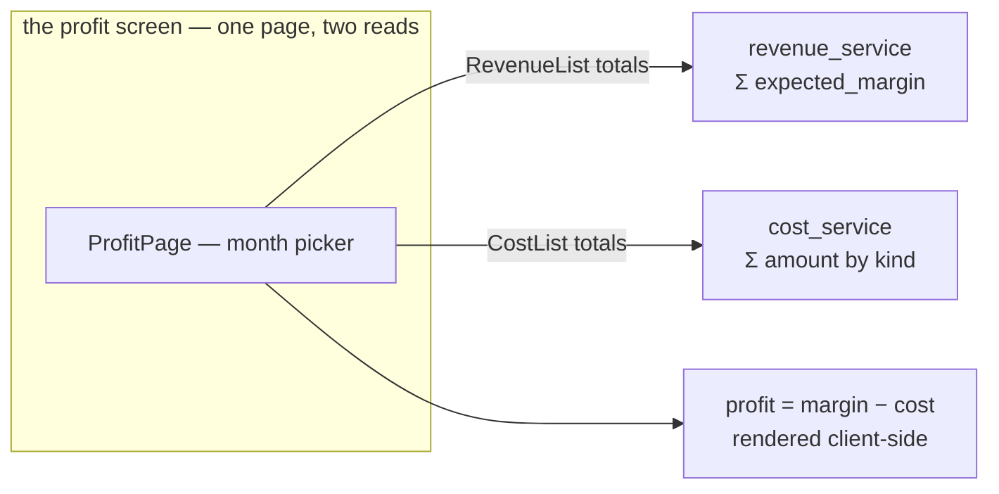
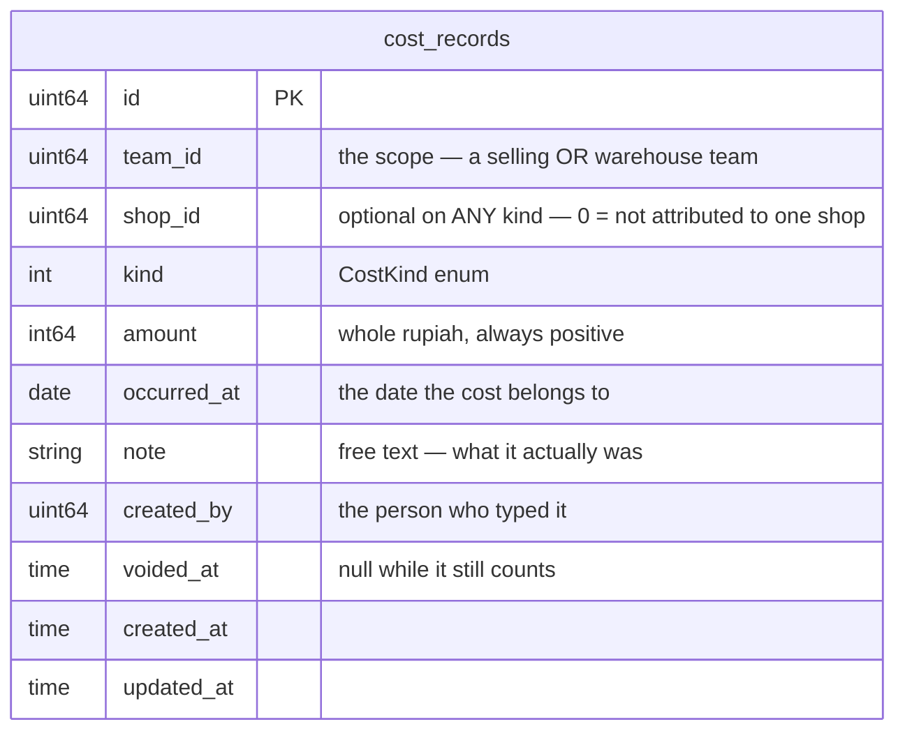

# Brainstorming — Cost domain (#161)

> Planning doc for **`cost_service`**. **Nothing is implemented.** #161 asks to plan the service and
> its UI; this frames the domain, records the four forks the owner settled on 2026-07-21, and proposes
> a decomposition into sub-issues — **to be confirmed before any issue is created.**

> **Decisions so far**
> - **A cost is money that NO ORDER caused.** (2026-07-21) That is the whole reason it is not part of
>   `revenue_service`: a revenue row is written by the system from an order, a cost row is typed by a
>   person about a period. See §1.
> - **§2.1 — "payment" means an OUTGOING BILL/EXPENSE.** (owner, 2026-07-21) Rent, electricity,
>   internet, subscriptions. It is **not** the marketplace/payment-channel fee on an order (that stays
>   #76's problem, on the revenue row) and it is **not** the method a cost was paid with.
> - **§2.2 — a cost attaches to a TEAM, plus an optional SHOP.** (owner, 2026-07-21) `team_id` is the
>   required scope, exactly as on a revenue row. An ads cost also names the shop it was spent on.
> - **§2.3 — cost kinds are a PROTO ENUM plus a free-text note.** (owner, 2026-07-21) Not a
>   team-managed category table.
> - **§2.4 — profit is joined in the FRONTEND.** (owner, 2026-07-21) A report screen reads revenue
>   totals and cost totals and subtracts. No cross-service RPC, no shared table.
> - **§2.3 — the third kind is `COST_KIND_OPERATIONAL`,** not `BILL`. (owner, 2026-07-21) All three
>   kinds then answer "what kind of *spending*" rather than mixing in "what kind of *document*" — a
>   subscription charged automatically is not a bill anybody receives.
> - **Any kind may name a SHOP,** not only ads. (owner, 2026-07-21) A team running two shops may split
>   its packing wages or a subscription between them, and "only ads may name a shop" is a rule somebody
>   would hit and ask to have relaxed. Optional everywhere, required nowhere.
> - **No recurring generation in v1.** (owner, 2026-07-21) A person types each payroll row. A wrong
>   auto-row silently distorts profit for months; a missing one is at least visible to whoever notices
>   payroll is absent. The model is shaped so a generator could write rows later.
> - **Create/edit/void is OWNER + ADMIN only.** (owner, 2026-07-21) No new finance role. These numbers
>   move profit directly, and the people already trusted to manage a team are the ones who move them.
> - ⚠ **`RevenueList` cannot filter by period, so §2.4's join does not work yet.** (found
>   2026-07-21) The plan claimed both services "already return totals for a filtered period" — revenue
>   does not; it takes `team_id` and a page and totals across ALL TIME. The profit screen needs a
>   period filter on **both** lists, and that is now its own sub-issue. See §2.4.
> - **No ledger.** Follows the precedent set for revenue (`plans/revenue_service/brainstorming.md`
>   §2.4): per-row records, no per-team balance, no double entry. A cost row is a record that money
>   went out, not an account movement.

---

## 1. What a cost is (first principles)

The business already knows what an **order** earned — `revenue_service` freezes that, one row per
order (#75). What it cannot see is everything it spent that no order asked for: the ads budget that
brought the buyers in, the people who packed the boxes, the electricity that kept the lights on.

Those costs share three properties, and all three differ from revenue:

| | `revenue_service` | `cost_service` (#161) |
| --- | --- | --- |
| **Origin** | the system writes it, at order placement | **a person types it**, after the money left |
| **Attaches to** | one order | a **period** — and a team, sometimes a shop |
| **Lifecycle** | frozen at write, never edited | entered by hand, so **mistypeable → correctable** |
| **Who writes** | customer service (placing the order) | **managers only** — this number moves profit directly |
| **Volume** | one row per order, thousands | a handful a month per team |

A person typing money into a form is the defining fact of this service, and it is what every design
choice below has to serve: the form has to be fast, the mistake has to be fixable, and the row has to
say *who* entered it.

### What it is deliberately NOT

- **Not a ledger.** No balances, no double entry, no payables. Same reasoning as revenue: a ledger is
  a real accounting subsystem and nothing yet needs one. It can be added; it cannot be removed.
- **Not per-order cost.** COGS and shipping are already on the order (#74). Marketplace and payment
  fees per order are #76's, and they belong beside the revenue row so settlement can compare them.
  Putting them here would mean the margin on one order lived in two services.
- **Not an approval workflow.** A restock is *requested* then *accepted* because goods physically
  move between two parties. A cost is recorded by the person who already spent the money. See §5.

---

## 2. The forks — all four ANSWERED (owner, 2026-07-21)

### 2.1 ✅ "payment" = an outgoing bill/expense

The word was genuinely ambiguous and the three readings pointed at three different services:

| Reading | Verdict | |
| --- | --- | --- |
| **An outgoing bill/expense** — rent, electricity, subscriptions | ✅ **CHOSEN** | A cost kind here, alongside ads and payroll. `cost_service` owns it end to end. |
| Marketplace / payment-channel fee per order | ❌ | These are *order* costs. #74 explicitly deferred `marketplace_fee` / `payment_fee` until a marketplace import can populate them, and they belong on the revenue row so #76 can reconcile them against a real payout. Recording them here would split one order's money across two services. |
| The METHOD a cost was paid with (ShopeePay / bank) | ❌ as a *kind* | Not a kind of cost — it would be a *field*. Precedent exists (`PaymentTypeSelect`, #132/#165), so it is cheap to add later. Left out of v1: see §5. |

### 2.2 ✅ Scope: team, plus an optional shop

| Option | Verdict | |
| --- | --- | --- |
| **`team_id` required + optional `shop_id`** | ✅ **CHOSEN** | `team_id` is the authorization scope (`use_scope`), identical to a revenue row. An ads cost also names the shop the budget was spent on, because "which shop is burning the ads money" is the question that makes ads spend worth recording at all. |
| Team only | ❌ | Flat and simplest, but two shops on one team become one undifferentiated ads number. |
| Team **or** shop **or** warehouse | ❌ | Unnecessary. **A warehouse IS a team** (`TEAM_TYPE_WAREHOUSE`), so warehouse payroll is already expressible as a cost on that team's `team_id` — no third scope, and no "whose profit does this reduce" puzzle. |

> **Consequence worth naming:** because a warehouse is a team, a warehouse team's cost list is its
> **own** — it does not roll up into any selling team's profit. Whether the business wants warehouse
> costs charged onward to the selling teams it serves is a real question, and it is the same question
> as revenue §2.5 (team-to-team fees), still open there. **Not settled here.** See §5.

### 2.3 ✅ Kinds: a proto enum, plus a note

| Option | Verdict | |
| --- | --- | --- |
| **Proto enum + free-text `note`** | ✅ **CHOSEN** | Every team's numbers mean the same thing, so "ads spend across all teams last month" is answerable. Adding a kind is a proto change — rare, deliberate, and visible in review. |
| Team-managed category table | ❌ | No deploy to add one, but two teams will name the same cost differently ("Iklan" / "Ads" / "Marketing") and cross-team reporting stops working the day it is needed. |
| Enum now, sub-categories later | ❌ (not now) | Kept as a future option, not built. The `note` field carries the detail until a real need for structured sub-categories appears. |

**The starting set** — small on purpose, `OTHER` so nothing is unrecordable:

```proto
enum CostKind {
  COST_KIND_UNSPECIFIED = 0;
  COST_KIND_ADS = 1;          // marketplace ads budget
  COST_KIND_PAYROLL = 2;      // wages paid to people
  COST_KIND_OPERATIONAL = 3;  // §2.1's "payment" — rent, electricity, internet, subscriptions
  COST_KIND_OTHER = 4;
}
```

> ✅ **`COST_KIND_OPERATIONAL`** (owner, 2026-07-21), not `PAYMENT` and not `BILL`.
>
> `PAYMENT` was rejected in §2.1: after settling that the word means an outgoing expense, it became the
> most confusable name available — it reads as a payment *fee* or a payment *method* to anybody who was
> not in this conversation. `BILL` was the first replacement, but a bill is a document you *receive*,
> and a subscription charged automatically is not one. `OPERATIONAL` makes all three kinds answer the
> same question — what kind of **spending** — rather than mixing in what kind of document.

### 2.4 ✅ Profit is joined in the frontend

The point of recording costs is `profit = Σ expected margin − Σ costs`. That join happens on the
**client**:

| Option | Verdict | |
| --- | --- | --- |
| **Frontend reads both, subtracts** | ✅ **CHOSEN** | Two independent services (HARD RULE 3), no service importing another, no shared table. The screen is arithmetic over two numbers. |
| Backend report RPC | ❌ | One round trip, but one service has to call the other and *own* a number derived from data it does not hold. That is the coupling HARD RULE 3 exists to prevent. |
| No profit screen | ❌ | It is what the costs are *for*. |

> ⚠ **CORRECTION (2026-07-21): the join does not work yet, and this section previously said it did.**
>
> The earlier text claimed *"both already return totals for a filtered period"*. **`RevenueList` does
> not.** Checked against the contract, not assumed:
>
> ```proto
> message RevenueListRequest {
>   uint64 team_id = 1;                              // scope
>   warehouse.common.v1.PageFilter page = 2;         // …and that is all
> }
> ```
>
> Its totals are **all-time** for a team (#78). Asking it for July gets you every July that ever
> happened, plus every other month. So a profit screen built on it today would subtract one month of
> costs from all-time revenue and print a number that is not profit and never was.
>
> **Both lists need a period filter**, server-side and for the same reason the status filter is
> server-side (#130/#151): the lists are paginated, so a client-side date filter narrows the loaded
> page only and leaves the totals beside it unfiltered — which is exactly how a wrong headline figure
> gets rendered confidently. That is now sub-issue **1a** in §6, and the profit screen depends on it.
>
> **What "July" selects, stated so both sides agree:** a revenue row's date is its `created_at` — the
> moment the order was placed, since the event fires on placement (#153). A cost row's date is the
> `occurred_at` a person chose. So *July profit* = margin expected on orders **placed** in July, minus
> costs **dated** July. Those are two different senses of "belongs to July", and they are close enough
> to subtract only because an order's revenue is frozen the day it is placed. Worth knowing before
> anybody reconciles the number against a bank statement.



---

## 3. The shape that falls out

### 3.1 The record

One table, one row per cost. Money is **whole rupiah as int64**, matching every other money field in
the system.



Three fields carry a decision each:

- **`amount` is always positive.** The kind says it is money going out — a signed amount would let a
  negative cost silently become revenue.
- **`occurred_at` is a DATE the person picks, not the timestamp of the insert.** Payroll is paid on
  the 5th for the month before. One date, chosen by the person, is enough — no accrual period, no
  posting date. *(Same spirit as revenue §2.3: model what can be populated, defer what cannot.)*
- **`voided_at`, not a delete.** Follows #164 exactly. A deleted row cannot tell you a cost was
  entered and then retracted, and somebody looking at a profit number that changed wants to see why.

### 3.2 The RPCs

| RPC | Notes |
| --- | --- |
| `CostCreate` | The form. Validates `amount > 0` and `kind != UNSPECIFIED`. **`shop_id` is optional on every kind** (owner, 2026-07-21) — a team with two shops may split its wages or a subscription between them, and refusing that would be a rule somebody asks to have relaxed. |
| `CostList` | **Paginated** (HARD RULE 9) — this table grows forever. Filters: **period**, kind, shop. Returns per-kind totals alongside the page, so the summary cards do not need a second call — the same shape `RevenueList` already uses (#78). The period filter is what the profit screen stands on; see §2.4. |
| `CostUpdate` | Because a person typed it. Amount/kind/date/note/shop, all correctable. |
| `CostVoid` | Stops a row counting, keeps it visible. Mirrors `RevenueVoid`. |

**Roles** — this is a manager's screen on both sides, unlike revenue where CS writes and managers
read:

```
create / update / void:  ROOT, ADMIN, TEAM_OWNER, TEAM_ADMIN
list:                    ROOT, ADMIN, TEAM_OWNER, TEAM_ADMIN
```

`team_id` carries `use_scope`, so the team-level roles above are legal (and not the dead letters
CLAUDE.md warns about). `TEAM_CUSTOMER_SERVICE` is deliberately absent from both: a person taking
orders has no reason to see or move the payroll number.

No RPC here is multi-step or cross-service, so **no `docs/services/cost_service/rpc.md` is needed** —
only the schema doc.

---

## 4. The screens

Everything below is built from components that already exist — `CurrencyInput`, `ShopSelect`,
`Pagination`, `ConfirmDialog`, `formatRupiah`. Nothing new is proposed for the design system.

### 4.1 `/costs` — the cost list (a page)

```
┌────────────────────────────────────────────────────────────┐
│ Costs                              [ July 2026 ▾ ] [+ Record Cost] │
├────────────────────────────────────────────────────────────┤
│  ┌─────────┐ ┌─────────┐ ┌─────────┐ ┌─────────┐          │
│  │ Ads     │ │ Payroll │ │ Bills   │ │ TOTAL   │  ← SimpleGrid,
│  │ Rp 4.2jt│ │ Rp 12jt │ │ Rp 1.8jt│ │ Rp 18jt │    same shape as
│  └─────────┘ └─────────┘ └─────────┘ └─────────┘    RevenuePage
├────────────────────────────────────────────────────────────┤
│ Date    Kind     Shop        Note            Amount    ⋮   │
│ 05 Jul  Payroll  —           June wages     Rp 12jt    ⋮   │
│ 03 Jul  Ads      Toko Sehat  Shopee ads     Rp 2.1jt   ⋮   │
│ 01 Jul  Bill     —           Electricity    Rp 800rb   ⋮   │
└────────────────────────────────────────────────────────────┘
                                          [ Pagination ]
```

- The **month picker is the primary control** — a cost list without a period is meaningless, and this
  is the same filter the profit screen uses.
- Row actions (Edit / Void) go behind a kebab overflow `Menu`, each item with a lucide icon. Void
  routes through `ConfirmDialog` with a Title Case title ("Void Cost Record") — it changes a profit
  figure, so it confirms.
- A voided row stays visible, struck through / badged, excluded from every total.

### 4.2 "Record Cost" — a dialog

A focused action, so a dialog rather than a page:

| Field | Component | Notes |
| --- | --- | --- |
| Kind | Chakra `Select` (new `CostKindSelect`, shared) | Drives whether Shop is shown. |
| Amount | **`CurrencyInput`** | Already exists — this is exactly its job. |
| Date | date field, defaults to today | The date the cost *belongs to*, not the entry time. |
| Shop | **`ShopSelect`** | Rendered **only when kind = ADS**. A payroll row has no shop. |
| Note | `Textarea` | Free text. What it actually was. |

`CostKindSelect` is the one new shared component, and it needs an `export const description` plus a
`/components` gallery entry in the same change.

### 4.3 `/profit` — revenue minus cost (later)

The §2.4 screen: one month picker, two reads, three numbers — expected margin, total cost, profit.
Carries the same "expected, not banked" warning banner `RevenuePage` already shows, because the
revenue half of the subtraction is still unreconciled (revenue §2.3).

**This is the destination, but it is the LAST piece** — it cannot be built before there are costs to
subtract.

---

## 5. Still open — flagged, not settled

**Settled on 2026-07-21** and moved into the decision log above: the third kind's name
(`OPERATIONAL`), shop on any kind, no recurring generation in v1, and owner/admin only. What is left:

- [ ] **Do warehouse-team costs charge onward to selling teams?** A warehouse's payroll currently
      reduces only the *warehouse team's* profit. Whether it should be recharged to the selling teams
      it fulfils for is the same question as revenue §2.5 (team-to-team fees) and is open in both
      docs. **Deliberately not answered here** — and it is the one open item that could change the
      schema, since a recharge is a second team on the row.
- [ ] **Payment method on a cost row.** §2.1 rejected it as a *kind*; it could still be a *field*
      (`PaymentTypeSelect` already exists). Worth it only if somebody actually asks "what did we pay
      this from" — left out of v1.
- [ ] **A receipt/proof attachment.** `document_service` can already store one, and its enum comment
      anticipates "payments" as a future resource type. Deferred until someone needs to prove a cost.
- [ ] **Does an ads cost need a date RANGE?** A campaign burns budget over a week, not on one day.
      v1 records it on one date (the day it was charged). If ads reporting needs per-day spend, this
      changes shape — and it is the one place where a single date might not hold.
- [ ] **Is "expected margin − actual cost" a number anybody should act on?** The profit screen
      subtracts money that genuinely left the business from margin that is still only *expected*
      (revenue §2.3 — nothing is reconciled until #76). The screen carries the same warning banner
      `RevenuePage` does, which is honest, but the subtraction still mixes two kinds of certainty.
      Worth revisiting the day settlement lands.

---

## 6. Proposed decomposition — CONFIRM BEFORE CREATING

Sub-issues under **#161** (parent), in dependency order — per the repo's sub-issue rule, not loose
top-level issues.

| # | Sub-issue | Depends on |
| --- | --- | --- |
| 1 | **Cost record — proto + schema + migration.** `CostKind`, `CostRecord`, the `cost_records` table, `docs/database-schema.md` section. | — |
| 2 | **`CostCreate` + `CostList`.** The service, the handlers, unit test per RPC, wire + register. `CostList` carries the period filter from the start. | 1 |
| 3 | **`CostUpdate` + `CostVoid`.** Correction and retraction, `voided_at` excluded from totals — mirrors `RevenueVoid` (#164). | 2 |
| 4 | **`/costs` screen.** The page, the Record Cost dialog, `CostKindSelect` + gallery entry, e2e. | 2 (3 for the row menu) |
| **4a** | **A period filter on `RevenueList`.** ⚠ **NEW — see §2.4.** Revenue totals are all-time today, so the profit screen has nothing to subtract *from*. Server-side, same shape as the status filters in #130/#151, plus a test that the TOTALS respect it and not just the page. | — (independent; can land any time) |
| 5 | **`/profit` screen.** The §2.4 join — revenue totals − cost totals for one period. | 4, **4a**, and #78's revenue screen |

Splitting 2 and 3 is deliberate: a cost you can enter and see is useful on its own, and correction
carries the void semantics that want their own review.

**4a is the piece the original plan missed.** It touches `revenue_service`, not `cost_service`, and it
is independent of everything else here — so it can land first, last, or in parallel. What it must not
do is get discovered *while* building screen 5, which is where a "profit" number that silently
subtracts July costs from all-time revenue comes from.

---

## 7. Session log

- **2026-07-21** — Owner opened #161: *"this service is used for recording another cost like: ads shop
  cost, payment, payroll. plan for implementing ui too"*.
- **2026-07-21** — Four forks put to the owner and answered: §2.1 payment = outgoing bill,
  §2.2 team + optional shop, §2.3 proto enum + note, §2.4 profit joined in the frontend. Owner:
  *"first we just planning, and if final, create subissue of that"* — so §6 waits for confirmation.
- **2026-07-21 (replan)** — Owner asked to replan. Four more forks answered — `OPERATIONAL` over
  `BILL`, shop optional on any kind, no recurring generation in v1, owner/admin only — and **one error
  found and corrected**: §2.4 asserted that both services already return period-filtered totals.
  `RevenueList` does not; it takes `team_id` and a page and totals across all time. A profit screen
  built on that claim would have subtracted one month of costs from all-time revenue. §2.4 now carries
  the correction and §6 carries the sub-issue (4a) that was missing.
