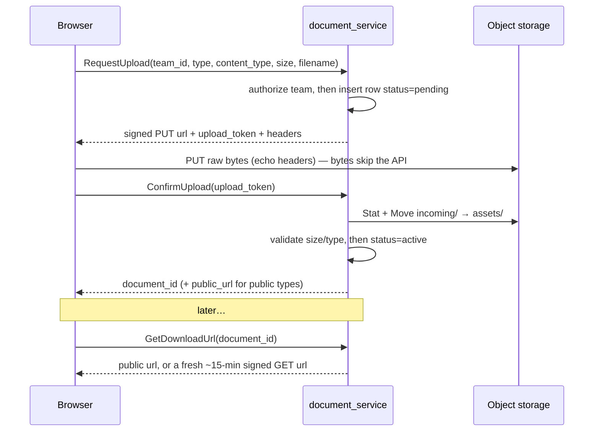

# Brainstorming — `document_service`

> Adapting a **prior internal** file-attachment service to this system. Requested on the board
> (#12). This doc **designs before it builds** (HARD RULES 6 & 7): it proposes a shape and, more
> importantly, surfaces the decisions that are the owner's to make.
>
> **Nothing is implemented yet.** And unlike `team_service`/`user_service`, this one opens with a
> genuine *"should we build it now at all?"* question (§2) — the domains that would actually attach
> documents (products, payments, orders) don't exist here yet.

> **Decisions so far**
> - **BUILT now** — the owner asked to implement it (#12), so the three RPCs ship on a **local
>   filesystem backend** behind the `Signer`/`ObjectStore` seam. GCS is deferred, not designed out.
>   (owner, 2026-07-14)
> - **`GetDownloadUrl` is team-scoped** — the inherited cross-team read gap (§6) is CLOSED: the
>   request carries `team_id` (use_scope) and the query is constrained to it, so another team's
>   document reads as NotFound.
> - **Resource types at launch: `GENERAL` (private) + `PROFILE_PICTURE` (public).** More get added
>   when real domains (products, payments) need them.
> - **Still open:** production storage backend (GCS/S3/MinIO — §4), public-ACL-vs-always-signed
>   (§4), a Delete RPC + `deleted_at` (§5). The local backend fakes signing/expiry; a real cloud
>   backend must implement them.

---

## 1. What it is

A **file-attachment / media service**. It stores user-uploaded *files* — images and PDFs — and
hands back URLs. It **generates nothing** (no PDF invoices, no shipping labels, no packing slips);
it is pure storage + serving. A business entity keeps only a `document_id` (or a public URL) and
points at the file by reference.

Its defining property: **the file bytes never transit the API server.** Upload and download go
*directly* between the browser and object storage over short-lived signed URLs; the service only
mints those URLs and tracks metadata. So the API stays small and cheap no matter how large or how
many the files are — the opposite of streaming multipart uploads through Go handlers.

Two visibility classes, chosen per upload:

| Class | Examples | How it's viewed | URL |
| --- | --- | --- | --- |
| **Public image** | product photo, profile picture, warehouse photo | straight `` | stable, permanent |
| **Private document** | payment proof, receipt, an uploaded invoice PDF | fetched on demand, shown in a viewer | fresh **~15-min signed** URL each time |

---

## 2. ⚠ Do we need it *yet*? — the real first question

The prior service's document kinds were `PRODUCT`, `TRANSACTION`, `INVOICE`, `PROFILE_PICTURE`,
`WAREHOUSE`, `GENERAL`. Every one of those presumes a domain this system **does not have yet**:
there is no product service, no payments, no orders. Today the only conceivable consumer is a
**profile picture** for a user, and even that isn't asked for.

`plans/plan.md` §1 ("what actually happens in the warehouse", "who the people are") is still empty.
Building a document service before a single screen needs to attach a file would invert HARD RULE 6
(jobs → screens → API → data), which is exactly the trap this project exists to avoid.

| Option | | Trade-off |
| --- | --- | --- |
| **A. Defer — keep this doc as the ready design** | ✅ | Honours design-order: build it the day the first real screen needs a file. The shape is small and well-understood (§3–§6), so "later" costs little. Nothing speculative ships. |
| **B. Build a minimal slice now** (`GENERAL` + `PROFILE_PICTURE` only, local-storage backend) | ⚠ | Proves the presigned-PUT pipeline end-to-end and gives the frontend an upload component to reuse — but with no real consumer it's a solution waiting for a problem, and the resource-type list will churn once real domains land. |
| **C. Port it whole now** (all resource types, GCS backend) | ❌ | Bakes in product/payment/invoice assumptions from the old system's domain model — the precise "re-derive the old design" outcome HARD RULE 1 forbids. |

**Recommendation: A (defer), or B if you want the upload primitive proven early.** Either way the
design below is the thing to agree on first.

---

## 3. The contract — 3 RPCs, a two-phase upload

The upload is **two-phase** so a half-finished upload can never leave a dangling metadata row that
claims a file which isn't there.

| RPC | Does | Scope |
| --- | --- | --- |
| `RequestUpload` | authorize the team, write a `pending` row, return a signed **PUT** URL + an opaque `upload_token` (HMAC of `id:expiry`) | team-scoped (`use_scope` on `team_id`) |
| `ConfirmUpload` | verify the token, `Stat` the object, enforce size/content-type, move `incoming/`→`assets/`, mark `active` (+ set public URL for public types) | authenticated |
| `GetDownloadUrl` | return the viewable URL for an `active` doc — stable (public) or fresh signed GET (private) | authenticated — **but see §6** |

Unconfirmed uploads sit under `incoming/teams/{teamId}/…/{uuid}.ext` and are reaped by a
storage-bucket lifecycle TTL; confirmed ones live permanently under `assets/…`. The `upload_token`
(server-signed HMAC) is what maps a confirm back to its pending row without trusting a
client-supplied id.

---

## 4. Storage model — one seam, two backends

Two small interfaces keep the handlers backend-agnostic and unit-testable — this is the part worth
adopting almost verbatim:

- **`Signer`** — `SignedPutURL(...)`, `SignedGetURL(...)`
- **`ObjectStore`** — `Stat`, `Move`, `Delete`, `SetPublic`

| Backend | Where | Notes |
| --- | --- | --- |
| **GCS** | production | V4 signed URLs signed **keylessly** via the IAM `SignBlob` API (no exported service-account key — the runtime SA signs for itself). `Move` = copy-then-delete. Public = object ACL `AllUsers:Reader`. |
| **Filesystem + HTTP endpoint** | local dev / tests | stores under a temp dir; a `/local-storage/` handler serves `GET`/`PUT`; no real signing. Never mounted in production. |

This mirrors how the rest of this system already splits prod/dev by config (Redis vs memory cache,
Postgres DSN). The dev backend means the whole upload flow works with **no cloud account** — which
is what makes it testable in the e2e harness.

**Open — the backend is not a given for us.** The prior service assumed GCS. This system hasn't
committed to a cloud. Options: GCS (as above), S3/MinIO (MinIO gives a local *and* prod story with
one API), or filesystem-only until scale demands otherwise. See §7.

---

## 5. Data model — one `documents` table

| Column | Notes |
| --- | --- |
| `id` (uuid, PK) | |
| `team_id` (indexed) | **owning team** — the scope. (A warehouse *is* a team here, per team_service §3.6, so this covers warehouse-owned files too.) |
| `resource_type` | which kind (drives public-vs-private + ACL) |
| `bucket_name`, `object_key` (indexed) | storage location; `object_key` moves `incoming/`→`assets/` on confirm |
| `mime_type`, `size`, `original_name` | `size`/`mime` re-read from `Stat` at confirm, not trusted from the client |
| `created_by_id` | uploader (best-effort audit) |
| `status` (`pending`→`active`) | no `deleted` state in the prior design — see below |
| `public_url` | set only for public types |
| `created_at` | |

One table, GORM model + goose migration (HARD RULE 3). Two things to decide for our version:

- **Soft-delete?** The prior table had none — orphan cleanup leaned entirely on the storage TTL,
  and there was no way to *remove* a confirmed document. We likely want a `deleted_at` + a
  `Delete` RPC (and an `ObjectStore.Delete` call), for consistency with how team/user handle
  removal here.
- **`updated_at`?** Absent in the prior table; trivial to add and worth it.

---

## 6. Auth & scoping — and one hole to close deliberately

Access is the system's existing ACL: `role_base.v1.request_policy` on the request message +
`use_scope` on the team field, read by the access interceptor (no new mechanism).

- `RequestUpload.team_id` carries `(use_scope) = true` → the caller must hold **a role in that
  team** to upload. Good.
- `ConfirmUpload` / `GetDownloadUrl` in the prior service were **`allow_only_authenticated`** — and
  `GetDownloadUrl` looked a document up by id + `status=active` **without re-checking the caller's
  team**. So *any* authenticated user who has (or guesses) a `document_id` can get a download URL
  for a private file belonging to another team.

That is a real cross-team read leak. For an all-internal-staff system it may be judged acceptable
(the same way team bank details were, team_service §3.1) — but it should be a **decision**, not an
inherited default. Options: (a) leave read authenticated-only; (b) re-check `team_id` on
`GetDownloadUrl` against the caller's memberships; (c) make private-doc ids unguessable (uuids
already are) and accept (a). See §7.

---

## 7. Open questions (owner)

- [ ] **Build now or defer?** (§2) — recommendation: defer, or build the minimal `GENERAL` +
      `PROFILE_PICTURE` slice on the local-storage backend to prove the pipeline.
- [ ] **Storage backend** for production: GCS, S3/MinIO, or filesystem-for-now? (§4)
- [ ] **Public images**: real public ACL (`AllUsers:Reader`, needs fine-grained ACL buckets) vs.
      *always* serving a signed URL even for images (simpler infra, no public objects)? (§4)
- [ ] **Cross-team read**: tighten `GetDownloadUrl` to a team check, or keep it
      authenticated-only? (§6)
- [ ] **Delete**: add `deleted_at` + a `Delete` RPC (recommended), or rely on storage TTL only? (§5)
- [ ] **Which `resource_type` values** exist at launch — and do we wait until a real consumer
      (product/payment) defines them? (§2)
- [ ] **Limits**: max size (prior default 10 MiB) and signed-URL TTL (prior default 15 min)?
