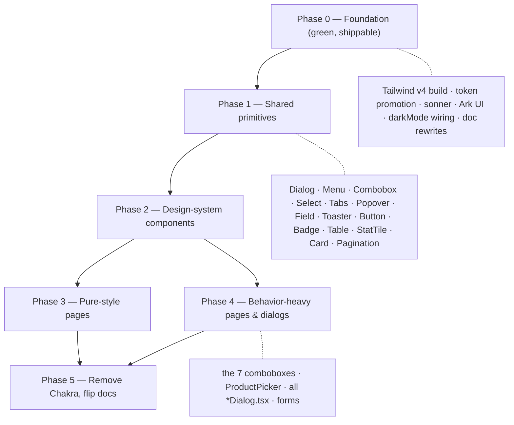

# Frontend: Chakra UI → Tailwind migration

> **Status: DONE (2026-07-24).** Chakra UI is fully removed — the app is **Tailwind CSS v4 + Ark UI**.
> Every phase landed on `dev`, green (tsc + build) at each commit. `@chakra-ui/react` and
> `@emotion/react` are uninstalled; no `@chakra-ui`/`@emotion` reference remains in `src/` or `e2e/`.
> Verified at runtime: the login→walk smoke flow, a dark-mode ([data-theme]) render, and the auth e2e
> (9/9, incl. the theme toggle). This doc is now the record of how it was done.
>
> **Phases:** 0 foundation · 1 primitives (15) · 2 shared components (~30) · 3 pages+layouts+dialogs
> (~80, two fan-out rounds) · 5 removal. One real regression caught by the smoke and fixed: Ark keeps
> closed overlays mounted (Chakra unmounted them), so `ui/Dialog`/`Menu`/`Popover` now
> `lazyMount + unmountOnExit`.

## Decision log

| # | Decision | Who | State |
| --- | --- | --- | --- |
| D1 | The **mocks are the SOURCE OF TRUTH** for UI design (they are Tailwind now). | owner | ✅ set |
| D2 | The **app's styling layer becomes Tailwind CSS, not Chakra UI v3**. | owner | ✅ set |
| D3 | Headless/behavior library to replace Chakra's composites | owner | ✅ **Ark UI** (2026-07-24) |
| D4 | Transition strategy (coexistence vs big-bang) | owner | ✅ **coexistence, incremental** (2026-07-24) |
| D5 | Keep the shared-component **API** stable vs redesign the component layer | owner | ✅ **preserve API** (2026-07-24) |
| D6 | Dark-mode signal: `.dark` class vs `[data-theme]` attribute | owner | ✅ **`[data-theme]`** (2026-07-24) |
| D7 | Tailwind **v4** (`@theme`, `@tailwindcss/vite`) vs **v3** (JS config) | owner | ✅ **v4** (2026-07-24) |

**All phases DONE (2026-07-24), in order, each green on `dev`:**
- **Phase 0 — foundation.** Tailwind v4 + `@tailwindcss/vite` + Ark UI + sonner; `src/index.css` holds
  the dark-aware token block + `@theme` mapping; dark mode on `[data-theme]`; governing docs flipped.
- **Phase 1 — 15 primitives**, each screenshot-verified light/dark: `Button`/`IconButton`, `Badge`,
  `Spinner`, `Input`, `Field`, `Select`, `Combobox`, `Menu`, `Dialog`, `Tabs`, `Table`, `Card`,
  `StatTile`, `Popover`, `Checkbox`, `Toaster` (sonner). Same part-names as Chakra, so migration is an
  import swap; Ark UI is the same Zag engine Chakra v3 used, so behaviour transfers.
- **Phase 2 — ~30 shared components** in `components/` migrated (pickers keep #131/#136/#138 rules).
- **Phase 3 — ~80 pages/layouts/dialogs** migrated in two fan-out rounds (shell + read pages, then
  form/dialog pages + the 7 feature dialogs), mirroring the mocks.
- **Phase 5 — removal.** `ChakraProvider` gone, `theme.ts` deleted, Preflight re-enabled, `.dark`
  dropped (e2e assertions → `[data-theme]`), vite chunk retargeted to `ark`, both deps uninstalled.

**Verified:** `tsc` + `vite build` green throughout; the login→walk smoke, a dark-mode render, and the
Playwright e2e suite pass at runtime — **95/97**, every spec green **in isolation**. The one full-suite
miss is `settlement.spec:153`: it asserts the global "total payable" tile equals *its own* 25.000 seed,
but the tile correctly sums ALL of Root's payables, which other specs (sharing the Root team) inflate
to 33.000. It passes in isolation, the migrated UI shows the correct total, and a frontend migration
can't change backend data — so it's a pre-existing cross-spec test-isolation issue, not a regression
here. (The follow-on `:174` then "did not run" — serial.)

**Behavioural regressions the smoke + e2e caught (all fixed) — the parts a screenshot can't show:**
1. **Closed overlays stayed mounted.** Ark keeps closed dialog/menu content in the DOM; Chakra
   unmounted it — a hidden 2nd "Username" field broke login. → `ui/Dialog`/`Menu`/`Popover` default to
   `lazyMount + unmountOnExit`.
2. **Composable Selects flattened to native.** `PaymentType/Marketplace/ExpenseKind/TeamType` were
   Chakra composable `Select`s (the owner's choice over `NativeSelect`); the fan-out made them native
   `<select>`, breaking their click-to-open e2e. → added a `ui/SelectMenu` (Ark Select) primitive and
   reverted the four.
3. **Pickers inert inside modals.** A portalled combobox/select popup lands outside an open dialog,
   which Ark makes `inert` → options unclickable. → `ui/Combobox`/`ui/SelectMenu` render **inline**
   (like CategorySelect always did).
4. **Buttons submitted their form.** A native `<button>` in a `<form>` is `type="submit"`; Chakra
   defaulted to `button`. Clicking a picker/Cancel submitted the form (product-create's Save vanished).
   → `ui/Button`/`IconButton` default `type="button"`.

These four are the load-bearing behaviours the audit predicted would be invisible in a screenshot —
each surfaced by the e2e, not the eye.

> **D3 rationale (owner):** Ark UI — Chakra v3 is built on it, so composable call-sites port ~1:1;
> and it has a Combobox (Radix doesn't), which the 7 pickers require. A headless lib is *unstyled*,
> so it does **not** deviate from the mocks: the mock's Tailwind classes drive 100% of the look; Ark
> only supplies the behavior the static mock can't (focus-trap, keyboard nav, ARIA, positioning).

D1/D2 are the owner's; everything below derives from them. **This is a multi-week migration, not a
restyle** — see the blast radius.

---

## 1. The blast radius (audit, 2026-07-24)

- **113 of 177** frontend files import `@chakra-ui/react`.
- **~1,500 uses of behavioral composites** across **72 files** — focus-trap, portalling, keyboard
  nav, ARIA, controlled-open state. **Tailwind does NOT provide any of this** — it is styling only.
- **~207 `colorPalette` uses across ~90 files**; **~87 `toaster.create` calls across 49 files**.
- **No Tailwind in the app build today** — no `tailwindcss`/`postcss`/config anywhere under
  `frontend/`. The mocks reach Tailwind only through the Play **CDN**, which is NOT a real build.

| Subsystem | Size | Effort | The crux (what Chakra gives that Tailwind won't) |
| --- | --- | --- | --- |
| Design-system core (`theme.ts`, provider, toasts) | 8 files | **M** | semantic tokens, `colorPalette` ramps, default `size=sm`, `createToaster`, Emotion runtime |
| Build & deps | 11 files | **M** | stand up Tailwind (real build) + headless + toast libs; remove Chakra last |
| **Headless/behavior inventory** | 177 scan | **XL** | Dialog 25f/499 refs · Combobox 7f/145 · Tabs 9f/132 · Select 5f/95 · Menu 5f/87 · Portal 44f · Field 33f |
| Shared components A (15) | 15 files | **L** | badges/inputs mostly; AddressPicker/CategorySelect/ConfirmDialog hard |
| Shared components B (13) | 13 files | **XL** | **7 comboboxes + ProductPicker** — the pickers with #131/#136 rules baked in |
| App shell / nav / i18n | 17 files | **L** | user-card `Menu`, modal `TeamSwitcher`, per-team palette, responsive props |
| Read/list/detail pages | 32 files | **L** | 76 `Table` blocks, kebab `Menu`, `Tabs` — mechanical but large |
| Form & dialog pages | 22 files | **XL** | `Dialog` (focus-trap) + `Field` (label/aria) across ~100 fields |
| Playwright e2e | 20 specs | **S** | **83% `getByTestId`** — a strong safety net if testids are carried over |
| Mocks as visual spec | 19 mocks | **L** | look is ~free; **behavior & a11y are entirely absent from the mocks** |
| Governing docs | 4 docs | **M** | CLAUDE.md/README/design-tokens/plan all still say "app = Chakra, mocks = throwaway" |

### The two things that dominate the risk
1. **Behavior is not styling.** The mock's `.js-menu` display-toggle has *no* focus trap, no
   roving-tabindex keyboard nav, no `aria-activedescendant`, no collision-aware positioning. Porting
   overlays to that pattern ships a **visually-correct, accessibility-broken** app. → a headless
   library is **required** (§4.1).
2. **The 7 combobox pickers** (`ProductSelect`, `UserSelect`, `ShippingSelect`, `SupplierSelect`,
   `TeamSelect`, `RoleSelect`, `AddressPicker`) carry invisible, hard-won rules — the #131
   display-text-from-value derivation, clear-to-empty as a real value, `bigint` id round-tripping,
   inline-vs-portal (`CategorySelect` renders inline to survive inside a modal). A naive rebuild
   silently reintroduces bugs that were fixed the hard way.

---

## 2. What survives the migration untouched (good news)

- **`lib/colorMode.ts`** — already framework-agnostic (pure DOM + `useSyncExternalStore`, zero Chakra
  imports). The no-flash pre-paint script in `index.html` stays too.
- **`react-i18next`** (`i18n/*`, all `t("…")` call sites), **`react-router`** (`router.tsx`),
  **`nav.ts`**, **`roles.ts`**, all `features/*/queries.ts` and the pure helpers — **no Chakra**.
  ⚠ Do NOT adopt the mocks' toy `data-i18n` text-swap; keep real i18n.
- **`lucide-react`** icons — render as sized SVG; only the `<Icon boxSize>` wrapper is dropped.
- **All data/state/validation logic** in components and pages is framework-neutral and ports as-is —
  only presentation changes.
- **e2e (83% testid)** — the safety net that lets us migrate **page-by-page** with confidence.
  ~25 Chakra-coupled selectors need a one-line pre-fix each (e.g. `toHaveClass(/dark/)` →
  `toHaveAttribute('data-theme')`).

---

## 3. Recommended architecture

**Primitives-first, then fan out, Chakra & Tailwind coexisting until the last file lands.**

- **Phase 0 — Foundation.** Add the real Tailwind build (not the CDN), promote the token set into
  it (extend the mock subset — see §3.1), wire `darkMode`, add the headless + toast libs, and rewrite
  the governing docs. Chakra still runs; nothing visually changes yet. **This is the first green,
  shippable increment** and the one I'd land first.
- **Phase 1 — Shared primitives (once, on one engine).** `Dialog`/`ConfirmDialog`, `Menu`,
  `Combobox`, `Select`, `Tabs`, `Popover`, `Field`, `Toaster`, plus the visual molecules `Button`,
  `Badge`/status badges, `Table`, `StatTile`, `Card`, `Pagination`. Everything downstream reuses these.
- **Phases 2–4** migrate components then pages against those primitives, each validated by its own
  Playwright spec (testids intact). Pure-style pages first (fast wins), behavior-heavy last.
- **Phase 5** removes `@chakra-ui/react` + `@emotion/react`, regenerates the lockfile (the ~90
  transitive `@zag-js/*` disappear), and flips the docs' "in progress" to "done".

### 3.1 Token promotion — the mock `:root` set is a SUBSET of `theme.ts`
The mock tokens cover colors + radii + shadow + font, but **omit**: the `brand.50–950` ramp, the
`l2`/`l3` radii aliases, the semantic spacing scale (`field`/`card`/`section`/`page`), and the
`textStyle` roles (`label`/`caption`/`statValue`/`numeric`) + heading sizes (22/15/26). These live
**only** in `theme.ts` today. They must be re-expressed as Tailwind theme values or the app drifts.

### 3.2 The one dependency the choice can't avoid
**Radix has no Combobox.** The 7 server-backed searchable pickers force either **Ark UI** (has it) or
an add-on like **Downshift/cmdk** alongside Radix. This drives §4.1.

---

## 4. Open questions — owner's call (HARD RULE 8)

### 4.1 Headless/behavior library  ⬜
| Option | ✅ | ❌ |
| --- | --- | --- |
| **Ark UI** (recommended) | Chakra v3 is *built on* Ark UI / Zag.js — the composable call-sites (`Dialog.Root/Positioner/Content`, `Combobox.Root`, `Menu.RadioItemGroup`) transfer nearly 1:1; has Combobox, Select, Tabs, everything used | new dep; still must be Tailwind-styled |
| Radix + Downshift/cmdk | very mature a11y | **no combobox** (needs a 2nd lib); API diverges from current code → more rewrite |
| Headless UI | tiny, Tailwind-native | no combobox/number-input; thin widget set strands the pickers |
| Hand-roll on `.js-menu` | no dep | **rejected** — reships a11y-broken overlays; the mock pattern is visual-only |

### 4.2 Transition strategy  ⬜
| Option | ✅ | ❌ |
| --- | --- | --- |
| **Coexistence, incremental** (recommended) | `dev` stays green every commit; each page validated by its e2e spec; low blast per PR | Chakra + Tailwind both in the bundle for the duration |
| Big-bang rewrite | one clean cut, no dual-stack window | huge un-reviewable diff, `dev` red for a long stretch, high regression risk |

### 4.3 Shared-component API  ⬜
| Option | ✅ | ❌ |
| --- | --- | --- |
| **Preserve the API** (recommended) | wrap Ark+Tailwind behind the *same* component props (`ConfirmDialog`, `RackSelect`, `Pagination`…), so the 113 consuming files change imports/markup but not call patterns; invisible rules (#131/#136/#138) stay in one place | wrappers add a thin layer |
| Redesign the component layer | clean-sheet ergonomics | every call site rewritten; invisible rules easily lost; much larger surface |

### 4.4 Dark-mode signal  ⬜
The app uses the `.dark` **class** (`colorMode.ts`, key `wh-color-mode`); the mocks use the
`[data-theme]` **attribute** (key `mock-theme`). They must unify or dark mode silently no-ops.
| Option | ✅ | ❌ |
| --- | --- | --- |
| **`[data-theme]` attribute** (recommended) | matches the mocks (now the source of truth) — the app inherits the mock `tailwind.config` verbatim; only `colorMode.ts` + `index.html` script + **3** e2e assertions change | app's current convention changes |
| Keep `.dark` class | Tailwind's zero-config default; `colorMode.ts` already uses it | must re-touch all 19 mocks + their configs |

### 4.5 Tailwind version  ⬜ (proposed: v4)
| Option | ✅ | ❌ |
| --- | --- | --- |
| **Tailwind v4** (recommended) | CSS-first `@theme` in `index.css` fits the `:root` var block near-verbatim; `@tailwindcss/vite` needs no PostCSS/autoprefixer | mocks' config is v3-style (trivial to port; mocks are the *visual* spec, not the build) |
| Tailwind v3 | JS `tailwind.config` matches the mock config object exactly | legacy default; PostCSS pipeline; being superseded |

---

## 5. Docs to rewrite (part of Phase 0)
All four currently encode the OLD direction and **override future work** until fixed:
- **CLAUDE.md** — Stack line ("Chakra UI v3") and the entire "The design system" section (build-from-
  Chakra rules, `<Icon boxSize>`, "never a bare `
`"). ⚠ Highest priority — it steers every task.
- **mocks/README.md** — "Not the design system / throwaway / never graduates" → mocks ARE the source
  of truth and the same Tailwind the app ships.
- **plans/design-tokens.md** — retitle away from "Chakra semanticTokens"; point the token home at the
  Tailwind config / `index.css`. ⚠ It's the anti-drift contract — rewrite carefully.
- **plans/plan.md §2.2** — record the stack decision (was "Not decided") + a Session-log entry.

---

## 6. Non-goals / preserved invariants
- Keep `react-i18next`, `react-router`, `colorMode.ts`, `nav.ts`, `roles.ts`, all `queries.ts`,
  `lucide-react` — none are Chakra.
- Carry **every `data-testid`** verbatim; keep semantic HTML (`<nav>/<button>/<a>/<h1>/<table>`) so
  the ~47 role-based e2e selectors survive.
- Preserve the pickers' invisible rules (#131 display-from-value, #136 net-to-zero, #138
  warehouse-total badge, RackSelect selectable-unplaced) and the destructive-confirm HARD RULE.
- Keep Portalling for overlays (with `CategorySelect`'s deliberate inline exception).
