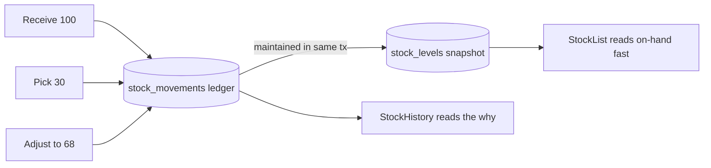
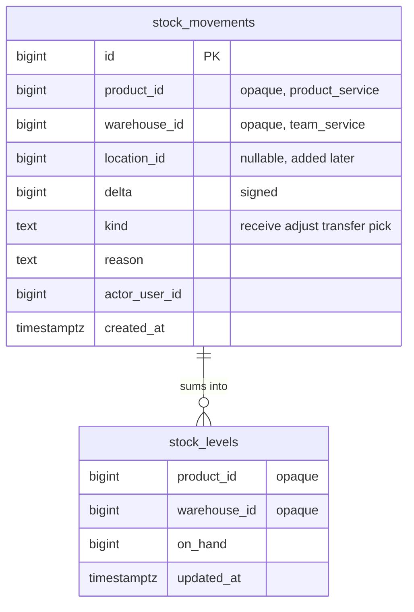
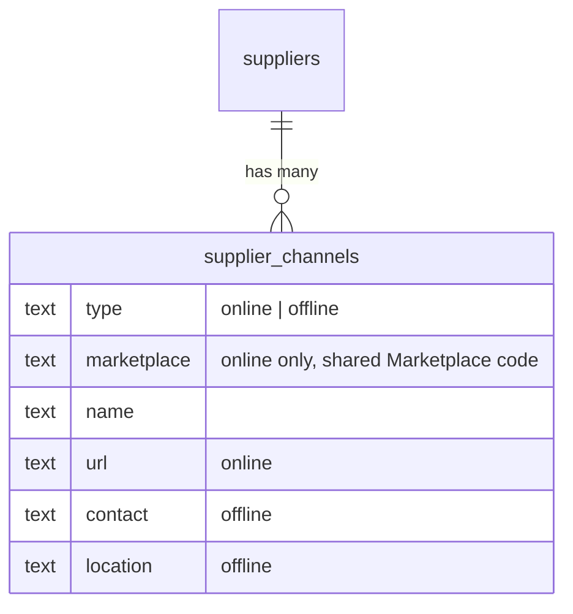

# Brainstorming — `inventory_service`

> The warehouse's answer to one question: **how much of each product is where, right now — and
> why did it change?** Everything else (picking, counting, transfers, reconciliation) is a
> consequence of getting that one thing right.
>
> Nothing here is built. Nothing is decided until it is in the decision log.

> **Decisions so far**
> - **Suppliers live in `inventory_service`** (#103) — a team's vendors, team-scoped CRUD.
> - **A supplier has channels** (#120) — online (a store on a marketplace) or offline (a physical
>   shop). See §10.
> - **`Marketplace` is a shared proto** (#120, owner call) — promoted out of `warehouse.selling.v1`
>   into `warehouse.marketplace.v1`, referenced by both selling (shops) and inventory (supplier
>   channels); the text encoding lives once in `pkgs/san_marketplace`.
>
> **Hard constraints inherited from the system**
> - **Per-service.** `inventory_service` owns its own models + goose migrations; no shared model
>   package, no cross-service FK. Product and warehouse ids are **opaque** here and resolved over
>   RPC (`ProductByIds`-style, `TeamByIds`). (HARD RULE 2/3)
> - **Roling.** Every RPC declares its policy on the request message; a stock RPC is
>   warehouse-scoped, so `warehouse_id` (a team id) carries `(use_scope)`. (Authorization section
>   of CLAUDE.md)
> - **Pagination.** Any stock list that grows with the catalogue pages. (HARD RULE 9)
> - **Design order: jobs → screens → API → data model.** (HARD RULE 6)

---

## 0. The blocker: this is downstream of `plan.md` §1

`plan.md` §1 — *what physically happens in the warehouse* — is **still empty and owner-blocked**.
Inventory is the service most sensitive to it: whether we track stock per **warehouse** or per
**bin**, whether we **scan** or type, whether **reservations** exist — all of these are decided by
the real operation, not by us. So this doc:

1. designs the part that is **true regardless** of §1 (what inventory fundamentally is), and
2. names the decisions that are **hostage to §1**, so they are visible and unbuilt until answered.

We can start the §1-independent core now; the rest waits. See §7 (sub-issues) for the split.

---

## 1. First principles — what inventory *is*

Strip away the screens and inventory is three nouns and one verb:

- **A product** — *what* (already owned by `product_service`; opaque `product_id` here).
- **A place** — *where* it sits. At minimum a **warehouse** (a team of type `WAREHOUSE`). Maybe
  finer: a rack/bin **location** inside a warehouse. (Open — §3.)
- **A quantity** — *how much* is at that place.
- **A movement** — the verb. Quantity never changes by magic: goods **arrive**, **move**, **leave**,
  or are **counted and corrected**. Every change is an event with a cause.

The whole service is: record movements truthfully, and answer "how much of X is at Y" fast.

### 1.1 The jobs inventory must serve (derived from `plan.md` §1.2, which is still blank)

| Job (physical) | The movement it produces | §1-blocked? |
| --- | --- | --- |
| Goods arrive at the door | **Receive** (+qty into a warehouse) | partly (where exactly?) |
| Put away to a rack | **Put-away** (move within a warehouse) | **yes** — needs locations |
| Pick for an order | **Pick / issue** (−qty) | **yes** — needs the order/selling side |
| Count / stock-take | **Adjustment** to a counted figure | no (warehouse-level) |
| Something is damaged / lost | **Adjustment** (−qty, reason) | no |
| Move stock between warehouses | **Transfer** (−here, +there) | no |
| A return comes back | **Receive** (return reason) | partly |

The **bold-not-blocked** rows (receive, adjust, transfer, count) form a coherent core that does
not need §1's fine detail. The blocked rows (put-away, pick) need locations and/or the selling
side and wait.

---

## 2. The core model — ledger vs snapshot

The single most important decision. How is "how much is here" stored?

| Option | How | ✅ | ❌ |
| --- | --- | --- | --- |
| **A. Snapshot only** | one row per (product, warehouse) with a `qty`; every movement `UPDATE`s it | fast reads; tiny table | **no history** — cannot answer "why is this wrong?", no audit, races on concurrent updates |
| **B. Ledger only** | append-only `stock_movements`; on-hand = `SUM(delta)` on read | full audit; reconcilable; no lost history; natural concurrency (insert-only) | on-hand is a `GROUP BY` scan — slow as movements grow |
| **C. Ledger + derived snapshot** *(recommended)* | ledger is the **source of truth**; a `stock_levels` row per (product, warehouse) is **maintained from it** in the same tx | fast reads **and** full history; snapshot is rebuildable from the ledger, so a bug is recoverable | two writes per movement; the snapshot-update must be transactional |

**Leaning C.** A warehouse system's whole value is *trust in the number*, and trust needs the
ledger. The snapshot is just a cache of `SUM(delta)` that we keep honest inside the movement's
transaction. Deny-by-default's cousin: the ledger is truth, the snapshot is convenience.

---

## 3. How fine is "where"? — location granularity

Directly hostage to §1 (are there racks? is anything labelled?).

| Option | Grain | ✅ | ❌ |
| --- | --- | --- | --- |
| **A. Warehouse-level** *(start here)* | qty per (product, **warehouse**) | simple; matches "how much do we have at Jakarta?"; no §1 needed | cannot direct a picker to a shelf |
| **B. Location-level** | qty per (product, **location**), location belongs to a warehouse | enables put-away + directed picking; scan a bin | needs a `locations` model, labelling, and §1 to say it is real |

**Proposal:** ship **A**, and design the movement/ledger so a `location_id` can be **added later**
without a rewrite (nullable now, meaning "somewhere in the warehouse"). Do not build B until §1
says racks and labels exist.

> **Update (#129): racks exist.** The owner asked for rack management — a warehouse writes down its
> racks (`code`, the label on the shelf; CRUD + soft delete). So the question this section says is
> "hostage to §1" — *are there racks, is anything labelled?* — is answered **yes** for the registry.
>
> **It does NOT decide option B.** #129 asked for "essential first", and that is what was built: a
> LIST of racks. Nothing points at one, and stock is still counted per (warehouse, product). Whether
> a movement carries a `location_id` — whether stock lives ON a rack — is still the open call here,
> and it is a bigger one: it changes the ledger, the put-away job, and every stock read. Racks being
> real is the **prerequisite** for asking it, not the answer.

---

## 4. Whose product is in whose warehouse?

A real cross-service question, because `product_service` scopes a product to **one team** (a
selling or warehouse team), while a warehouse is a **different** team.

- A `SELLING` team's product physically sits in a `WAREHOUSE` team's building.
- So an inventory row is fundamentally **(product_id, warehouse_id, qty)** — and `product_id`'s
  owning team may differ from `warehouse_id`.

| Question | Options |
| --- | --- |
| Can a warehouse hold products it does not "own"? | **Yes** (3PL-style — the warehouse stores other teams' goods) · No (only own-team products) |
| Who may read a warehouse's stock? | warehouse staff (scoped to `warehouse_id`) · the product's owning team too? |
| Scope key on stock RPCs | **`warehouse_id`** (the physical place, and the thing staff have a role in) |

**Leaning:** scope stock operations by **`warehouse_id`** (that is where the person stands and what
they have a role in), and treat `product_id` as an opaque reference resolved via `product_service`.
Whether cross-team storage is allowed is an **owner call** (§8).

---

## 5. On-hand vs available — reservations

When an order is being picked, is its stock **reserved** so two orders can't claim the same unit?

- **On-hand** = physically present.
- **Available** = on-hand − reserved.

Reservations only mean something once the **selling/order side** exists and is in scope — which is
itself an open question in `plan.md` (§4: "just the warehouse, or the money/selling side too?").

**Proposal:** **out of scope for v1.** Track on-hand only. Add `reserved` (and available = on-hand −
reserved) when the order side lands. Designing it now would be inventing the selling side, which the
clean-slate rule forbids without the owner.

---

## 6. Shape it would take (sketch, not a commitment)

Following the roling + pagination rules. All illustrative — the real proto is derived *after* the
screens (HARD RULE 6), once §1 is answered.

**Models** (`inventory_service_models/`):
- `stock_movement` — id, product_id, warehouse_id, location_id (nullable), delta (signed), kind
  (receive/adjust/transfer_out/transfer_in/pick), reason, ref (opaque, e.g. an order id), actor
  user_id, created_at. **Append-only.**
- `stock_level` — (product_id, warehouse_id) unique, on_hand, updated_at. Derived from the ledger.

**RPCs** (`warehouse.inventory.v1`), each scoped by `warehouse_id (use_scope)`:
- `StockList` — on-hand per product at a warehouse (paged, searchable by product) — reads the snapshot.
- `StockHistory` — the movement ledger for a product at a warehouse (paged) — reads the ledger.
- `StockReceive` — record incoming goods (+qty).
- `StockAdjust` — correct to a counted figure (writes the delta + a reason).
- `StockTransfer` — move between two warehouses (a −out + a +in; a small saga if the two
  warehouses are ever different services — they are not, so one local tx).

---

## 7. Breaking it up — proposed sub-issues

Per the issue ("break this to many issue if this too big"). Sequenced so the §1-independent core
lands first and the §1-blocked parts wait. Each is small enough to be one PR-sized unit.

**Ready to start (no §1 needed):**
1. **Scaffold `inventory_service` + core stock model** — service dir, `stock_movement` +
   `stock_level` models, goose migration, register. Ledger + derived snapshot (§2 option C).
2. **`StockReceive` + `StockList`** — record incoming goods; read on-hand (paged). The first
   end-to-end slice.
3. **`StockHistory`** — the movement ledger for a product (paged), so a wrong number is explainable.
4. **`StockAdjust`** — correct to a counted figure with a reason (backs stock-take).
5. **`StockTransfer` between warehouses** — −out/+in in one tx.
6. **Frontend: warehouse stock screen** — on-hand list + receive + adjust, scoped to a warehouse.

**Blocked on `plan.md` §1 / scope (do NOT create until answered):**
7. **Locations / bins** (§3 option B) — needs "are there racks, is anything labelled?".
8. **Put-away & directed picking** — needs locations + the order side.
9. **Reservations / available-to-promise** (§5) — needs the selling/order side in scope.

---

## 8. Open questions (owner input required)

- [ ] **`plan.md` §1 itself** — the warehouse operation. Nothing past sub-issue 6 proceeds without it.
- [ ] **Scope:** is v1 warehouse-only (on-hand + movements), or does it reach into the selling/order
      side (reservations, picking)? (`plan.md` §4 open question.)
- [ ] **Location granularity:** warehouse-level to start (recommended), or bins from day one?
      Driven by "is anything barcoded / are there labelled racks?" — **racks are labelled and now
      exist as a registry (#129), so the premise is settled; the granularity call is not.** The open
      part is whether a stock movement carries a `location_id`, which changes the ledger and every
      stock read. Still the owner's.
- [ ] **Cross-team storage:** may a warehouse hold another team's products (3PL-style), or only its
      own team's? (§4)
- [ ] **Core model:** confirm ledger + derived snapshot (§2 option C) is the direction.
- [ ] **Units:** whole units only, or fractional / multiple UoM (e.g. box vs piece)? (Likely whole
      units v1 — confirm.)
- [ ] **Negative on-hand:** hard-forbid (a pick cannot exceed on-hand) or allow-and-flag (reality
      sometimes goes negative before a correction)?

---

## 9. Suppliers & their channels (#103, #120)

Suppliers were added to `inventory_service` (#103) — a team's vendors, the counterpart to "who do we
buy stock from?". #120 asks the next question: **how do we actually reach a supplier to order?** A
supplier is one entity but a team may reach it several ways — an official Shopee store, a TikTok
shop, a physical shop you call. So a supplier **has many channels**.

**Channel shape.** A `supplier_channels` row is one contact route, of one of two kinds:

| Kind | What it records | Fields |
| --- | --- | --- |
| **Online** | a store on a marketplace | `marketplace` (required) + `name` + `url` |
| **Offline** | a physical shop | `name` + `contact` + `location` |

- `type` and `marketplace` are stored **as text** and mapped in the handler (no `CHECK` IN-list —
  #80). The handler enforces the pairing: an **online** channel must name a marketplace; an
  **offline** one stores none (a marketplace on the request is ignored).
- `supplier_id` is a **real FK** (same service), `ON DELETE CASCADE`. Scope to a team is enforced by
  the handler (verify the supplier is an active supplier in the scoped team, then operate on its
  channels) — the same "verify the parent, then touch the child" shape as `shop_users`. A channel of
  another team's supplier reads as **NotFound**.
- CRUD: `SupplierChannelList` (paged, per supplier), `Create`, `Update`, `Delete`. Managers write;
  the broad team read (incl. warehouse roles + customer service) can list. Channels are **hard**
  deleted — unlike suppliers, a channel carries no history worth keeping.

**Why `Marketplace` became shared.** The marketplace list (Shopee, TikTok, …) was born in
`warehouse.selling.v1` because shops needed it first (#66). But a marketplace is not a *selling*
concept — it is a shared vocabulary of e-commerce platforms, and a **supplier** lives on one just as
a **shop** does. Rather than couple inventory→selling (an import across domains) or duplicate the
enum, the owner chose to **promote it** to a neutral `warehouse.marketplace.v1`, referenced by both.
The canonical *text* form is likewise shared, in `pkgs/san_marketplace` (a pure stateless helper —
HARD RULE 3 bans shared *models*, not helpers), so the two domains cannot drift to different
encodings of "shopee".

**Not yet.** A channel is just contact info today — ordering *through* a channel (a purchase order, a
received shipment tied back to the channel it came from) is downstream of the warehouse receiving
flow (§1) and is not built.

---

## 10. Session log

- **2026-07-15** — Opened the doc from issue #22. Framed inventory from first principles (movements
  ledger + derived on-hand), separated the §1-independent core from the §1-blocked detail, and
  proposed a sub-issue breakdown. All key model/scope decisions raised as options — none settled.
- **2026-07-16** — Added supplier **channels** (§9, #120): online/offline contact routes per
  supplier. Recorded the owner's call to **promote `Marketplace` to a shared proto**
  (`warehouse.marketplace.v1`) referenced by both selling and inventory, with the text encoding in
  `pkgs/san_marketplace`. Supplier now has a detail page reached by clicking the row.
- **2026-07-17** — Restock editability (#131), from the owner's rule *"when restock not accepted by
  warehouse, it's freely edited"*. This settles a question the lifecycle had left implicit: **which
  state is writable**. The answer is that **`pending` is the only one**, and the reason is physical —
  before acceptance nothing has moved, so a request is still just an *intention* its author owns and
  may rewrite in full (the target warehouse included). Acceptance is the point of no return: it *is*
  the stock movement, so a `fulfilled` request is a record of something that physically happened and
  editing it would be rewriting history, not changing a plan. `cancelled` is closed for the same
  reason in reverse — editing it would quietly un-close it.
  - The consequence worth remembering: **edit is a full replace, not a patch**, because the edit
    screen is the create form re-opened. That makes "the person cleared this field" expressible at
    all — a patch shape would have to invent an absent-vs-empty distinction the form does not have.
  - **A lesson that generalises past restock: adding an edit form re-judges every picker on it.** Two
    habits that are harmless on a create-only form turn into bugs the moment the same form re-opens on
    a saved row, and both bit here:
    1. **A "force a choice" placeholder becomes a WRITE-ONCE field.** `SupplierSelect` and
       `ShippingSelect` rendered their empty option `disabled`. Nothing is recorded yet on a create
       form, so that reads as helpful; on an edit form it means a supplier or courier recorded by
       mistake can never be removed — while the contract, the handler and its test all support
       clearing it. The rule: **if "none" is a legal value, its option must be selectable.**
    2. **A picker whose options arrive over the network cannot display a value prefilled at mount.**
       The combobox derives its display text once, against a collection that is still empty, and never
       re-derives — so the field renders blank though a value is set. Every use before this one
       mounted empty and let the person pick, which is why it had never shown.
    Both are worth re-checking on the next edit screen (`#133` and after), not re-discovering.
- **2026-07-17** — Accepting a restock is **counting** (#133), settled with the owner. This is a bigger
  call than it looks, so it is recorded as a principle rather than a feature: **a request is a promise;
  a delivery is a fact, and the system must never let one stand in for the other.** Until now,
  accepting received exactly the quantities that were asked for — which quietly assumed the promise
  always comes true. It does not: 9 of the 10 arrive, one is damaged, a line never turns up, and
  occasionally 11 come. Receiving the ask on the warehouse's behalf is *inventing stock it does not
  physically have*, and stock that exists only in the database is the one thing an inventory system
  must never produce.
  - **Stock receives `received_quantity`, counted by the warehouse.** `quantity` (asked) stays on the
    line untouched. Both are kept because **the gap between them is the point** — it is what someone
    chases the supplier about; a record that quietly said 9 were asked for would erase the discrepancy
    it exists to show.
  - **A short count still fulfils** (the owner's call). The goods arrived and the request has done its
    job; the shortfall lives on the line rather than in the status. The alternative — a
    `partially_received` state that stays open for a second delivery — was considered and **not**
    taken: it needs a new state and a rule for when it finally closes, and no one has asked for a
    restock to arrive in two deliveries yet.
  - **An incomplete count is refused, not interpreted.** A line left out would have to mean "all of it
    came" or "none did", and a system that guesses which is a system whose stock drifts. There is
    deliberately no "accept as asked" shortcut — that shortcut is precisely how a warehouse ends up
    holding stock nobody counted.
  - **Still open** (not settled here): what a discrepancy should *trigger*. Today it is recorded and
    visible, and nothing else happens — nobody is notified, and no one is accountable for the missing
    one. Who chases it, and whether the selling team is told, is a §1 question about accountability —
    see the §0 blocker.
  - Still open, and deliberately not settled here: whether the warehouse should be able to **request a
    change** rather than only accept/refuse (today it has no say short of refusing). That only
    matters once §1 says who is accountable for a wrong restock — see the §0 blocker.
