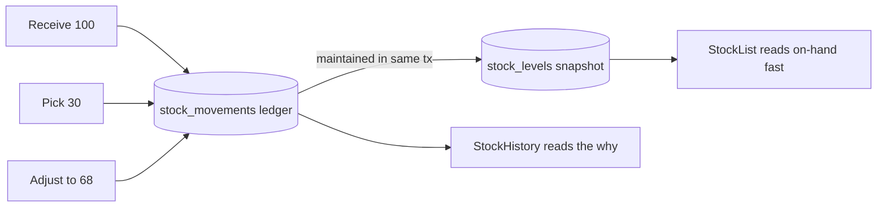
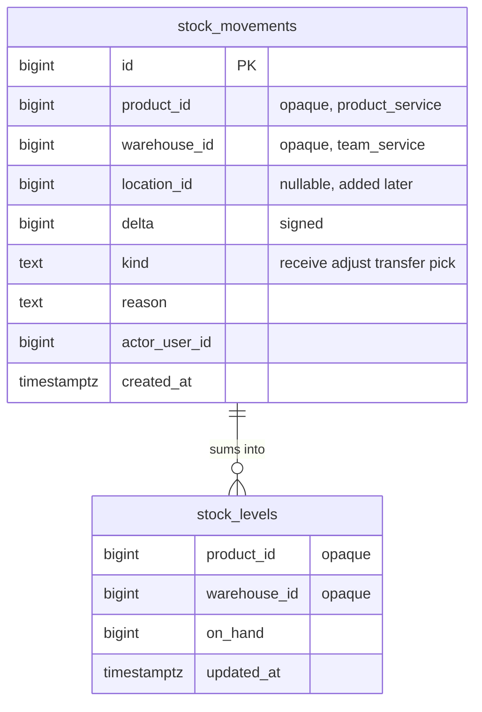
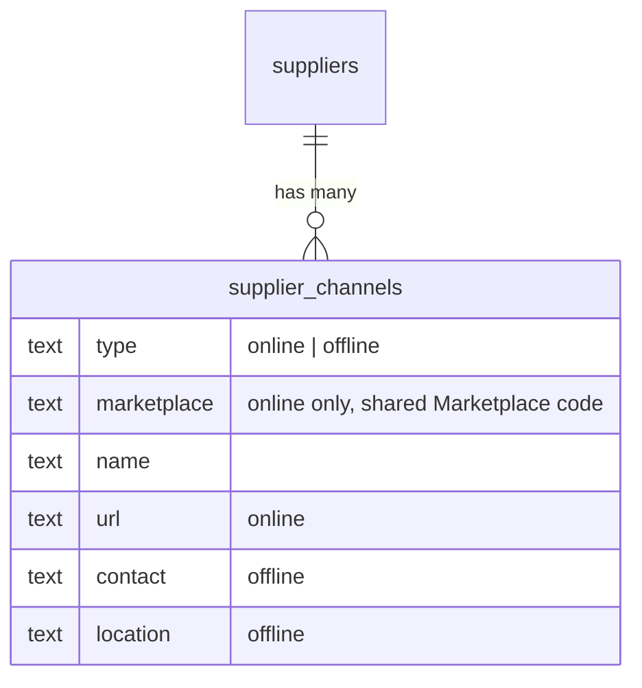
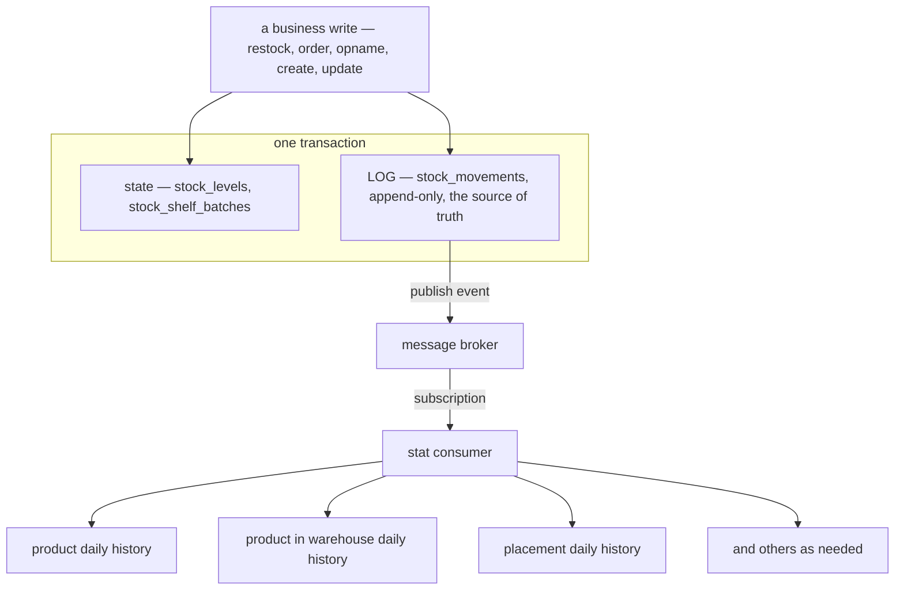

# Brainstorming — `inventory_service`

> The warehouse's answer to one question: **how much of each product is where, right now — and
> why did it change?** Everything else (picking, counting, transfers, reconciliation) is a
> consequence of getting that one thing right.
>
> Nothing here is built. Nothing is decided until it is in the decision log.

> **Decisions so far**
> - **Suppliers live in `inventory_service`** (#103) — a team's vendors, team-scoped CRUD.
> - **A supplier has channels** (#120) — online (a store on a marketplace) or offline (a physical
>   shop). See §10.
> - **`Marketplace` is a shared proto** (#120, owner call) — promoted out of `warehouse.selling.v1`
>   into `warehouse.marketplace.v1`, referenced by both selling (shops) and inventory (supplier
>   channels); the text encoding lives once in `pkgs/san_marketplace`.
>
> **Hard constraints inherited from the system**
> - **Per-service.** `inventory_service` owns its own models + goose migrations; no shared model
>   package, no cross-service FK. Product and warehouse ids are **opaque** here and resolved over
>   RPC (`ProductByIds`-style, `TeamByIds`). (HARD RULE 2/3)
> - **Roling.** Every RPC declares its policy on the request message; a stock RPC is
>   warehouse-scoped, so `warehouse_id` (a team id) carries `(use_scope)`. (Authorization section
>   of CLAUDE.md)
> - **Pagination.** Any stock list that grows with the catalogue pages. (HARD RULE 9)
> - **Design order: jobs → screens → API → data model.** (HARD RULE 6)

---

## 0. The blocker: this is downstream of `plan.md` §1

`plan.md` §1 — *what physically happens in the warehouse* — is **still empty and owner-blocked**.
Inventory is the service most sensitive to it: whether we track stock per **warehouse** or per
**bin**, whether we **scan** or type, whether **reservations** exist — all of these are decided by
the real operation, not by us. So this doc:

1. designs the part that is **true regardless** of §1 (what inventory fundamentally is), and
2. names the decisions that are **hostage to §1**, so they are visible and unbuilt until answered.

We can start the §1-independent core now; the rest waits. See §7 (sub-issues) for the split.

---

## 1. First principles — what inventory *is*

Strip away the screens and inventory is three nouns and one verb:

- **A product** — *what* (already owned by `product_service`; opaque `product_id` here).
- **A place** — *where* it sits. At minimum a **warehouse** (a team of type `WAREHOUSE`). Maybe
  finer: a rack/bin **location** inside a warehouse. (Open — §3.)
- **A quantity** — *how much* is at that place.
- **A movement** — the verb. Quantity never changes by magic: goods **arrive**, **move**, **leave**,
  or are **counted and corrected**. Every change is an event with a cause.

The whole service is: record movements truthfully, and answer "how much of X is at Y" fast.

### 1.1 The jobs inventory must serve (derived from `plan.md` §1.2, which is still blank)

| Job (physical) | The movement it produces | §1-blocked? |
| --- | --- | --- |
| Goods arrive at the door | **Receive** (+qty into a warehouse) | partly (where exactly?) |
| Put away to a rack | **Put-away** (move within a warehouse) | **yes** — needs locations |
| Pick for an order | **Pick / issue** (−qty) | **yes** — needs the order/selling side |
| Count / stock-take | **Adjustment** to a counted figure | no (warehouse-level) |
| Something is damaged / lost | **Adjustment** (−qty, reason) | no |
| Move stock between warehouses | **Transfer** (−here, +there) | no |
| A return comes back | **Receive** (return reason) | partly |

The **bold-not-blocked** rows (receive, adjust, transfer, count) form a coherent core that does
not need §1's fine detail. The blocked rows (put-away, pick) need locations and/or the selling
side and wait.

---

## 2. The core model — ledger vs snapshot

The single most important decision. How is "how much is here" stored?

| Option | How | ✅ | ❌ |
| --- | --- | --- | --- |
| **A. Snapshot only** | one row per (product, warehouse) with a `qty`; every movement `UPDATE`s it | fast reads; tiny table | **no history** — cannot answer "why is this wrong?", no audit, races on concurrent updates |
| **B. Ledger only** | append-only `stock_movements`; on-hand = `SUM(delta)` on read | full audit; reconcilable; no lost history; natural concurrency (insert-only) | on-hand is a `GROUP BY` scan — slow as movements grow |
| **C. Ledger + derived snapshot** *(recommended)* | ledger is the **source of truth**; a `stock_levels` row per (product, warehouse) is **maintained from it** in the same tx | fast reads **and** full history; snapshot is rebuildable from the ledger, so a bug is recoverable | two writes per movement; the snapshot-update must be transactional |

**Leaning C.** A warehouse system's whole value is *trust in the number*, and trust needs the
ledger. The snapshot is just a cache of `SUM(delta)` that we keep honest inside the movement's
transaction. Deny-by-default's cousin: the ledger is truth, the snapshot is convenience.

```mermaid
flowchart LR
    A[Receive 100] --> L[(stock_movements ledger)]
    B[Pick 30] --> L
    C[Adjust to 68] --> L
    L -->|maintained in same tx| S[(stock_levels snapshot)]
    S --> Q[StockList reads on-hand fast]
    L --> H[StockHistory reads the why]
```

---

## 3. How fine is "where"? — location granularity

Directly hostage to §1 (are there racks? is anything labelled?).

| Option | Grain | ✅ | ❌ |
| --- | --- | --- | --- |
| **A. Warehouse-level** *(start here)* | qty per (product, **warehouse**) | simple; matches "how much do we have at Jakarta?"; no §1 needed | cannot direct a picker to a shelf |
| **B. Location-level** | qty per (product, **location**), location belongs to a warehouse | enables put-away + directed picking; scan a bin | needs a `locations` model, labelling, and §1 to say it is real |

**Proposal:** ship **A**, and design the movement/ledger so a `location_id` can be **added later**
without a rewrite (nullable now, meaning "somewhere in the warehouse"). Do not build B until §1
says racks and labels exist.

> **Update (#129): racks exist.** The owner asked for rack management — a warehouse writes down its
> racks (`code`, the label on the shelf; CRUD + soft delete). So the question this section says is
> "hostage to §1" — *are there racks, is anything labelled?* — is answered **yes** for the registry.
>
> **It does NOT decide option B.** #129 asked for "essential first", and that is what was built: a
> LIST of racks. Nothing points at one, and stock is still counted per (warehouse, product). Whether
> a movement carries a `location_id` — whether stock lives ON a rack — is still the open call here,
> and it is a bigger one: it changes the ledger, the put-away job, and every stock read. Racks being
> real is the **prerequisite** for asking it, not the answer.

### ✅ DECIDED (2026-07-17, owner, via #134): **option B — stock lives ON a rack.**

#134 asked for a rack to show "what product inside of it and stock count info", which is not a screen
question but this one: a per-rack count cannot be *displayed* unless it is *kept*. The owner chose B
knowingly, over a placement-map alternative that would only have recorded which products belong on a
rack while leaving counts warehouse-level. That alternative was rejected for a good reason: with a
product on two racks it could never answer *"how many are on this shelf?"* — only *"where might I
look?"* — and a rack page showing the warehouse total next to a shelf would read as a per-shelf count
and be a lie.

**So the grain becomes `(warehouse, rack, product)`.** This is the biggest model change since the
ledger itself, and it is emphatically **not one issue** — it changes:

| What | How it changes |
| --- | --- |
| `stock_levels` | PK grows a `rack_id`; today it is `(warehouse_id, product_id)` |
| `stock_movements` | every movement names the rack it moved stock **onto / off** |
| **Receiving** | acceptance must say WHICH rack the goods go on — including **#133's accept screen**, which grows a rack per line |
| **Picking** | an order picks from a *named* rack, which is the point of doing this at all |
| Every stock read | `StockList`, the on-hand summaries, the product detail's stock |

**The migration path §3 already proposed still holds and should be used**: `rack_id` **nullable**,
meaning *"somewhere in this warehouse, unplaced"*. Existing rows become unplaced rather than being
forced onto an invented rack — the system must not fabricate a location it was never told. "Unplaced"
is then a real, visible state a warehouse can work off (a put-away queue), not a migration artefact.

**Follow-up questions this decision opens:**

- [x] **How does stock get onto a rack?** — **DECIDED (owner, 2026-07-17): put-away is PART OF
      ACCEPTING.** The warehouse names the rack as it counts, in one step, so nothing routinely sits
      unplaced. This is #137, and it makes #137 the primary path rather than an alternative to #136.
      - The rejected option was a separate shelving job afterwards. Worth remembering *why* it was
        rejected, because it will come back: it matches a receiving bay (goods land, someone shelves
        them later, often a different person) but it costs a second job and a second screen, and it
        leaves an unplaced pile as the normal state rather than the exception.
      - **The consequence:** counting and placing become one act. Whoever counts at the door must know
        which shelf it goes on — a real operational assumption, and the first thing to revisit if the
        accept screen starts feeling wrong.
      - **#136 does not disappear**, it narrows: something must still move stock that is ALREADY
        unplaced (which today is *everything* — #135 left every row unplaced) and shift stock rack→rack
        when a shelf is re-organised. It is no longer how stock normally lands.
- [x] **Does a stock-take name a rack?** — **DECIDED (owner, 2026-07-17): YES, a stock-take counts a
      SHELF.** `StockAdjust` grows a `rack_id`; you stand at A-01-3, count what is on it, and correct
      that shelf. Every correction is then unambiguous.
      - The rejected option — a warehouse-level figure — needed a rule for spreading a correction
        across a product's shelves (proportionally? onto unplaced? refuse?), and **every such rule
        invents a fact nobody observed.** A stock-take that corrects the wrong shelf is worse than no
        stock-take, because it is believed.
      - **This must land BEFORE anything places stock** (#137), or the existing warehouse-level adjust
        silently corrects the unplaced pile while the racks hold the rest.

**Still open — owner input needed, NOT settled here:**

- [x] **May one product sit on several racks?** — **YES, and it is now load-bearing rather than
      theoretical.** #135 allowed it, #137 can put two lines of one delivery on two shelves, and #136
      lets a person split a pile across shelves deliberately. Every "how many do we have" read is a SUM
      for this reason, and narrowing it now would be a real change rather than an index.
- [ ] **What happens to stock that is never placed?** Does unplaced stock count as on-hand and
      sellable, or is it invisible until shelved? This one has real money attached. Less urgent now
      that accepting places stock directly (#137) and #136 gives a way to shelve the backlog — unplaced
      is the exception rather than the rule — but **it is still unanswered, and today the answer is
      "yes, sellable" by default**: `StockList` sums across places, unplaced included, so every screen
      already treats it as ordinary on-hand. That is a decision that was made by omission rather than
      on purpose, which is why it stays on this list.
- [x] **Does a rack's stock block its deletion?** — **DECIDED (owner, 2026-07-17): YES, refuse it.**
      Deleting a rack that still holds stock is **FailedPrecondition** — empty the shelf first.
      - This was a **live bug**, not a hypothetical: `RackDelete` is a SOFT delete, so the FK's
        `ON DELETE RESTRICT` never fires, and #137 made it reachable by putting stock on shelves. The
        goods would have been *stranded* — still in `stock_levels`, at a location that had vanished
        from every list, so nobody could find them or fix them.
      - The rejected option was moving the stock to unplaced and deleting anyway. It has no dead end,
        but it **invents a location**: the boxes are still physically on that shelf until a person
        moves them, and the record would say "somewhere" with nobody having looked. Same reasoning
        that refuses a placeless stock-take (#139) and an incomplete count (#133) — refuse, do not
        interpret.
      - **Known rough edge until #136 ships:** there is no move-stock-off-a-rack screen yet, so the
        only way to empty a shelf today is a stock-take (#139) zeroing it. Refusing is still right —
        it is reversible, and un-stranding goods would not be.

---

## 4. Whose product is in whose warehouse?

A real cross-service question, because `product_service` scopes a product to **one team** (a
selling or warehouse team), while a warehouse is a **different** team.

- A `SELLING` team's product physically sits in a `WAREHOUSE` team's building.
- So an inventory row is fundamentally **(product_id, warehouse_id, qty)** — and `product_id`'s
  owning team may differ from `warehouse_id`.

| Question | Options |
| --- | --- |
| Can a warehouse hold products it does not "own"? | **Yes** (3PL-style — the warehouse stores other teams' goods) · No (only own-team products) |
| Who may read a warehouse's stock? | warehouse staff (scoped to `warehouse_id`) · the product's owning team too? |
| Scope key on stock RPCs | **`warehouse_id`** (the physical place, and the thing staff have a role in) |

**Leaning:** scope stock operations by **`warehouse_id`** (that is where the person stands and what
they have a role in), and treat `product_id` as an opaque reference resolved via `product_service`.
Whether cross-team storage is allowed is an **owner call** (§8).

### ✅ DECIDED (2026-07-17, owner, forced by #138): **a warehouse may read the products it holds.**

Cross-team storage is not hypothetical — **it already happens**. `ProductSelect scope="all"` is
cross-team discovery (#110), so a selling team raises a restock for **its own** product and fulfilling
it (#137) puts that product on the **warehouse's** shelf. `stock_levels` therefore already holds rows
whose `product_id` belongs to somebody else's catalogue. The first table row above is answered by the
running system: **yes**.

#138 is what forced the second row. "What is on this rack" must start from the **rack's stock rows**,
and their product ids may belong to anyone — so a rack page that could only name the warehouse's *own*
products would silently omit half the shelf, which is worse than no page at all.

**The decision: a new `ProductByIds` lookup in `product_service`, callable by WAREHOUSE roles.** Names
stay **live** (a rename shows through), and it is the pattern this repo already names — *"resolved over
RPC (`ProductByIds`-style, `TeamByIds`)"*.

The rejected alternative was snapshotting `sku`/`name` onto the stock row, the way a restock line
already snapshots them. It has a real argument — the box's printed label *is* the old name after a
rename, so a snapshot is arguably truer to the shelf — but `stock_levels` is a **derived cache of the
ledger**, and denormalising a cache means a name that drifts from the catalogue forever with nothing to
rebuild it from.

**Two consequences to be honest about:**

- **This is genuinely new exposure for warehouse roles.** `ProductDiscover` already lets *selling*
  roles browse every team's catalogue, so for them a by-ids lookup adds nothing — but it has **no
  warehouse roles**, so today a warehouse cannot read another team's product names at all. After this,
  it can. The bound is that a by-ids lookup is not a browse: you must already know the id.
- **"Only what it holds" is NOT enforced, and cannot be by `product_service`** — it does not know what
  any warehouse holds. Enforcing it would mean moving the lookup behind `inventory_service` (which does
  know) and having *it* call `product_service`. That is real machinery, and it is only worth building
  if a warehouse reading a product name it does not stock is actually a problem. **Flagged, not
  hidden** — say the word and it moves.
- **It also fixes a gap nobody had noticed:** the Stock page is *product-driven*
  (`productList({teamId: warehouseId})` joined with stock), so it can only ever show the warehouse's
  **own** products — meaning **it cannot display the stock the restock flow creates**. That predates
  #138 and is not caused by it.

---

## 5. On-hand vs available — reservations

When an order is being picked, is its stock **reserved** so two orders can't claim the same unit?

- **On-hand** = physically present.
- **Available** = on-hand − reserved.

Reservations only mean something once the **selling/order side** exists and is in scope — which is
itself an open question in `plan.md` (§4: "just the warehouse, or the money/selling side too?").

**Proposal:** **out of scope for v1.** Track on-hand only. Add `reserved` (and available = on-hand −
reserved) when the order side lands. Designing it now would be inventing the selling side, which the
clean-slate rule forbids without the owner.

---

## 6. Shape it would take (sketch, not a commitment)

Following the roling + pagination rules. All illustrative — the real proto is derived *after* the
screens (HARD RULE 6), once §1 is answered.

**Models** (`inventory_service_models/`):
- `stock_movement` — id, product_id, warehouse_id, location_id (nullable), delta (signed), kind
  (receive/adjust/transfer_out/transfer_in/pick), reason, ref (opaque, e.g. an order id), actor
  user_id, created_at. **Append-only.**
- `stock_level` — (product_id, warehouse_id) unique, on_hand, updated_at. Derived from the ledger.

**RPCs** (`warehouse.inventory.v1`), each scoped by `warehouse_id (use_scope)`:
- `StockList` — on-hand per product at a warehouse (paged, searchable by product) — reads the snapshot.
- `StockHistory` — the movement ledger for a product at a warehouse (paged) — reads the ledger.
- `StockReceive` — record incoming goods (+qty).
- `StockAdjust` — correct to a counted figure (writes the delta + a reason).
- `StockTransfer` — move between two warehouses (a −out + a +in; a small saga if the two
  warehouses are ever different services — they are not, so one local tx).

```mermaid
erDiagram
    stock_movements {
        bigint id PK
        bigint product_id "opaque, product_service"
        bigint warehouse_id "opaque, team_service"
        bigint location_id "nullable, added later"
        bigint delta "signed"
        text kind "receive adjust transfer pick"
        text reason
        bigint actor_user_id
        timestamptz created_at
    }
    stock_levels {
        bigint product_id "opaque"
        bigint warehouse_id "opaque"
        bigint on_hand
        timestamptz updated_at
    }
    stock_movements ||--o{ stock_levels : "sums into"
```

---

## 7. Breaking it up — proposed sub-issues

Per the issue ("break this to many issue if this too big"). Sequenced so the §1-independent core
lands first and the §1-blocked parts wait. Each is small enough to be one PR-sized unit.

**Ready to start (no §1 needed):**
1. **Scaffold `inventory_service` + core stock model** — service dir, `stock_movement` +
   `stock_level` models, goose migration, register. Ledger + derived snapshot (§2 option C).
2. **`StockReceive` + `StockList`** — record incoming goods; read on-hand (paged). The first
   end-to-end slice.
3. **`StockHistory`** — the movement ledger for a product (paged), so a wrong number is explainable.
4. **`StockAdjust`** — correct to a counted figure with a reason (backs stock-take).
5. **`StockTransfer` between warehouses** — −out/+in in one tx.
6. **Frontend: warehouse stock screen** — on-hand list + receive + adjust, scoped to a warehouse.

**Blocked on `plan.md` §1 / scope (do NOT create until answered):**
7. **Locations / bins** (§3 option B) — needs "are there racks, is anything labelled?".
8. **Put-away & directed picking** — needs locations + the order side.
9. **Reservations / available-to-promise** (§5) — needs the selling/order side in scope.

---

## 8. Open questions (owner input required)

- [ ] **`plan.md` §1 itself** — the warehouse operation. Nothing past sub-issue 6 proceeds without it.
- [ ] **Scope:** is v1 warehouse-only (on-hand + movements), or does it reach into the selling/order
      side (reservations, picking)? (`plan.md` §4 open question.)
- [ ] **Location granularity:** warehouse-level to start (recommended), or bins from day one?
      Driven by "is anything barcoded / are there labelled racks?" — **racks are labelled and now
      exist as a registry (#129), so the premise is settled; the granularity call is not.** The open
      part is whether a stock movement carries a `location_id`, which changes the ledger and every
      stock read. Still the owner's.
- [ ] **Cross-team storage:** may a warehouse hold another team's products (3PL-style), or only its
      own team's? (§4)
- [ ] **Core model:** confirm ledger + derived snapshot (§2 option C) is the direction.
- [ ] **Units:** whole units only, or fractional / multiple UoM (e.g. box vs piece)? (Likely whole
      units v1 — confirm.)
- [ ] **Negative on-hand:** hard-forbid (a pick cannot exceed on-hand) or allow-and-flag (reality
      sometimes goes negative before a correction)?

---

## 9. Suppliers & their channels (#103, #120)

Suppliers were added to `inventory_service` (#103) — a team's vendors, the counterpart to "who do we
buy stock from?". #120 asks the next question: **how do we actually reach a supplier to order?** A
supplier is one entity but a team may reach it several ways — an official Shopee store, a TikTok
shop, a physical shop you call. So a supplier **has many channels**.

**Channel shape.** A `supplier_channels` row is one contact route, of one of two kinds:

| Kind | What it records | Fields |
| --- | --- | --- |
| **Online** | a store on a marketplace | `marketplace` (required) + `name` + `url` |
| **Offline** | a physical shop | `name` + `contact` + `location` |

- `type` and `marketplace` are stored **as text** and mapped in the handler (no `CHECK` IN-list —
  #80). The handler enforces the pairing: an **online** channel must name a marketplace; an
  **offline** one stores none (a marketplace on the request is ignored).
- `supplier_id` is a **real FK** (same service), `ON DELETE CASCADE`. Scope to a team is enforced by
  the handler (verify the supplier is an active supplier in the scoped team, then operate on its
  channels) — the same "verify the parent, then touch the child" shape as `shop_users`. A channel of
  another team's supplier reads as **NotFound**.
- CRUD: `SupplierChannelList` (paged, per supplier), `Create`, `Update`, `Delete`. Managers write;
  the broad team read (incl. warehouse roles + customer service) can list. Channels are **hard**
  deleted — unlike suppliers, a channel carries no history worth keeping.

**Why `Marketplace` became shared.** The marketplace list (Shopee, TikTok, …) was born in
`warehouse.selling.v1` because shops needed it first (#66). But a marketplace is not a *selling*
concept — it is a shared vocabulary of e-commerce platforms, and a **supplier** lives on one just as
a **shop** does. Rather than couple inventory→selling (an import across domains) or duplicate the
enum, the owner chose to **promote it** to a neutral `warehouse.marketplace.v1`, referenced by both.
The canonical *text* form is likewise shared, in `pkgs/san_marketplace` (a pure stateless helper —
HARD RULE 3 bans shared *models*, not helpers), so the two domains cannot drift to different
encodings of "shopee".

```mermaid
erDiagram
    suppliers ||--o{ supplier_channels : "has many"
    supplier_channels {
        text type        "online | offline"
        text marketplace "online only, shared Marketplace code"
        text name
        text url          "online"
        text contact      "offline"
        text location     "offline"
    }
```

**Not yet.** A channel is just contact info today — ordering *through* a channel (a purchase order, a
received shipment tied back to the channel it came from) is downstream of the warehouse receiving
flow (§1) and is not built.

---

## 10. Session log

- **2026-07-30** — **The selling team's product detail: Price, Batch and Stock history, made to work**
  (owner, #232). Three of that page's four tabs had never shown a row. They were not unfinished screens
  — they were screens with no RPC that could answer them, and the page said so in three separate
  "awaiting the stock service" notes.
  - **One cause under all three.** Every batch, layer and movement read in this service is scoped to the
    WAREHOUSE team and admits WAREHOUSE roles only. A selling team has no building to name and no role
    to ask with. `OwnerStockByIds` was the one read that could answer, and it returns per-product
    AGGREGATES — the spread, the ready count — never the rows they are made of. So the Price tab could
    show "Rp 25.000 – Rp 40.000" above a table that could not show what sat between the two ends.
  - **Three owner-scoped reads**, mirroring the warehouse trio: `OwnerCostLayerList`, `OwnerBatchList`,
    `OwnerStockHistory`. The same questions, asked by the team that owns the goods, over the same
    ownership climb every owner read makes (batch → restock line → the team that raised it).
  - **The warehouse stops being the SCOPE and becomes a LENS**, and that is the substantive change
    rather than a plumbing detail. An owner's purchases are not a fact about a building — 200 units in
    Surabaya and 300 in Jakarta are one purchase history — so the deliveries list spans every warehouse
    holding the goods and names the building on each row, a shape the warehouse-side reads can never
    produce because a warehouse can only ever be asked about itself.
  - **RECOUNTS ARE INCLUDED, and working out why took a second ownership rule** (owner). A batch-less
    movement cannot climb the restock chain, so the strict reading drops it. That reading also drops
    **every PICK** — `stock_pick.go` writes them with no batch — which would leave the owner's ledger
    showing goods arriving and never leaving. So a batch-less event belongs to whoever owns batches of
    that product in that building. Still a join, never a claim from the client.
  - **The "After" column got its own table** (owner). The ledger's `balance` is THAT SHELF's running
    total, and printing it under a Warehouse column states a rack fact as a building one — the #135
    mistake in a new costume. `stock_owner_movements` (`00020`) projects each event into the owner's
    lens: ownership resolved once at write time, shelf MOVEs dropped because they change nothing the
    owner holds, and a backfill so the tab does not open empty on products that already have a history.
    Written inline by `appendMovement` today, an **event consumer later** (owner) — the rows and the
    read shape do not change when it moves.
  - **The projection stores NO balance**, deliberately. Two writers on different shelves of one product
    have nothing serialising them, so a stored running total is a number two concurrent receives would
    both get wrong. It is a window function at read time instead — which also has to run BEFORE the
    kind and date filters, or it totals "the adjustments I asked to see" rather than the stock.
  - **`MovementTable` was widened, not copied.** It already served three ledgers and its own header
    says why that matters. It gained a `warehouse` context column and a row type the owner's message
    can satisfy; a fourth copy would have drifted exactly as the first three did.
  - **Still open, deliberately:** the history has no kind or date filter on screen yet, though the RPC
    takes both. Which of them a catalogue owner actually reaches for is worth watching before adding
    controls — the warehouse's version grew a date range because receiving is a daily rhythm, and an
    owner's question ("why is this number wrong") may not have a date in it at all.

- **2026-07-15** — Opened the doc from issue #22. Framed inventory from first principles (movements
  ledger + derived on-hand), separated the §1-independent core from the §1-blocked detail, and
  proposed a sub-issue breakdown. All key model/scope decisions raised as options — none settled.
- **2026-07-16** — Added supplier **channels** (§9, #120): online/offline contact routes per
  supplier. Recorded the owner's call to **promote `Marketplace` to a shared proto**
  (`warehouse.marketplace.v1`) referenced by both selling and inventory, with the text encoding in
  `pkgs/san_marketplace`. Supplier now has a detail page reached by clicking the row.
- **2026-07-17** — Restock editability (#131), from the owner's rule *"when restock not accepted by
  warehouse, it's freely edited"*. This settles a question the lifecycle had left implicit: **which
  state is writable**. The answer is that **`pending` is the only one**, and the reason is physical —
  before acceptance nothing has moved, so a request is still just an *intention* its author owns and
  may rewrite in full (the target warehouse included). Acceptance is the point of no return: it *is*
  the stock movement, so a `fulfilled` request is a record of something that physically happened and
  editing it would be rewriting history, not changing a plan. `cancelled` is closed for the same
  reason in reverse — editing it would quietly un-close it.
  - The consequence worth remembering: **edit is a full replace, not a patch**, because the edit
    screen is the create form re-opened. That makes "the person cleared this field" expressible at
    all — a patch shape would have to invent an absent-vs-empty distinction the form does not have.
  - **A lesson that generalises past restock: adding an edit form re-judges every picker on it.** Two
    habits that are harmless on a create-only form turn into bugs the moment the same form re-opens on
    a saved row, and both bit here:
    1. **A "force a choice" placeholder becomes a WRITE-ONCE field.** `SupplierSelect` and
       `ShippingSelect` rendered their empty option `disabled`. Nothing is recorded yet on a create
       form, so that reads as helpful; on an edit form it means a supplier or courier recorded by
       mistake can never be removed — while the contract, the handler and its test all support
       clearing it. The rule: **if "none" is a legal value, its option must be selectable.**
    2. **A picker whose options arrive over the network cannot display a value prefilled at mount.**
       The combobox derives its display text once, against a collection that is still empty, and never
       re-derives — so the field renders blank though a value is set. Every use before this one
       mounted empty and let the person pick, which is why it had never shown.
    Both are worth re-checking on the next edit screen (`#133` and after), not re-discovering.
- **2026-07-17** — Accepting a restock is **counting** (#133), settled with the owner. This is a bigger
  call than it looks, so it is recorded as a principle rather than a feature: **a request is a promise;
  a delivery is a fact, and the system must never let one stand in for the other.** Until now,
  accepting received exactly the quantities that were asked for — which quietly assumed the promise
  always comes true. It does not: 9 of the 10 arrive, one is damaged, a line never turns up, and
  occasionally 11 come. Receiving the ask on the warehouse's behalf is *inventing stock it does not
  physically have*, and stock that exists only in the database is the one thing an inventory system
  must never produce.
  - **Stock receives `received_quantity`, counted by the warehouse.** `quantity` (asked) stays on the
    line untouched. Both are kept because **the gap between them is the point** — it is what someone
    chases the supplier about; a record that quietly said 9 were asked for would erase the discrepancy
    it exists to show.
  - **A short count still fulfils** (the owner's call). The goods arrived and the request has done its
    job; the shortfall lives on the line rather than in the status. The alternative — a
    `partially_received` state that stays open for a second delivery — was considered and **not**
    taken: it needs a new state and a rule for when it finally closes, and no one has asked for a
    restock to arrive in two deliveries yet.
  - **An incomplete count is refused, not interpreted.** A line left out would have to mean "all of it
    came" or "none did", and a system that guesses which is a system whose stock drifts. There is
    deliberately no "accept as asked" shortcut — that shortcut is precisely how a warehouse ends up
    holding stock nobody counted.
  - **Still open** (not settled here): what a discrepancy should *trigger*. Today it is recorded and
    visible, and nothing else happens — nobody is notified, and no one is accountable for the missing
    one. Who chases it, and whether the selling team is told, is a §1 question about accountability —
    see the §0 blocker.
  - Still open, and deliberately not settled here: whether the warehouse should be able to **request a
    change** rather than only accept/refuse (today it has no say short of refusing). That only
    matters once §1 says who is accountable for a wrong restock — see the §0 blocker.
- **2026-07-17/20** — **§3 built out: stock now lives on racks, end to end** (#134's family). The owner
  settled four calls in sequence, each forced by the next screen rather than asked in the abstract:
  stock is located on a rack (§3, #135), a stock-take counts a shelf (#139), put-away is part of
  accepting (#137), and a warehouse may read the products it holds (§4, #138). Moving stock between
  places inside a warehouse closes the set (#136) — it shelves the pile #135 left behind, re-organises
  shelves, and is the escape hatch for #138's rule that a rack holding stock cannot be deleted.
  - **The principle that kept recurring, in five costumes: refuse, do not interpret.** An incomplete
    count (#133), a placeless stock-take (#139), arrived goods with no shelf (#137), a move with one
    end unnamed (#136), a rack deleted out from under its stock (#138). Each was the same temptation —
    accept a convenient default and quietly write a number nobody observed — and the same answer.
    Stock that exists only in the database is the one thing this system must never produce.
  - **A second recurring shape: a place is not an absence.** `unplaced` is where goods sit before
    anyone shelves them, so it is a selectable value everywhere, while *unanswered* is refused. The two
    look identical in a nullable column and mean opposite things, which is why every query matches with
    `IS NOT DISTINCT FROM` and every picker separates "unplaced" from its placeholder.
- **2026-07-30** — **Choosing what to restock: own catalogue only, with ready and ongoing on the row**
  (owner). Two calls that arrived together in one sentence, and that is the interesting part — they are
  not two features, they are one, and neither is sound alone.
  - **The picker is scoped to the team's OWN catalogue.** It used to browse every team's
    (`ProductDiscover`, no `teamId`), so a selling team could put another team's product on its
    request. The rare, deliberate case was the default and the ordinary one had no guard rail.
  - **Each row shows READY and ONGOING** — #209's words, unchanged, so the picker does not invent a
    third vocabulary for the numbers the product detail already names.
  - **Why they are one decision:** `OwnerStockByIds` establishes ownership by joining
    `batch → restock_request_item → restock_request.requesting_team_id`, so another team's product
    answers **zero**. On screen "0 ready, 0 on the way" reads as *we have none* when the truth is *not
    mine to know* — a wrong number, not a missing one. **Narrowing the catalogue is what makes the
    badges honest**, which is why they landed in the same change.
  - **The two figures have DIFFERENT WAREHOUSE LENSES, on purpose:**

    | | lens | the question it answers |
    | --- | --- | --- |
    | ready | the **destination** warehouse | does *this building* need a delivery? |
    | ongoing | **every** warehouse (owner) | have I already bought this? |

    Ongoing is a fact about the **purchase**, not about a building — 200 already heading to Surabaya is
    money spent whether or not Jakarta is the destination — so it answers before a warehouse is even
    chosen. `filter.warehouse_id` is one lens over the whole `OwnerStockItem`, so this is deliberately
    **two calls**, not one. They run in parallel over the same ten ids.
  - **They also show under opposite rules**, and the asymmetry is the point: ready renders at **0**
    (out-of-stock is the case worth seeing), ongoing renders only when there **is** some (nothing on the
    way is the normal state of most products, and a badge saying so on every row is noise). Two numbers
    with two lenses side by side read as one number about one place, so the dialog states the scopes
    once above the list rather than lengthening both labels on every row.
  - **A read that had never once worked, found on the way in.** The badge was fed by `StockList`,
    which is policied to **warehouse roles** — and it was called scoped to the *destination* warehouse,
    where a selling team holds no role. Every call was denied and swallowed by a `catch` commented
    "stock is decoration", so unless you were ROOT the number had simply never appeared. It read as a
    design gap ("the picker shows no stock") and was an authorization bug. **A silent catch around a
    read is how a feature stays broken without anyone filing a bug** — it deserves at least a
    console-visible trace next time one is written.
  - The same change removed a **1000-row cliff**: the old code paged up to 5 × 200 whole-warehouse
    stock rows on every open and joined them client-side, so the 1001st stocked product silently had no
    badge. The by-ids read asks about the **ten ids on screen**, per page.
  - **Still open, deliberately:** ordering. The list is still the catalogue's order, so "what is
    actually running low" is something you read off the badges rather than something the screen sorts
    by. Low-stock-first ordering, and a supplier's usual products, are the next question — and they are
    what would turn a generic catalogue browser into a restock-aware one, which is a fork worth taking
    on its own rather than by accident.

- **2026-07-30** — **The warehouse's inbound queue gets a headline and a lens** (owner). The receiving
  restock list had status tabs and nothing else; the buying side had gained tiles, a search box, a
  warehouse lens and a date range. This closes the gap on the side that does the physical work — but
  deliberately not by copying, because the two sides ask different questions of the same rows.
  - **Four tiles, chosen by the owner:** total product, total count, total amount, oldest pending. Over
    **PENDING restocks targeting this warehouse** only — a fulfilled delivery has become stock and a
    cancelled one never arrives, so either leaking in gives a queue that never drains.
  - **`product_count` is DISTINCT products, not lines.** One SKU on four deliveries is one thing to
    find a shelf for. 400 pieces of one SKU and 400 across 90 SKUs are the same afternoon's counting
    and very different afternoons' put-away, and the unit count cannot tell them apart.
  - **The age is the value, the date is the help text.** "3 days" is the thing worth acting on; a count
    of 7 waiting hides the box that has sat since Monday behind six that came this morning. Calendar
    days, not elapsed hours — a delivery raised at 23:00 has been waiting *since yesterday* to the crew
    reading it at 08:00, and flooring the elapsed time would call that "today".
  - ⚠ **MONEY CAME ONTO THIS PAGE, and the old rule was narrowed rather than dropped.** The page
    previously refused money outright, on the argument that another team's purchase prices have no
    place on a counting crew's work queue. The owner's call splits it: what the QUEUE is worth is the
    warehouse's own exposure and belongs in the headline; a per-line purchase price beside a product
    somebody is counting is still one supplier's invoice terms on every row, and the table still asks
    for `showPrices={false}`. Recorded because the page's own comment used to argue the opposite, and a
    comment left claiming a rule the code no longer keeps is worse than no comment.
  - **`requesting_team_id` is the mirror of `warehouse_id`, and the mirror is exact.** Each side has
    exactly ONE lens, and it is the one whose answer varies: a buyer picks the destination, a warehouse
    picks the origin. The other is meaningless on that screen because it could only ever equal the
    caller's own team.
  - ⚠ **A lens must NARROW the two-sided scope, never replace it.** `RestockRequestList` is scoped
    `requesting_team_id = team OR warehouse_id = team`. Written as a substitute for that clause, the
    new filter would hand one warehouse another team's entire book — and it would pass every
    filter-shaped test, because those only ever check that the right rows come back. The test that
    catches it seeds a restock from the named team to a DIFFERENT warehouse and asserts it stays out.
  - **A separate RPC, not a parameter on `OwnerStockStat`.** Two reasons, and the second is the hard
    one: they are different sets (`warehouse_id = team` vs `requesting_team_id = team`), and
    `OwnerStockStat`'s policy carries **no warehouse roles at all** — the crew reading this screen
    would have got PermissionDenied. A stat RPC's policy is part of whose question it is.
  - **The team badge came off the header** (owner). The switcher already names the team and every row
    targets it, so the badge restated the chrome — the same reason the selling list dropped its title,
    badge and blurb earlier.
  - **A process lesson, not a design one.** Verifying this in a browser meant standing up a stack, and
    the ad-hoc API server bound `:8081` two minutes before the owner started `npm run e2e`. Playwright's
    `reuseExistingServer: true` adopted it — with `ALLOWED_ORIGINS` pointing at the wrong UI port — so
    the suite ran against a server whose CORS rejected its own browser. **`reuseExistingServer` means a
    stray server is not ignored, it is CONSCRIPTED.** Check for a live Playwright run before binding
    either test port, not just whether the port is free.
  - **Later the same day, four more owner calls on the same screen**, recorded because two of them
    reverse a default the code had argued for:
    1. **The From lens offers SELLING teams only.** The consequence is real and invisible from the
       control: a ROOT-raised restock still appears in the table but cannot be picked, so it is
       filterable only by leaving the lens unset. The "From" column's own lookup stays UNrestricted —
       restricting it would print a bare id on exactly those rows.
    2. **A date range, defaulting to the last 7 days** (a live relative window, so it still means "the
       last 7" tomorrow). ⚠ It is a lens on the TABLE only — the tiles keep ignoring it, which is what
       keeps "Oldest waiting" honest, since an age measured inside a 7-day window could never exceed 7.
       The trap that leaves: a delivery older than the window is COUNTED in the headline with NO ROW
       under it. The tile is then the prompt to widen the range, which works but is a thing to watch.
    3. **ONE person filter with a role, not two pickers.** The proto keeps both `created_by_user_id`
       and `accepted_by_user_id` and would AND them; the UI can only set one, so "raised by Ani AND
       counted by Budi" is simply not offered. **The role also decides the picker's SCOPE** — "raised
       by" searches across teams (the buyer is in a selling team), "counted by" scopes to the current
       team (the crew at the door) — and switching the role must CLEAR the person, or the new question
       is silently asked about somebody who cannot answer it.
    4. **A fifth tile: the restock count**, leading, because it is the coarsest and the one a shift is
       planned by. Counted over the REQUESTS — off the item join it would report a two-line delivery
       twice, which is also why the oldest-pending query now carries it.
  - **`RESTOCK_DATE_FIELDS` moved to `features/restock/`** the moment the second list offered it. A
    restock has the same three dates on either screen, and two copies is how one of them quietly gains
    a fourth or drops `cancelled`.
- **2026-07-30** — **The selling team's restock DETAIL, rebuilt as three tabs** (owner): Info · Product
  · Timeline, vertical down the left like the rack, batch and warehouse-product details. The split is
  by the QUESTION, not by how much fits on a screen — Info is the terms of the purchase, Product is
  what was ordered and what became of it, Timeline is who did what. What stays OUTSIDE the tabs is the
  identity and the actions: the number, the status and Edit/Cancel are true of the whole restock, and
  somebody who came to cancel one should not have to guess which tab hid the button.
  - **THE DRILL-DOWN WAS LOSING INFORMATION, and that is why the Timeline exists.** The LIST already
    showed created-by, accepted-by and accepted-at; the page you reached by clicking that row showed a
    single "Created" date and no people at all. The record had carried the answer since the actor
    columns landed and the detail screen threw it away. Worth generalising: **a row that says more
    than the page it opens is a bug, and nothing about either screen looks wrong on its own.**
  - **A timeline rather than three more fields in the Info grid**, because these are EVENTS. A grid
    says everything in it is equally true right now; a sequence says one thing followed another, which
    is what somebody reconstructing "when did this land, and who counted it" actually reads. It is also
    the only shape with somewhere honest to put what has NOT happened: a pending restock ends with a
    dimmed "waiting for the warehouse" step instead of stopping dead.
  - **The step follows the STATUS, never the timestamp.** A FULFILLED restock from before
    `accepted_at_unix` existed carries 0 there, and keying the step off the date dropped "Delivery
    accepted" from a delivery whose goods are demonstrably on a shelf. The missing date is SAID ("Date
    not recorded"), not hidden — the same refuse-do-not-interpret rule §10 keeps re-deriving, applied
    to a read rather than a write.
  - **The person leads, through the shared `UserItem`** (owner) — avatar, name, @username, then the
    caption beside it: "Rina │ raised the request / Monday". A hand-rolled "by Rina" is how two screens
    start disagreeing about what a person looks like. Two Chakra details worth keeping: a
    `size="sm"` timeline indicator is a **16px disc**, so a 12px glyph in it renders as an unreadable
    blob (lg + `variant="subtle"` is what fits and stops each step out-shouting the avatar), and a
    vertical `Separator` has **no intrinsic height** — without `alignSelf="stretch"` the rule simply
    never appears.
  - ⚠ **CANCELLING RECORDS NO PERSON.** `created_by_user_id` and `accepted_by_user_id` exist;
    `cancelled_by_user_id` does not, so that step can only give a date. Left visible rather than
    papered over with the author's name, which would claim the person who raised it is the person who
    called it off. **Open: is that column worth adding?**
- **2026-07-30** — **ACCEPTED · LOST · BROKEN on the line, both sides** (owner). The Product tab and the
  warehouse's line table now carry three numbers where one used to be, and the reason is #154's own
  argument finally reaching the screen that acts on it: **"they sent it crushed" and "they never sent
  it" are two different conversations with a supplier** — one is a claim, the other a re-send.
  - The buyer previously got a single red "short by 3" derived from asked − accepted. Because
    `received_quantity` EXCLUDES damaged units, that 3 could be *1 never arrived + 2 arrived broken*,
    and the required `reason` the warehouse typed at the door reached nobody. The warehouse recorded
    the difference, the batch receipt printed it, and the team that raises the claim could not see it.
  - **Zeros show as an em dash, but the COLUMNS stay on any counted delivery** — unlike the Rp 0 COD
    row, which is hidden. The distinction: "0 lost, 0 broken" is a positive fact somebody wants
    confirmed, while a zero COD fee means "not that kind of delivery".
  - `DamageCell` went to `features/restock/` the moment the second page used it — the same rule that
    moved `RESTOCK_DATE_FIELDS`. One product column (cover + name + SKU via `ProductListItem`) replaced
    the SKU/Name pair: a picture, a name and a code are one identity, and splitting them made the row
    read as two facts while pushing the numbers to the far right.
- **2026-07-30** — **Filtering a restock list BY PERSON** (owner): `created_by_user_id` and
  `accepted_by_user_id` on `RestockRequestListFilter`, server-side like every filter there.
  - **Two fields, ANDed, not one "involved this person".** The two are asked by different people for
    different reasons — a manager reviewing purchasing asks whose orders these are, somebody chasing a
    bad delivery asks who was at the door — and merged into one field an answer could not say which
    side of the restock the person was on. `accepted_by_user_id` implies an accepted restock, so it
    excludes pending and cancelled ones by construction, exactly as the ACCEPTED date field does.
  - ⚠ **A restock predating the actor columns carries 0 and can therefore never match.** That is
    correct: the record does not say who raised it, and returning it under somebody's name would invent
    the one fact being filtered on.
  - **The two screens chose DIFFERENT controls over the same two fields**, and the difference is worth
    keeping visible rather than smoothing over: the warehouse list has one picker with a role segment
    (so the pair cannot be asked for, and the role decides the picker's scope), while the selling list
    has two pickers (so it can ask for the pair, and each is scoped to the team that person works in —
    the author is in this selling team, the acceptor at the destination warehouse). **Open: should they
    converge?** One control is tidier; two can express "raised by Ani and counted by Budi".
  - **The role segment and the person picker are ONE form group** (owner). Two separately-bordered
    controls read as two independent filters; one border with a divider says the left half names what
    the right half is asking. It reuses `DateRangePicker`'s exact shape — bordered `Flex`, ghost Menu
    button with square corners, 1px divider — so the two controls sitting side by side on this page
    are visibly siblings rather than two people's ideas of a segmented control.
    - This needed `UserSelect` to gain a **`flush`** prop (drop its own border/rounding), which is the
      "extend the shared component rather than fork it" rule doing its job: the alternative was the
      page reaching into the combobox's input with a CSS selector, which would have broken silently
      the next time the picker's internals moved. The focus ring deliberately STAYS — it is the only
      thing that says which half of a fused control has the keyboard.
- **2026-07-30** — **A restock's history is a TABLE, not two columns** (owner, `00019`). "When we edit the
  restock, it's logged in the timeline" was the ask; the cheap answer was `updated_at` + `updated_by`,
  and it was rejected for a reason worth keeping: **a pending restock is edited REPEATEDLY** — a
  quantity corrected, a courier added, a line dropped — so a column pair remembers only the most recent
  edit and a request edited five times reads exactly like one edited once. That failure cannot be fixed
  out of the column pair, so the events became rows.
  - `restock_request_events` is **append-only**: `created` · `edited` · `accepted` · `cancelled`, each
    with an actor and the moment it happened. Nothing is ever updated or deleted — an event is a claim
    that something happened at a moment, and a mutable history is not a history.
  - **Written in the SAME TRANSACTION as the change it describes, carrying the SAME instant.** Both
    halves matter: an event outside the transaction can survive a rolled-back write, and an event that
    called `time.Now()` again would have the timeline and the `accepted_at` date filter naming
    different seconds for one delivery. `recordRestockEvent` takes both `tx` and `at` for exactly this.
  - **The COLUMNS ARE NOT SUPERSEDED, and the split is the interesting part.** The list filters and
    sorts on `created_by_user_id` / `accepted_at` / `cancelled_at`, which a child table cannot serve
    cheaply — so the columns answer *what is the current state*, and the events answer *what happened,
    in order*. Detail preloads the events; the list deliberately does not, exactly as it skips a line's
    placements. That is two representations of overlapping facts, which is normally a smell — it is
    accepted here because each is unusable for the other's job, and both are written in one transaction
    so they cannot disagree.
  - **The pre-existing rows were BACKFILLED** from those same columns, because the screen reads events
    now and an old restock would otherwise show an empty timeline — a record of nothing rather than a
    record whose history was kept differently. `actor_user_id` carries `0` across unchanged: the row
    does not say who raised it, and inventing an id would put a real person's name against work they
    may not have done (00018's rule, re-applied). **`edited` events cannot be backfilled and are not
    faked** — nothing ever recorded an edit, so an old restock's history begins with what is known.
  - **What the timeline still does NOT say: WHICH FIELDS an edit changed.** An edit is a full replace of
    every line (#131), so a diff has to be computed at write time and stored, and that was a deliberate
    stopping point rather than an oversight. "quantity 10 → 12" is the obvious next step if anyone asks
    for it.
  - **`cancelled_by_user_id` landed with it** (owner). 00018 recorded *when* a cancellation happened and
    never *who*, so the cancelled step was the one step on the timeline that could not name a person —
    while a colleague cancelling somebody else's restock is the ordinary case, which is why the id
    cannot be inferred from `created_by_user_id`.
  - **A process trap, not a design one: a green suite went red on stale data, not on code.**
    `TestRestockRequestList_FilterByStatus` counted 6 rows where it seeded 3, and the cause was
    COMMITTED rows left in `warehouse_test` by an e2e run — `san_testdb` rolls back its own transaction
    and can do nothing about data another process committed. The tell is a count that is a multiple of
    what the test seeded; the fix is `go run ./tools/san db reset-test`. Worth reaching for before
    debugging a filter that "suddenly" over-returns.

- **2026-07-30** — **The accept line is THREE COLUMNS, and the COD fee sits outside the summary card**
  (owner). A layout call, but it encodes what accepting a delivery actually is: three questions asked
  at the pallet, not one long form scrolled top to bottom.
  - **`what it is` · `where it goes` · `what went wrong`**, side by side (`3fr / 4fr / 3fr`). Stacked,
    a 40-line delivery was read card by card; in columns it is scanned DOWN one — *has everything got a
    shelf?* is a single sweep of the middle column. Put-away is widest because it is the column you
    type in.
  - **The problems column is ALWAYS THERE, even empty.** It used to be a ghost "Report a problem" link
    that appeared under the put-away box, which quietly framed reporting a loss as an unusual thing to
    do — the opposite of what a system that refuses to interpret a count wants. A reserved column says
    the question is asked of every line; "nothing broken or missing" is just the usual answer.
  - **Two rows per problem, not one.** In a third of the width, the kind, the count and *what
    happened?* cannot share a line and stay typeable. The note gets its own full-width row.
  - **Only the panels stretch.** The product column is `alignSelf: start`: matching its height to the
    put-away panel beside it opened a bare gap between the SKU and the HPP that read as a rendering
    fault rather than as space.
  - **The COD fee moved OUT of the summary card.** Everything in that card is a fact already recorded
    on the request — read it, do not touch it. The COD fee is the one money figure the person at the
    door *types*: what the courier actually collected on handover. Inside the card it looked like
    another recorded row, while it is an input that moves every HPP on the page below it.
  - **The width cap belongs to the SUMMARY, not the page** (owner). The delivery summary is a
    read-only block of short values, and at full width on a wide monitor it strings six labels across a
    metre of screen with nothing between them — so it stops at `7xl`. The counting below keeps every
    pixel: three columns of put-away is the work, and narrowing it to keep a header tidy is backwards.
  - Below `xl` all three collapse to one column. A rack picker, a quantity and a free-text note cannot
    share a narrower row without all three becoming unusable, and the phone case is a person standing
    at a pallet.

- **2026-07-30** — **The last two native dropdowns are gone: `RackSelect` and a new `DamageTypeSelect`**
  (owner). `RackSelect` was the only shared picker still on `NativeSelect`, and the accept screen's
  three columns are what made it obvious — it now sits directly beside a Chakra `Input` in the
  put-away panel, where native chrome reads as a different app. #165 had already settled the argument
  for `PaymentTypeSelect` and the reasoning carries unchanged: `Select` is in the bundle for every
  other picker, so there is no weight to earn.
  - **The migration DELETED a rule rather than porting it.** `""` (unanswered) was an
    `<option value="" disabled>` with eight lines defending why this one disabled placeholder was
    legitimate. Chakra's `Select` models it directly — an empty value array IS "nothing selected" —
    so the hack is gone and the semantics are identical: `unplaced` stays a selectable ITEM, and
    unanswered stays unpickable.
  - **`DamageTypeSelect` is new, extracted from the accept page** where BROKEN/LOST had been two
    hand-written `<option>`s inline. Two options is not a reason to skip the design system: the next
    screen that reports the same loss would have written its own pair of words for it. It emits the
    enum, so the page no longer maps `"broken" | "lost"` strings on the way to the payload.
  - **A hand-rolled fetch went with it.** `RackSelect` loaded racks in a `useEffect` keyed on
    `warehouseId` and, on failure, set an error and stopped — the effect could not re-run because the
    warehouse had not changed, so ONE transient failure left the picker permanently empty with no way
    back but a reload. `ShopSelect` hit exactly this in #176. It now reads through react-query, and
    `useRacks` / `useRackCodes` share one cache entry via `select`, so a screen that both shows a
    placement and lets you change it fetches a warehouse's shelves once.
  - **The e2e had to change with it, and that is the honest cost:** `selectOption()` only drives a
    native `<select>`. A place is now CHOSEN — open the trigger, click the option — which is what a
    person does anyway. `getByRole("option")` sees only the open listbox, because a closed
    `Select.Content` is hidden and hidden nodes are out of the accessibility tree.
- **2026-07-30** — **Two corrections to the same tab, both found by the owner LOOKING at it** — worth
  recording because in each case the code was doing exactly what it had been told to.
  - **ACCEPTED · LOST · BROKEN were gated on acceptance, so nobody saw them.** They rendered only when
    `status == FULFILLED`, which is defensible per-cell and wrong per-screen: **a restock you are
    looking at is usually PENDING** — that is the whole state the screen exists to track — so the
    common case showed none of the three columns and the tab looked as though it had never gained them.
    The ask arrived four times before the cause was clear, which is the tell: **when a feature is
    reported missing and the code says it is present, the gate is the bug.** Now always present, an
    uncounted line reading `—` per cell. The em dash is load-bearing: `received_quantity` is genuinely
    0 before the count, and printing 0 would tell the buyer nothing arrived when nobody has opened the
    box. Same fix on the warehouse's table — except PLACE, which stays gated, because an uncounted line
    has no shelf and an em dash there invites the crew to hunt for one they forgot.
  - **The card overflowed the page, and it took THREE fixes because it was three problems.** Seven
    columns do not fit a laptop, and each layer fails on its own:
    1. `minW="0"` on every `Tabs.Content` — **a vertical `Tabs.Root` is a flex ROW**, and a flex child
       defaults to `min-width:auto`, so it refuses to shrink below its content: the wide table did not
       overflow the panel, it WIDENED it.
    2. `maxW="full"` on the card, so the card can never exceed the panel that holds it.
    3. Chakra's `Table.ScrollArea` around the table, so **the table scrolls and the page does not** —
       the header and the totals stay put and only the columns slide.
    Verified by measuring `documentElement.scrollWidth` against `clientWidth` at 1440 / 1100 / 900 —
    eyeballing a screenshot cannot tell "fits" from "the page grew".
  - **The e2e covers the pairing, not just the presence** (`Restock detail: lost and broken show with
    their reasons`): 10 asked, 7 sellable, 2 broken, 1 lost, each with its own reason, and the test
    asserts each cell holds ITS number and ITS reason and *not* the other's. Both figures come from one
    `damaged` array filtered by TYPE, so a crossed filter leaves both cells looking perfectly
    plausible — and a buyer chasing a re-send for goods that arrived crushed. It accepts through the
    API with `unplaced` placements (a legal place, #135), so a rendering test needs no racks and does
    not re-test the accept form that orders.spec already drives.
  - **A harness trap, twice in one session: `reuseExistingServer: true` CONSCRIPTS a stray server.**
    First an unrelated Vite app on `:5175` (every spec failed at the login form, against somebody
    else's app); then a leftover e2e backend on `:8081` whose `ALLOWED_ORIGINS` still named a dead UI
    port, so CORS refused the suite its own browser. Both read as the app being broken. When the whole
    suite fails at login, **check who owns the ports before reading any diff.**

- **2026-07-30** — **The delivery summary is THREE CARDS, and the line shows TWO prices** (owner). The
  single stacked summary card had become nine small grey labels in a row, which is the shape a screen
  takes when nobody decides what it is answering. Split by question:
  - **WHO raised it** — the requesting team and the person, through the shared `TeamItem` and
    `UserItem` rather than a hand-rolled avatar and label. Worth recording because the first cut *was*
    hand-rolled: `components/` already had both, and re-implementing them is precisely how one screen
    starts showing a team differently from every other. A warehouse counting a delivery is settling
    someone else's order, and "who do I ask about this?" is the first question a short count produces.
  - **WHAT was ordered and how it travelled** — order ref, supplier, date, AWB, courier, note.
    - ⚠ **The supplier still shows a REFERENCE, not a name, and cannot show one.** `SupplierDetail` is
      scoped to the caller's team and the supplier belongs to the REQUESTING team, so the warehouse
      has no read that resolves it. Naming it needs a by-ids read the warehouse may call — the same
      shape `ProductByIds` already took for exactly this reason. **Open: worth adding?**
  - **WHAT IT COST** — a Chakra `Stat` block: products, shipping, total. These are the three numbers
    that decide whether the invoice in the courier's hand matches the order, so they are figures to
    read at arm's length, not another labelled row. Shipping carries its own breakdown and MOVES as
    the COD fee is typed.
  - **`Freight Total` is gone** from beside the COD input — the Shipping stat says it, and two live
    totals a hand apart is one more than anyone needs.
  - **Each line shows the price BEFORE freight as well as the HPP.** With only the HPP, typing a COD
    fee made the number move and it read as *the supplier's price changing*. Two figures make the gap
    between them what it actually is: what the delivery cost to get the goods here.

- **2026-07-30** — **`SupplierByIds`: the warehouse may now NAME the vendor it is receiving from**
  (owner). This **reverses a call recorded above**, so it is written down as a reversal rather than
  slipped in — #133/#125 stripped the supplier from the warehouse's restock detail on the grounds
  that a buying team's vendor is its own commercial business *and* that the warehouse "was never
  entitled to" it.
  - **What changed is which of those two reasons was load-bearing.** The accept screen is not a record
    being read after the fact — it is a person standing at a pallet with the supplier's carton in
    their hands, matching it against a screen. Withholding the name there protects nothing they cannot
    read off the box, and costs them the check they are there to make. "Supplier #2" was a number
    standing in for a fact already in the room.
  - **A new RPC, not a widened policy.** `SupplierDetail` ALREADY granted warehouse roles and still
    returned NotFound cross-team, because the barrier was never the policy — it was the `team_id = ?`
    in the handler's WHERE. `SupplierByIds` is the only supplier read without that clause, and it is
    the guideline's ByIDs shape, mirroring `ProductByIds` which took the identical decision for the
    identical reason (a warehouse must be able to read the label on a box on its shelf).
  - **The bound is the shape, not the role list:** a by-ids lookup is NOT a browse — the caller must
    already hold the id — and what comes back is a NAME, not terms, prices or payment details. There
    is still no way for a warehouse to enumerate who a selling team buys from.
  - **A missing id is absent, never an error, and soft-deleted suppliers ARE returned** — a restock
    outlives its vendor record, and a delivery from a retired supplier should still name it. One dead
    id must not blank a delivery.
  - **The e2e proves the cross-team read specifically**: the supplier is created under team 1 and the
    assertion runs as the WAREHOUSE. A same-team fixture would have passed against the old behaviour
    and told us nothing.
  - The warehouse restock DETAIL page still omits the supplier — now by relevance, not permission.
    Its header comment says so, because the old comment asserted a barrier that no longer exists.
    **Open: should the detail page show it too, now that it can?**

## 11. Daily statistics — how the numbers get built (owner's proposal)

**Owner, 2026-07-30.** Not settled yet — this records the proposal as stated, so the open points
below can be worked one at a time rather than re-argued from scratch.

```mermaid
flowchart TB
    W["a business write — restock, order, opname, create, update"]

    subgraph TX["one transaction"]
        S["state — stock_levels, stock_shelf_batches"]
        L["LOG — stock_movements, append-only, the source of truth"]
    end

    W --> S
    W --> L

    L -->|publish event| B["message broker"]
    B -->|subscription| C["stat consumer"]

    C --> D1["product daily history"]
    C --> D2["product in warehouse daily history"]
    C --> D3["placement daily history"]
    C --> D4["and others as needed"]
```

**The four steps.**

1. **A table holds the source of truth, like a log.** For inventory that is `stock_movements` —
   append-only, one row per change, with its cause and a signed delta. Nothing else is authoritative.
2. **Every business write writes the state change AND the log in ONE transaction, synchronously.**
   Create, update, opname, restock, order. The two commit together, so they cannot disagree.
3. **The write then sends an event to the message broker.**
4. **A consumer processes those events and builds up the statistical tables** — product daily
   history, product-in-warehouse daily history, daily placement history, and others as they are
   needed.

**What this fixes, and is not up for re-discussion:** the log is authoritative and the stat tables
are derived from it; the log write is transactional, not eventual; the stat tables are BUILT UP from
events rather than computed on read.

**Open, and to be taken one at a time:**

- [ ] What the event carries, and whether inventory publishes one event or several.
- [ ] What one row of a statistical table holds — the day's movement, the day's ending position, or
      both.
- [ ] Which day a movement belongs to, and in whose timezone.
- [ ] What happens when the broker delivers an event twice, or drops one.
- [ ] What "and others" turns out to be.
