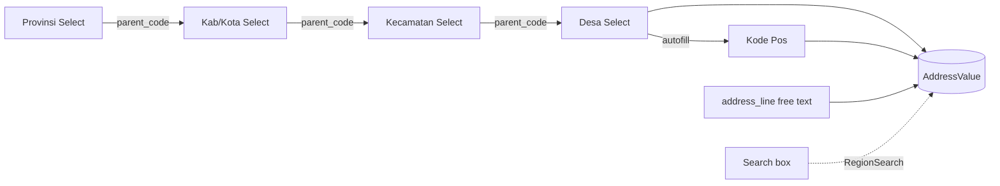
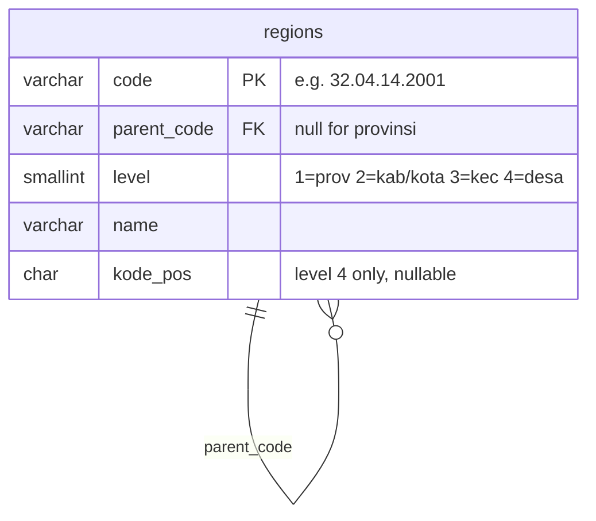

# Brainstorming — Indonesian address: `region_service` + shared `AddressPicker` (#112)

> Planning doc for a **reference service that holds Indonesia's administrative regions**
> (provinsi → kabupaten/kota → kecamatan → desa/kelurahan) **with kode pos**, and the
> **shared `AddressPicker`** component every address-entry screen reuses. Nothing here is
> implemented, and **nothing is decided** — this maps the job, sketches the screen first
> (HARD RULE 6), and proposes a break-up into sub-issues.

> **Decisions so far**
> - **SETTLED (owner, 2026-07-16, before overnight run):**
>   - **Service = `region_service`** (`warehouse.region.v1`).
>   - **Schema = single self-referential `regions` table** (Option A, §4.2).
>   - **Saved addresses = SNAPSHOT on the record** (§5) — codes + names + kode pos + street frozen.
>   - **Overnight mode = work the whole Ready board autonomously**, re-checking through the night
>     for items the owner adds; provisional calls documented + flagged for 06:00 review.
> - **Agent defaults (flagged for review):** kode pos = one-per-desa column (§3); access policy for
>   the global-read RPCs = provisional (§4.4).
> - **Now Ready** — parent #112 → In progress; #113–#118 moved Backlog → **Ready** for the
>   overnight run. (agent, 2026-07-16)
> - **Precedent that leans the big call:** `selling_service` already decided an order **FREEZES**
>   its money + line snapshots, and stores the customer address as **free text today**. So a
>   *snapshot* of the chosen address on a transaction is consistent with the house style
>   (§5) — the picker reads live, the record keeps a frozen copy.

---

## 1. The job — who types an address, and why

An address is entered in many places, by different people, for different reasons:

| Where | Who | Why it matters |
| --- | --- | --- |
| Order customer address (`selling_service`) | CS / order taker | where the parcel ships; **free text today** |
| Shipping destination (future rate calc) | system / CS | courier cost depends on kecamatan/kota + kode pos |
| Team / warehouse address (`team_service`) | admin | where a warehouse physically is |
| Shop address (`selling_service`) | team owner | return / pickup origin |
| User profile (`user_service`) | anyone | contact detail |

Every one of these is the **same sub-task**: pick Provinsi → Kabupaten/Kota → Kecamatan →
Desa/Kelurahan, get the kode pos, then add the free-text bit (jalan, no. rumah, RT/RW) that
no dataset can supply. That repetition is the whole argument for **one shared component over
one shared service**.

---

## 2. Frontend first — the `AddressPicker` (HARD RULE 6)

A single curated shared component, `frontend/src/components/AddressPicker.tsx`, alongside
[`ConfirmDialog`](../../frontend/src/components/ConfirmDialog.tsx) and the existing `ShopSelect`
/ `ProductSelect` / `ShippingSelect` pickers. It `export const description` and appears in the
[`/components` gallery](../../frontend/src/dev/ComponentsPage.tsx).

**Shape (Chakra v3, per the design system):**

- Four **cascading `Select`s** (composable, **searchable** `Select` — not `NativeSelect`, because
  desa needs typeahead), each loading its children from `region_service` **by parent** as the one
  above it resolves.
- A **kode pos** `Field` that **auto-fills** when a desa is chosen — **editable** (a desa is not
  strictly 1:1 with one postcode; see §3).
- A free-text **`address_line`** `Textarea` for the street detail.
- Optional **fast path:** a single searchable box that queries `RegionSearch` ("type your
  village") and back-fills all four levels + kode pos at once.

**The value it emits** — codes **and** denormalized names, so a consumer can snapshot without a
second round-trip:

```ts
type AddressValue = {
  provinsi_code, provinsi_name,
  kabupaten_code, kabupaten_name,
  kecamatan_code, kecamatan_name,
  desa_code, desa_name,
  kode_pos,        // auto-filled, overridable
  address_line,    // free text
}
```



> **Not the `CategorySelect` full-tree pattern.** HARD RULE 9's tree exception lets
> `CategoryList` load the WHOLE tree because it's small. Regions are ~84k nodes — the picker
> **must** load level-by-level by `parent_code` (each level is dozens of rows), never the whole
> tree.

---

## 3. The data

**Source (recommended):** the maintained, Kemendagri-official pair —
[`cahyadsn/wilayah`](https://github.com/cahyadsn/wilayah) (regions) +
[`cahyadsn/wilayah_kodepos`](https://github.com/cahyadsn/wilayah_kodepos) (kode pos). Same
maintainer, same 10-digit `kode wilayah` key, so kode pos **joins cleanly onto the desa row**
instead of being name-matched. External reference data → no conflict with the clean-slate rule.

**Volume (Kepmendagri 300.2.2-2430/2025):** 38 provinsi · 514 kabupaten/kota · 7.285 kecamatan
· 83.762 desa/kelurahan. Trivial for Postgres; revised ~yearly by the government.

**Format note:** cahyadsn ships **MySQL**; our stack is **Postgres (:5433)**. The seed step
converts it (a CSV/`COPY` path is cleanest).

**Kode pos caveat:** officially one kode pos **per desa/kelurahan**, so it models as a **column
on the desa row**, not a separate table. But in big cities a kelurahan can span several
postcodes and PT Pos data doesn't align perfectly with Kemendagri boundaries — the dataset maps
one (best-effort) code per desa, which is fine for shipping. A precise multi-postcode model
would need PT Pos data (messier) — out of scope unless the owner asks.

---

## 4. The service

### 4.1 Name — OPEN (§8)

Proposed **`region_service`** (`warehouse.region.v1`). Alternatives: `wilayah_service`,
`address_service`, `location_service`. Recommend `region_service` (English, matches docs;
"address" is the *component*, "region" is the *reference data*).

### 4.2 Schema — one self-referential table vs four

| Option | ✅ | ❌ |
| --- | --- | --- |
| **A. Single `regions` table** (`code` PK, `parent_code`, `level` 1–4, `name`, `kode_pos` on L4) | Mirrors the source 1:1 → least transform risk; cascading = `WHERE parent_code = ?`; trivial seed | `level` is a convention, not four typed tables |
| **B. Four tables** (`provinsi`/`kabupaten`/`kecamatan`/`desa` with FKs) | Explicit, self-documenting relations | 4× the seed + join work; every query picks a table |

Recommend **A** — it matches cahyadsn exactly (the seed is a near-verbatim load), and
"children of X" is one indexed predicate.



### 4.3 RPCs — `warehouse.region.v1`

| RPC | Shape | Pagination |
| --- | --- | --- |
| `RegionList` | children of `parent_code` (empty = provinsi) | **required `PageFilter`** (HARD RULE 9) — even though a level is small, desa overall is huge |
| `RegionSearch` | typeahead over `name`, optional `level` filter, **capped `limit`** | capped like `SearchUser` — never returns "everything" |
| `RegionResolve` | full ancestry for a `code` (4 names + kode pos) | single row — hydrate a snapshot / render a saved address |

### 4.4 Access — global read reference data

Reads are **not team-scoped** — regions are the same for everyone. So the request messages
carry **no `use_scope` field**, and the policy is a broad **any-authenticated read**, not a
team role (putting a team role on an unscoped message is the dead-letter trap in CLAUDE.md).
Exact "authenticated" expression is an open question (§8).

---

## 5. The one real decision — snapshot vs live (needs owner, §8)

Region data changes (desa mekar/rename/merge). If a saved order points a live FK at a desa
that later changes, the historical order silently reads differently than what was typed.

| | Snapshot on the record | Live FK to `regions` |
| --- | --- | --- |
| Transaction addresses (order, shipment) | ✅ record is what was agreed; survives region edits | ❌ history mutates under you |
| Mutable profile (warehouse/team/shop address) | ✅ safe to display | ⚠ fine to store code + re-resolve, but display-snapshot safer |

**Recommend: snapshot on transactions** (store the codes **+** names **+** kode pos **+**
address_line as frozen text on the order/shipment), consistent with `selling_service`'s existing
"order FREEZES" decision. The picker always reads live from `region_service`.

---

## 6. Consumers (where the component lands)

- **`selling_service` order** — replace the free-text customer address with a structured,
  snapshotted address (the immediate payoff).
- **`shipping_service`** — destination for future rate calc (kecamatan/kota + kode pos).
- **`team_service`** — warehouse address.
- **`selling_service` shop** — return/pickup origin.
- **`user_service`** — profile contact.

No cross-service model sharing: each consumer stores its **own** snapshot (HARD RULE 3);
`region_service` is reached only via its RPCs.

---

## 7. Proposed break-up (sub-issues)

Frontend-first order; design (§4.1, §4.2, §5, §4.4) is the gate and lives in this doc.

1. **Data pipeline (#113)** — convert `cahyadsn/wilayah` + `wilayah_kodepos` → Postgres seed
   (join kode pos onto desa; pin the Kepmendagri version; ~84k rows).
2. **Schema + migration + seed + schema doc (#114)** — goose migration for `regions`
   (Option A) + kode pos; load the seed; `docs/database-schema.md` erDiagram.
3. **Proto contract (#115)** — `warehouse.region.v1`: `RegionList` (cascading, paginated),
   `RegionSearch` (capped), `RegionResolve`; global-read policy; `buf generate`.
4. **Handlers + unit tests (#116)** — one file per RPC, a test per RPC (`san_testdb`); register
   in the mux + Wire.
5. **Shared `AddressPicker` (#117)** — cascading `Select`s + kode pos autofill + free-text;
   emits `AddressValue`; gallery `description`; typecheck.
6. **Integrate `AddressPicker` (#118)** — swap the order's customer address to
   structured+snapshot; add to team/shop/(shipping) address entry.

---

## 8. Open questions — RESOLVED 2026-07-16 (except where noted)

- [x] **Service name** — **`region_service`** (owner).
- [x] **Schema** — **single self-referential `regions` table** (Option A) (owner).
- [x] **Snapshot vs live** — **snapshot** on transaction addresses (owner).
- [x] **Kode pos** — **one-per-desa column** (agent default; flag if precise multi-postcode is
      later needed).
- [ ] **Access policy** — how to express "any authenticated user may read" for unscoped
      global-reference RPCs. **Agent makes a provisional call overnight (§4.4) and flags it for review.**
- [x] **Scope now** — work the whole **Ready** board overnight: region_service #113→#118 first,
      then any other Ready items, re-checking for newly-added ones (owner).
