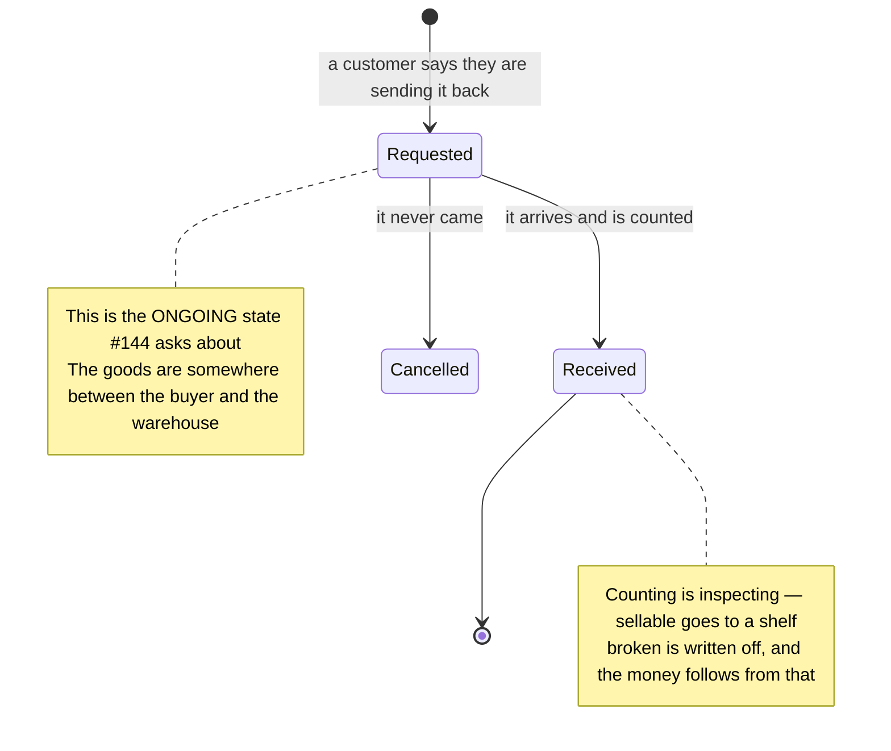

# Brainstorming — Customer returns (#163)

> Planning doc for **customer returns** — goods coming back from a BUYER. **Nothing is implemented and
> nothing is decided.** #163 lists three forks and says they were deliberately not guessed at
> (HARD RULE 8); this maps the domain, reports two findings that change what those forks mean, and
> proposes answers **for the owner to accept or reject**.
>
> It lives in its own directory rather than inside `selling_service` or `inventory_service` because
> **which service owns a return is itself a fork** (§5) — filing the plan under one of them would have
> quietly answered it.

> **Decisions so far**
> - *(none — every question below is open)*

---

## 1. The gap, and where it came from

#150 refused to let a SHIPPED order be cancelled, and said why:

> Putting the stock back would book goods onto a shelf while they are on a courier's van. **What comes
> back after shipping is a RETURN — a different event, with different money — and calling it a cancel
> would hide that rather than record it.**

Only the cancel half was built. **There is no way to record that a customer sent something back**, so:

- **#144** cannot show "ongoing Return" on the warehouse product page — it shows restock only.
- **#76** (settlement) will reconcile against revenue figures that a return silently invalidates.

---

## 2. ⚠ FINDING ONE — `MOVEMENT_KIND_RETURN` is already taken, and means the opposite kind of thing

The inventory ledger already has a `RETURN` kind
([inventory.proto](../../proto/warehouse/inventory/v1/inventory.proto)):

> Stock put BACK after a pick was undone (#70/#149) — a cancelled order, or an order write that failed
> after its stock had already been taken.

That is an **un-pick**: goods that never left the building, whose condition nobody needs to inspect.
A customer return is goods that **did** leave, travelled to a stranger, and came back — possibly
broken. Same word, different fact.

**This is not merely a naming irritation — it would corrupt the pick screen.**
[`StockPickLocations`](../../backend/services/inventory_service/inventory_v1/stock_pick_locations.go)
computes what an order still holds by **netting PICK against RETURN for that `ref`**:

```
SUM(-m.delta)  WHERE m.ref = <order>  AND m.kind IN (PICK, RETURN)
```

A customer return written as a `RETURN` row against the same order ref would subtract from that sum —
so **a shipped, returned order would read as partially un-picked**, and the packing screen would send
somebody to re-pick goods that are already at the customer's house.

➡ A customer return needs **its own movement kind** (`MOVEMENT_KIND_CUSTOMER_RETURN`, or the existing
one renamed to `UNPICK` and `RETURN` freed up — the second is a breaking rename of a shipped enum
value, so it is a real choice and not a formality).

---

## 3. ⚠ FINDING TWO — the owner has already described the shape, in #144

#144 asks for:

> D. **Ongoing** Return/Restock Stock Info (count / valuation)
> G. Last **created/accepted** Return/Restock info

Three things follow from that vocabulary, and none of them are guesses:

1. **"Ongoing" means in flight.** A return must therefore exist *before* its goods arrive — so it
   cannot be a single event recorded on receipt. That answers most of fork 3 (§4.3).
2. **"created / accepted"** is the restock request's own lifecycle (`PENDING → FULFILLED`).
3. **The owner names Return and Restock together, repeatedly.** They are the same job seen twice:
   *goods arriving at a warehouse that must be counted, placed, and partly written off.*

➡ **The proposal below is that a customer return IS the restock request's mirror image**, and reuses
the accept flow built in #154/#157 — count what actually arrived, split it across shelves, write off
what came back broken. That work is done and tested; a return would differ in where the goods come
from (a buyer, not a supplier) and in what it does to the money.

---

## 4. The three forks from #163

### 4.1 Does a return put the stock back?

| Option | ✅ | ❌ |
| --- | --- | --- |
| **Always back to sellable** | Simplest | Books broken goods onto a shelf as sellable — the exact lie #150 refused to tell about goods on a van |
| **Never — always a write-off** | Also simple, and safe | A perfectly good item that came back unopened is thrown away on paper while sitting on the shelf |
| **Inspected on receipt** ⭐ | What actually happens. Some comes back sellable, some broken, some never arrives at all | Needs a receiving screen — **which already exists** (#154/#157) |

⭐ The third, reusing the accept flow. #154 already models "arrived broken" for a delivery, and #163
itself notes it is "the same question, other direction".

### 4.2 What happens to the money?

**This fork cannot be answered independently of §4.1**, and that is the important part:

- Goods come back **sellable** → the revenue is gone, but the COGS is not: we still have the goods.
- Goods come back **broken** → the revenue is gone **and** so are the goods, so the COGS stands.
- Either way the **shipping was really spent** — twice, if the return was paid for too.

So the money owed to a return depends on the *condition* of what arrived, which means the money cannot
be settled when the return is created — only when it is accepted.

| Option | ✅ | ❌ |
| --- | --- | --- |
| **A. Void the revenue row** (#164's machinery) | Already built | **A partial return has nothing to void.** 2 of 5 items back is the common case, and voiding the row erases the 3 that were genuinely earned |
| **B. A second, NEGATIVE revenue row** ⭐ | Handles partial returns naturally. Append-only, so what was expected survives — the whole point of the row (#75). Totals just sum | `order_revenues` is one-row-per-order today; this changes that shape, and every reader must stop assuming uniqueness |
| **C. Reduce the row in place** | One row per order stays true | Destroys the record of what was expected, which is the only thing that row is for. #75 is explicit: it is "the truth for what was EXPECTED" |
| **D. Leave it to settlement (#76)** | No work now | #76 is deferred, and #144 wants return **valuation** on screen now. It would also mean the revenue screen knowingly shows money that came back |

⭐ **B**, because it is the only one that survives a partial return without destroying what was
expected. ⚠ It has a real cost that must be accepted with it: `RevenueList` and its totals must stop
treating one order as one row.

### 4.3 What are its states?

§3 answers most of this: "ongoing" requires an in-flight state, so a return exists before it arrives.
Mirroring the restock request:



The open part is whether **judging is a third state** or folded into receiving. #157 folds it: the
person counting a delivery decides then and there what is broken. Doing the same here keeps one screen
and one decision — but a return may need someone else's approval before a refund, which would make
judging separate.

---

## 5. Further forks the issue did not list

### 5.1 Which service owns a return?

| Option | ✅ | ❌ |
| --- | --- | --- |
| **`inventory_service`, beside restock requests** ⭐ | It is goods arriving at a warehouse, counted and placed — the identical job, and the accept machinery is already there | Inventory then holds a record whose *reason* is a selling event |
| **`selling_service`, beside orders** | A return is an event on an ORDER, and that is where the lifecycle lives | The stock half would have to be an RPC into inventory anyway |
| **Its own `return_service`** | Clean ownership | A third service for one table, plus two cross-service calls |

### 5.2 Does a return need its order?

Goods sometimes come back with nothing identifying them, or a buyer returns something bought months
ago. If a return **requires** an order, those cannot be recorded at all; if it does not, the money half
has nothing to reduce. A return with an **optional** order id — money only when it has one — is
probably right, but it is a decision.

### 5.3 Who starts one?

CS (the customer told them) or the warehouse (a parcel turned up)? Both happen. If the warehouse can
start one, a return can be *created and received in the same motion*, and the "ongoing" state is
skipped — which must not break #144's count.

### 5.4 What about a partial return of a partially-picked order?

Out of scope to answer here, but worth flagging: returns compose badly with anything else that touches
the same order's stock, and the ledger is the only thing that will keep it straight.

---

## 6. Proposed decomposition — CONFIRM BEFORE CREATING

Assuming §4.1 = inspected, §4.2 = B, §4.3 = the two-state mirror, §5.1 = inventory:

1. **A distinct movement kind** for a customer return (§2) — small, and everything else depends on it.
2. **The return model + migration** — a request with lines, mirroring `restock_requests`.
3. **`ReturnCreate` / `ReturnList` / `ReturnDetail`** — paginated (HARD RULE 9).
4. **`ReturnAccept`** — count, place, write off. Reuses #154/#157's shape.
5. **The money** — the negative revenue row, and `RevenueList` stopping its one-row-per-order
   assumption. **The riskiest piece — worth doing last and alone.**
6. **The screens** — a returns list and an accept page, both siblings of the restock ones.
7. **#144's "ongoing" figures** — only possible once 1–4 exist.

---

## 7. Open — the owner's to settle

- [ ] **§2 — a new movement kind, or rename the existing `RETURN` to `UNPICK`?** (the rename is breaking)
- [ ] **§4.1 — does a return put stock back?** (proposed: inspected on receipt, reusing #157)
- [ ] **§4.2 — what happens to the money?** (proposed: a second, negative revenue row — with the cost that one order stops meaning one row)
- [ ] **§4.3 — is judging a separate state, or folded into receiving as #157 does?**
- [ ] **§5.1 — which service owns returns?** (proposed: `inventory_service`, beside restock)
- [ ] **§5.2 — can a return exist without an order?**
- [ ] **§5.3 — may a warehouse start one, skipping "ongoing"?**
- [ ] **§6 — is the decomposition right, and should the sub-issues be created?**
