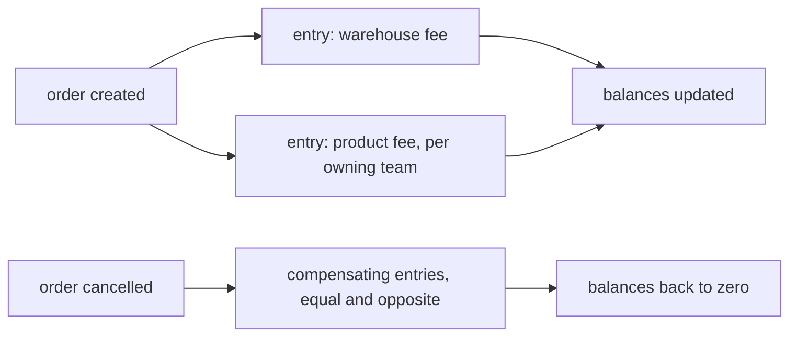
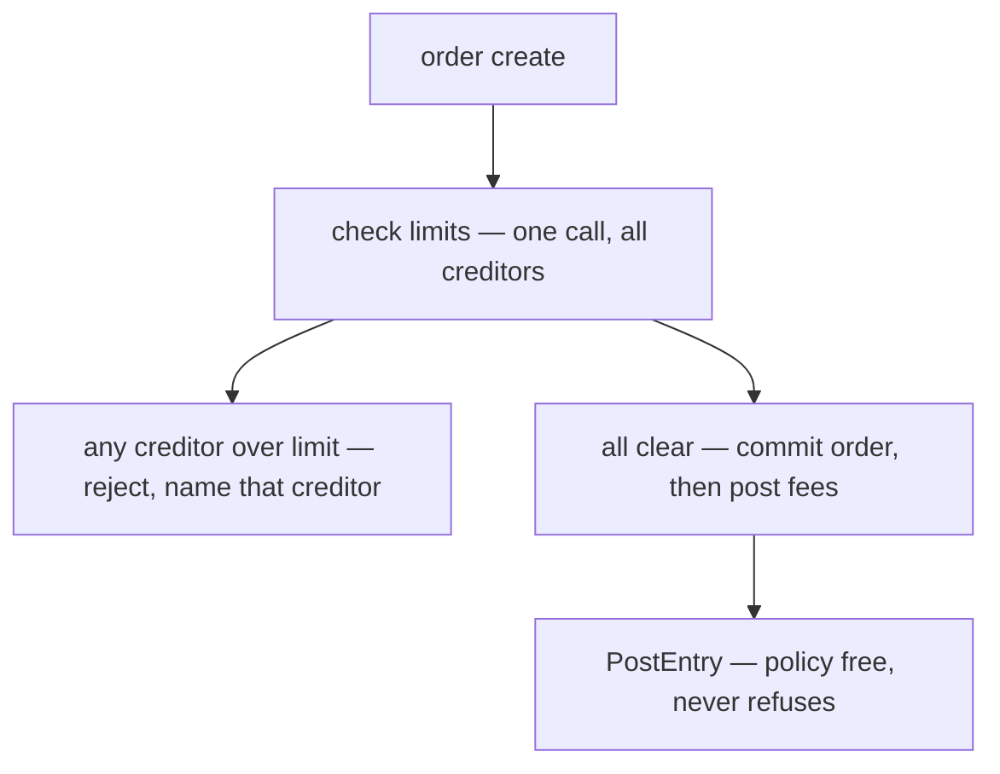
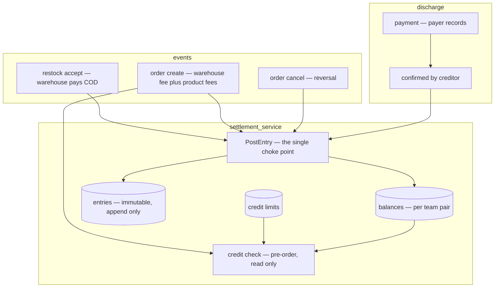
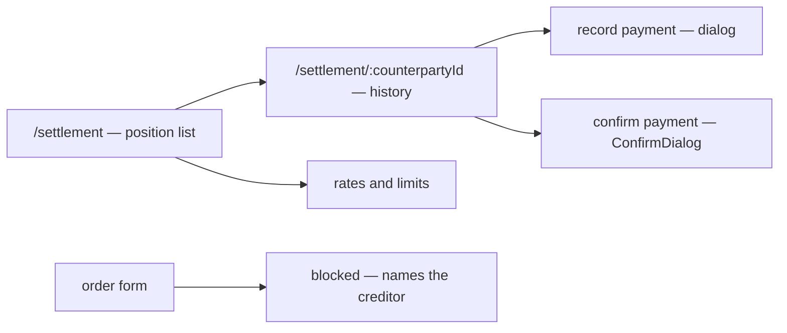

# Brainstorming — Settlement domain (what teams owe each other)

> Planning doc for **`settlement_service`**. **Nothing is implemented.** This frames the domain,
> records the decisions made on 2026-07-21, and names what is still open — to be confirmed before
> any issue is created.

> **Decisions so far** (all owner, 2026-07-21)
> - **The service is `settlement_service`, not `invoice_service`.** An invoice is a *document* — a
>   numbered demand for payment. What this holds is a **running position between two teams**, and it
>   may never issue such a document. See §1.
> - **MONEY ONLY — there is no goods balance.** See the ⚠ note below.
> - **Counterparties are TEAMS ONLY.** Not suppliers, not marketplaces. Both sides of every balance
>   are teams, so both are an authorization scope *and* both can log in — which is what makes the
>   confirm-based settlement in §4.9 possible at all. See §3.1.
> - **Three obligations, all money** — the COD fee the warehouse pays at the door, a **warehouse
>   fee** at order create, and a **product fee** when an order sells another team's product. The two
>   order-driven ones **reverse when the order is cancelled**. See §2.
> - **The LEDGER IS THE SOURCE OF TRUTH**, fed by order events. Obliges a dead-letter policy and a
>   reconciliation report — see §3.3.
> - **Credit limits are IN v1.** A team may not run up unlimited debt with a creditor. See §3.4.
> - **Back-office surface, management tier.** Read and confirm are both `ROOT, ADMIN, TEAM_OWNER,
>   TEAM_ADMIN, WAREHOUSE_OWNER, WAREHOUSE_ADMIN`. Warehouse staff and customer service never see
>   it. See §3.7.
>
> ⚠ **A reversal recorded honestly.** Earlier today this doc said money and borrowed goods were two
> balance kinds under one roof. The owner then clarified what "borrow" means: *"when order, it can
> select other team product and we charged"* — the goods are sold to a customer and never come back,
> so the obligation is money from the start. **There is no goods balance, no return flow, and no
> goods-to-money conversion.** The whole two-kind mechanism is dropped. If physical
> borrow-and-return between teams is ever wanted, it is a new fork — not a resurrection of this one.
>
> **Context settled elsewhere, and load-bearing here:**
> - **`revenue_service` is NOT a ledger** (owner, 2026-07-20) — per-order margin rows only.
>   ([revenue §2.4](../revenue_service/brainstorming.md))
> - **`expense_service` is NOT a ledger** (owner, 2026-07-21) — an expense row records money going out, not
>   an account movement. ([cost §1](../expense_service/brainstorming.md))
> - **Both deferred the same question to a third place, and this is it** — revenue §2.5
>   (*team-to-team fees*) and expense §2.2 (*warehouse costs charged onward*). See §3.7.

---

## 1. What this is (first principles)

The business is not one wallet. It is several teams — selling teams, warehouse teams — that
constantly do work for each other. A warehouse pays a courier for goods it does not own. A selling
team ships a product another team paid for. Each time, **one team is out of pocket for another**.

Today the system records the *event* and never records the *obligation*. Nothing says who is owed,
or whether it was ever settled.

`settlement_service` answers one question, from both sides:

> **"What do we owe each other, and are we square?"**

### 1.1 The obligation that already exists, unrecorded

Not hypothetical — it is in the restock contract today:

```proto
// The courier's fee collected ON DELIVERY (#155), paid by the WAREHOUSE and entered when it
// accepts. The requesting team cannot know it in advance…
int64 cod_shipping_fee = 19;
```

A **selling** team requests a restock. The goods are that team's. When the delivery arrives the
**warehouse** hands the courier cash at the door — out of pocket for goods it does not own. That
number reaches the order's COGS, which is correct for *costing* and silent on *settlement*. Nothing
records that the warehouse is owed it, or when it was repaid.

That is the problem demanding a ledger, and it is why the earlier "no ledger" decisions
(revenue §2.4, expense §1) do not apply here — their bar was *"when a problem actually demands one."*

### 1.2 Where it sits

| | `revenue_service` | `expense_service` | `settlement_service` |
| --- | --- | --- | --- |
| **Question** | did this order make money? | what did we spend that no order caused? | what do we owe each other? |
| **Grain** | one row per order | one row per period | a **running balance per counterparty** |
| **Written by** | the system, at order placement | a person, after the fact | the system, when an event creates an obligation |
| **Shape** | a frozen record | a typed record | a **ledger** — every movement double-entered |
| **Answers** | margin | spend | exposure, ageing, settlement |

Revenue and cost are **records of things that happened**. A ledger is a **running position that must
always balance** — a different kind of software, and why both earlier docs declined to build one in
passing.

---

## 2. What creates an obligation

| Event | Exists today? | Obligation | v1 |
| --- | --- | --- | --- |
| Warehouse pays COD at the door | ✅ (#155) | selling team owes warehouse | ✅ |
| **Order created** — warehouse fulfils it | ❌ no fee modelled | selling team owes warehouse | ✅ |
| **Order created** — it sells another team's product | ❌ not modelled | selling team owes product owner | ✅ |
| **Order cancelled** | ❌ | both of the above, reversed | ✅ |
| A team pays what it owes | ❌ | the debt, settled | ✅ |
| Warehouse costs allocated to sellers | ❌ **never** — see §3.7 | — | ❌ |

### 2.1 The COD fee

Posted when the warehouse **accepts** the restock — the moment cash leaves its hands and the amount
becomes knowable, which is why the field lives on accept rather than on create. The posting belongs
in the same transaction as the acceptance: if the stock movement commits and the obligation does
not, the warehouse is out of pocket with no record, which is exactly today's situation.

⚠ **This does not change what COD does today.** The fee still flows into HPP and reaches the order's
COGS — that is *costing*, and it stays. Settlement adds the missing half: *who is owed it, and has
it been repaid.* The same rupiah answers two questions, and recording it here must not remove it
from the other.

### 2.2 The two order-driven fees

Both are posted when an order is **created** and reversed when it is **cancelled**:

- **Warehouse fee** — the warehouse fulfils the order, so the selling team owes it.
- **Product fee** — the order sells a product belonging to another team, so the selling team owes
  that team. This is what "borrowing another team's product" means in practice: the goods leave and
  do not come back, so it is money from the first moment.

One order can post **several** obligations at once — one warehouse fee, plus one product fee per
distinct owning team in the lines.

**Reversal is a compensating entry, never a deletion.** The original stays and an equal-and-opposite
entry is added. The balance nets to zero, and the history shows the fee was charged and then
returned. Editing or deleting the original would make the ledger unauditable — "the fee briefly
existed" is exactly what an audit needs to see.



**Each must happen exactly once.** A retried create must not charge twice, and a double cancel must
not reverse twice. §4.6's "one code path" is necessary but not sufficient — the path must also be
idempotent per order.

### 2.3 ⚠ The hard problem this creates

These are the first postings driven by **another service**. Orders live in `selling_service`, the
ledger in `settlement_service`, and HARD RULE 3 keeps them independent — no shared models, no shared
transaction. But if the ledger is the source of truth (§3.3), a posting must be atomic with the event
that caused it, and **two services cannot share one transaction.**

| Option | |
| --- | --- |
| **Selling calls settlement over RPC, inline** | Simple. Not atomic: the order can commit and the posting fail, leaving a fulfilled order nobody was charged for — silently. |
| **Event consumed by settlement** | Atomic on the selling side, eventually consistent on the ledger side. Needs idempotency so a redelivered event cannot double-charge. |
| **Ledger is a projection (§3.3's other option)** | The question dissolves — fees are derived from orders on read, and there is no posting to lose. But then a *payment* against the debt has nowhere to live. |

> ### ⭐ This problem is already solved in this repo
>
> `revenue_service` does **exactly** this shape today, and it is the strongest evidence available for
> Q4. The events exist:
>
> ```proto
> message OrderPlacedEvent    { option (…event_config).event_topic = "order-placed";    }
> message OrderCancelledEvent { option (…event_config).event_topic = "order-cancelled"; }
> ```
>
> `selling_service` publishes them, and
> [revenue_service/push_handler.go](../../backend/services/revenue_service/push_handler.go) consumes
> both — writing a per-order row on placed and voiding it on cancelled. That is the same
> create-then-reverse pair the two order fees need, driven by the same two events.
>
> It also already solved the idempotency problem, and the reasoning is recorded there: Pub/Sub
> delivers **at least once**, so a redelivered order is normal, not an error. The handler ACKs the
> duplicate rather than NACKing it — because returning an error would make Pub/Sub redeliver a
> message that can never succeed, a poison loop built out of correct behaviour. A **unique index on
> `order_id`** is what makes that safe, and it is load-bearing rather than defensive.
>
> For settlement the same trick applies, with one difference: an order posts **several** entries (a
> warehouse fee plus one product fee per owning team), so the uniqueness key is
> `(source_type, source_id, counterparty)` rather than `order_id` alone.
>
> **Consequence: there is a paved road, and taking it makes "ledger is the source of truth" (§3.3)
> affordable** — the atomicity objection was the main argument against it, and the event path plus a
> uniqueness constraint answers it with a pattern this codebase already runs in production shape.

**Not free, and the costs should be named.** Eventual consistency means a brief window where an order
exists and its fee does not — so a credit check immediately after an order may read a stale balance.
And the subscription **needs a dead-letter policy**, or a permanently malformed message is redelivered
forever (`event_source/push.go`).

See **Q4** — still the owner's call, but now with a recommendation.

---

## 3. The forks

### 3.1 ✅ Counterparties: TEAMS ONLY

| Option | Verdict | |
| --- | --- | --- |
| **Teams only** | ✅ **CHOSEN** | Both sides are an authorization scope *and* can log in — see below. |
| Teams + suppliers | ❌ | A supplier is not a team, has no `team_id` to scope against, and cannot confirm anything. |
| Teams + suppliers + marketplaces | ❌ | Largest possible v1. Marketplace settlement is revenue #76's parked problem. |

> **Why this is more than "the simplest option".** §4.9 requires settlement to be **two-phase**: the
> payer records, the *creditor confirms* — only the creditor sees the money arrive. That flow only
> exists if both parties use the system. An external counterparty would need a weaker path where one
> side asserts both halves. Teams-only is what makes the confirm-based design coherent.

**Named consequence — supplier debt is NOT tracked.** A restock's `total_price` is money a team owes
its supplier, and nothing records it. That is out of scope, not non-existent. It is also not a
`expense_service` row — buying stock is not "money no order caused", it becomes COGS. Tracking it would
be a **new fork**, not an extension of this key.

### 3.2 ✅ Credit limits are in v1

A creditor caps how much a team may owe it. This is what makes a balance *operational* rather than
merely informative: an order is **blocked** because the limit is hit.

**Enforcement is an explicit pre-check, never a guard inside the posting path.** The ledger stays a
policy-free write — `PostEntry` records what happened and never refuses. Order creation *chooses* to
gate itself by asking first. Mixing the two would mean a ledger that sometimes declines to record
reality, which is how books stop matching the world.



Checked **per creditor independently** — the fulfilling warehouse, and each team owning a product in
the order. Any one over its limit rejects the whole order, naming which.

Still open (**Q7**): the semantics — see §3.5.

### 3.3 ✅ The ledger IS the source of truth (owner, 2026-07-21)

| Option | Verdict | |
| --- | --- | --- |
| **Ledger is the truth** | ✅ **CHOSEN** | `entries` + `balances` are authoritative. "What does A owe B?" is answered by reading the balance, not by recomputing from orders. |
| Ledger is a projection | ❌ | Debt derived by summing source rows on read — never wrong, but a *payment* is not derivable from any order, so it needs its own table and the balance becomes *derived fees − recorded payments*. That is half a ledger built by accident. With payments **and** credit limits both in v1, it would have become one immediately. |

**Fed by events, per §2.3** — `OrderPlacedEvent` and `OrderCancelledEvent`, the same pair
`revenue_service` already consumes. Idempotent on `(source_type, source_id, counterparty)`, because
one order posts several entries.

#### What this decision obliges

1. **Every obligation-creating event must post, or the books are wrong.** There is no recomputation
   to fall back on. This is the whole cost of the choice, and it is paid in the next three points.
2. **The subscription needs a dead-letter policy.** Without one a malformed message is redelivered
   forever (`event_source/push.go`). With one, a message can be **dropped** — which under "ledger is
   truth" means a fee silently never charged. Dead-lettering is therefore not just an ops concern
   here, it is a correctness one: something must watch that queue.
3. **⭐ A reconciliation report is now a real requirement, not a nicety.** Because events can be lost
   and the ledger cannot self-correct, there must be a way to ask: *"do the entries match the orders
   that should have produced them?"* It **reports** discrepancies — it does not silently repair them,
   because an automatic fix hides the bug that caused the gap. This falls out of the decision and is
   added to §6.
4. **The balance must be recomputable from `entries` alone** (§4.8) — otherwise there is no way to
   verify the authoritative number is right.

#### The eventual-consistency window, named

There is a brief gap between an order committing and its fees posting, so a credit check immediately
after an order may read a slightly stale balance. **This is acceptable and bounded**: the overshoot
is at most the fees of orders still in flight, and §3.5's *current-debt* option already accepts a
one-order overshoot by design. It would only become a problem if credit limits had to be a hard
ceiling — see Q6.

### 3.4 What is charged? (the fee amounts)

Nothing in the system computes either fee today. Both need a source:

| | Options |
| --- | --- |
| **Warehouse fee** | ✅ **the warehouse sets its own rate, in an admin screen** (owner, 2026-07-21). Editable by `WAREHOUSE_OWNER` / `WAREHOUSE_ADMIN` — the same management tier that reads the balances (§3.6). The *shape* of the rate is a remaining sub-question, below. |
| **Product fee** | ✅ **a MARKUP over the owner's price** (owner, 2026-07-21) — the owning team does not lend at cost, it sells at a margin. **How the markup is expressed is deferred**: a percentage, a fixed amount per unit, per product, per team pair, or a negotiated rate. |

#### ⭐ Where the rate lives — with the ledger, not with the warehouse's other settings

A warehouse already has a settings surface (`/teams/:teamId/edit`, which carries its weekly hours,
owned by `team_service`). The fee rate is **not** going there.

The rate is read at posting time, and the credit limit is read at order time. If either lived in
another service, settlement would need a cross-service fetch on its hottest path — and a fee that
cannot be computed because another service is down is a fee that silently never posts, which under
"ledger is truth" (§3.3) means the books are wrong.

So **`settlement_service` owns both** — they are the same kind of thing:

> **A creditor's policy: what I charge you, and how much I will let you owe me.**

One config surface, one owner, no cross-service read on the posting path. The *screen* may still sit
next to the warehouse's other settings in the UI — that is a navigation choice, not a data-ownership
one.

#### ✅ SETTLED (owner, 2026-07-22) — the two fee shapes

| | Decision |
| --- | --- |
| **Warehouse handling fee** | **Flat per order**, a default rate per warehouse with **per-selling-team overrides**. No rate configured = charge 0. |
| **Product fee** | **Cost (HPP) + markup.** A owes B what the goods cost, plus B's margin. |

**The anchor is `OrderItem.unit_cost`, and it is a better one than it first appeared.** The order
line already carries what the product cost per unit, frozen at order time (#74) — so:

```
product fee (per owning team) = Σ over that team's lines (unit_cost × quantity) × (1 + markup)
```

Three properties fall out, none of which the other anchors had:

1. **Reproducible forever.** The cost is frozen on the order, so the fee can be recomputed from the
   order years later and produce the same number — which is exactly what a ledger entry needs to be
   defensible.
2. **Un-gameable.** `unit_cost` is SERVER-SET and ignored on input, because *"a client supplying it
   would be writing its own margin, which is the one number nobody placing an order should get to
   choose."* That protection now guards the product fee too, for free.
3. **No cross-service read on the posting path.** The number rides in on the order event; settlement
   does not have to ask inventory anything.

#### ✅ Q10 — an unknown cost posts ZERO and is REPORTED, not refused (owner, 2026-07-22)

`unit_cost = 0` means **unknown, not free**. Under cost+markup that computes a fee of **zero**: the
owning team is owed nothing for goods that genuinely left its stock, and nobody is told.

**This is not an edge case, which is what settled it.** `StockCost` reads one place only — fulfilled
restock requests, scoped to one warehouse:

```sql
FROM restock_request_items i JOIN restock_requests r ON r.id = i.restock_request_id
WHERE r.warehouse_id = ? AND r.status = fulfilled AND i.received_quantity > 0
```

Stock enters a warehouse **four ways, and three of them leave no cost behind**:

| Arrival | Leaves a cost? |
| --- | --- |
| A fulfilled restock request | ✅ the only one |
| **Direct receive** — the `Receive` action on the stock screen (`useReceiveStock`) | ❌ |
| **Adjust up** — a stock-take correction | ❌ |
| **Transfer in** from another warehouse | ❌ *in this warehouse* |
| A restock line where nothing arrived (`received_quantity = 0`) | ❌ skipped deliberately |

Receiving stock directly is one click on the inventory screen, so a zero cost is an ordinary state,
not a corner.

**The decision:**

1. **Post 0.** A sale is not blocked by a bookkeeping gap. Refusing the order was considered and
   rejected as far too aggressive — it stops the business working because a number is missing.
2. **The reconciliation report (§6) LISTS every entry posted with an unknown cost.** This is what
   turns a silent loss into a visible one somebody can settle by hand, and it is now part of that
   issue's scope rather than a nice-to-have.

> **Why `revenue_service`'s answer could not simply be copied.** It meets the same gap and chose to
> count and warn (`unknownCostOrders`). That works there because revenue's failure is *a wrong number
> on a report* — optimistic margin, visible, nobody out of pocket. Settlement's failure is **money not
> owed**, and a warning on a report does not pay anybody. Hence the report is not the mitigation here;
> it is the worklist.

#### ⭐ Widen the cost lookup for TRANSFERS (proposed, not yet decided)

For the transfer-in case the cost is **not actually unknown** — it exists, in the origin warehouse's
restock history. `StockCost` is warehouse-scoped because freight differs per delivery, which is right
for *"what did these goods cost this building"* and arguably wrong for settlement, where the question
is *"what did these goods cost **their owner**"*.

Recovering it is one query change rather than a new subsystem, and it removes a whole class of zero
fees. Worth doing when the fee writer is built (§6 step 7) — flagged here so it is not rediscovered
as a bug later.

#### The actual NUMBERS are mocked for now (owner, 2026-07-22 — "add mock default first, we talk later")

The two fee SHAPES are settled above. What a warehouse actually charges, and what the markup actually
is, are business decisions still to be had. So they are mocked — but *where* they are mocked matters,
because there are two kinds of default here and only one of them is safe.

| | Value | Why |
| --- | --- | --- |
| **The SHIPPED default** (no config row) | **charge 0** | Already decided above, and the only safe answer. A team that has configured nothing is not charging, so a forgotten placeholder cannot quietly bill anybody. |
| **The DEV FIXTURE default** (`seed dev`) | an obviously-fake example rate | Visible, disposable, and never reaches a real deployment — the same bargain `devpassword123` already makes. |

⚠ **The mock must NOT become a plausible-looking shipped default.** A "sensible" 10% baked in as the
fallback is the dangerous option: it is indistinguishable from a real decision, nobody is prompted to
replace it, and the first sign of trouble is one team invoicing another a number nobody chose. Zero is
LOUD — somebody notices they are owed nothing and asks — whereas a plausible number is silent.

Proposed mock values for the dev fixture, to be argued and replaced:

- warehouse handling fee: **Rp 5.000 per order**
- product markup: **10%**

Both are round and obviously illustrative, and they live only in the seed. **Nothing downstream may
read them as decided.** §4.5 — the computed amount is frozen onto each entry — is what makes replacing
them later safe for history already written.

#### The analysis that led there — the product fee's missing anchor (#181)

**A product has NO price in this system.** That is the whole of what is left to decide, and it was
not obvious until the data was checked:

- `product.proto` has **no price field at all** — a product carries sku, name, description, category
  and images. `ProductSelect` says so outright: *"a product has no catalogue price, so the CS person
  types the buyer-paid unit price on the line itself."*
- The only prices in the system are **`unit_price`** on an order line (what the BUYER paid, typed per
  order) and **`unit_cost` / `cogs`** (what the goods COST, derived from whoever restocked them).

So "a markup over the owner's price" has nothing to be a markup *of* yet. There are three candidate
anchors, and they are not variations on a theme — they answer different questions:

| Anchor | Exists today? | What A owes B is then… | The catch |
| --- | --- | --- | --- |
| **Cost (HPP)** | ✅ `StockCost`, and the order already freezes `cogs` (#74) | what the goods cost, plus B's margin | The cost is the WAREHOUSE's basis, from whoever restocked it — it is not a number B set, and B may disagree with it. It is also "latest restock price" today (revenue §, flagged as wanting revisiting), so it moves. |
| **Buyer-paid price** | ✅ `unit_price` on the line | a share of what the customer actually paid | Ties B's income to A's pricing decisions. A discounts, B earns less, and B never agreed to the discount. Reads as a commission split rather than a sale. |
| **A configured wholesale price** | ❌ nothing like it exists | exactly what B says its product is worth to another team | The truest answer and the most work: a new per-product, per-owner price — and a screen for B to maintain it. Also the only one where B is stating a number rather than having one derived. |

**A worked example, because the three diverge sharply.** B's product cost 60,000 to restock. A sells
it for 100,000. With a 20% markup:

- **on cost** → A owes B 72,000 (B keeps 12,000, A keeps 28,000)
- **on buyer-paid** → A owes B 20,000 (which is *less than the goods cost*, so B loses 40,000)
- **on a wholesale price** B set at 80,000 → A owes B 80,000, whatever A charges

The middle row is not a rounding difference — a percentage of the selling price is a fundamentally
different deal, and at 20% it loses B money on every sale. If the intent is "B sells to A at a
margin", the anchor has to be **cost** or **a price B sets**, and a percentage of the buyer's price
is only sensible as a *commission* model where B keeps the goods' value some other way.

⚠ **Whichever is chosen, the resulting amount is frozen onto the entry (§4.5)** — so the anchor can be
changed later without rewriting history. What cannot be deferred is the *direction*, which is already
decided: there IS a markup, and charging at cost now would understate what B was owed on every past
order with no way to tell which.

#### Remaining sub-questions on the warehouse fee

| Question | Options | Leaning |
| --- | --- | --- |
| **What is it charged per?** | flat per order · per unit · per weight/volume | **Flat per order** — it is a fee for *handling an order*, it needs no data the order does not already have, and per-unit can be added later as a second field without invalidating history (§4.5 freezes the computed amount either way). |
| **One rate, or per selling team?** | one rate for everyone · a default plus per-team overrides | **A default plus overrides**, matching how credit limits will need to work anyway — one mechanism, not two. |
| **No rate configured?** | charge 0 · block the order | **Charge 0.** A warehouse that has not set a rate is not charging, which is the safe reading. Blocking orders because a finance setting is missing would take the warehouse offline for an unrelated reason. |

> **The markup is decided in direction, not in detail** — and the detail is deferrable precisely
> because §4.5 freezes the resulting amount onto the entry. Whatever rule produces the number, the
> ledger stores the number, so introducing a richer markup model later does not rewrite old balances.
> What must NOT be deferred is *that* there is a markup: if v1 charges at cost and a markup is added
> later, every historical entry understates what the owning team was owed, and there is no way to
> tell which entries were which.

⚠ **Whatever the rule, the amount must be FROZEN onto the entry at posting time.** If the entry
stores only a reference and the rate changes later, history silently rewrites itself and old
balances stop reconciling. This is the same principle #74 applied when the order froze its COGS.

### 3.5 ✅ Credit-limit semantics (owner, 2026-07-21)

| Question | Decision | |
| --- | --- | --- |
| **Current or projected debt?** | ✅ **current** — `debt < limit` allows the order | Exposure can reach `limit + one order's fees`, and the *next* order is blocked. Friendlier than a hard ceiling: a person is cut off next time rather than rejected mid-order for an amount they cannot see. |
| **Default?** | ✅ **unlimited until configured** | A creditor that has set nothing is extending unlimited credit. No config = allow. |
| **Whose config?** | a default per creditor, plus per-debtor overrides (§3.4) | Same mechanism as the fee rate. |

> **Why "current" fits this design particularly well.** §3.3 accepts a brief window where an order has
> committed and its fees have not yet posted, so a check may read a slightly stale balance. Under
> *projected* semantics that staleness would undermine a promise the design makes ("nothing ever
> crosses the ceiling"). Under *current* semantics it does not: an overshoot of roughly one order is
> **already** what the rule allows. The two decisions agree instead of fighting.

⚠ **`0` must mean "no credit at all", never "unlimited".** Unlimited is the *absence* of a limit —
represented by no config row, or an explicitly nullable limit. Encoding unlimited as `0` is a classic
trap: the two readings are opposites, and the day someone genuinely wants to freeze a team's credit
they will set `0` and accidentally grant infinite credit instead. Removing a limit means **deleting
the config**, not zeroing it.

### 3.6 ✅ Roles: the management tier of each team

Back-office. Nobody on the warehouse floor sees it — `WAREHOUSE_STAFF` picks and counts,
`TEAM_CUSTOMER_SERVICE` places orders, and neither chases debt.

| | Roles |
| --- | --- |
| **Read** a team's position | `ROOT, ADMIN, TEAM_OWNER, TEAM_ADMIN, WAREHOUSE_OWNER, WAREHOUSE_ADMIN` |
| **Confirm** a payment | the same set |
| **Excluded** | `TEAM_CUSTOMER_SERVICE`, `WAREHOUSE_STAFF` |

A warehouse owner can therefore see what their warehouse is owed — which §1.1 requires. Matches the
`expense_service` precedent: *"the people already trusted to manage a team are the ones who move them."*

> Read and confirm landed on the **same set**, so this is one policy, not two. That was not a
> deliberate merge — the answers converged. Narrowing confirmation later (owners only, dropping the
> `*_ADMIN` roles) is a one-line proto change, and tightening is far easier than loosening.

```proto
message SettlementBalanceListRequest {
  option (warehouse.role_base.v1.request_policy) = {
    roles: [
      ROLE_ROOT, ROLE_ADMIN,
      ROLE_TEAM_OWNER, ROLE_TEAM_ADMIN,
      ROLE_WAREHOUSE_OWNER, ROLE_WAREHOUSE_ADMIN
    ]
  };
  uint64 team_id = 1 [(warehouse.role_base.v1.use_scope) = true];
}
```

⚠ **The `use_scope` field is not optional.** A team-level role on an unscoped message is evaluated
against the root team — the entries become dead letters and the proto claims something the system
does not do (CLAUDE.md, authorization rules).

⚠ **A balance has two sides and only one can be the scope.** `use_scope` pins one field, so a request
scoped to `team_id` proves the caller belongs to *that* team and says nothing about the counterparty.
The handler must never treat a caller-supplied `counterparty_id` as if it were the scope. This is the
easiest authorization mistake available in this service.

### 3.7 ✅ ONE charge, and settlement NEVER reads `expense_service` (owner, 2026-07-21)

`expense_service` **just records what a team spent.** It is that team's own bookkeeping — it feeds
that team's profit screen and nothing else reads it. In particular, **settlement derives nothing from
expense rows.** There is no mechanism that takes a warehouse's rent and payroll and splits them
across selling teams.

And there is **no standing charge either** (owner, 2026-07-21). A warehouse bills selling teams
**only per order**:

| | Charged | Paid to |
| --- | --- | --- |
| **Handling fee** | per order (§2.2) | the fulfilling warehouse |
| **Product fee** | per order, per owning team (§2.2) | the team that owns the product |
| ~~Standing charge~~ | ❌ **does not exist** | — |

So the complete set of money movements is: the COD fee, the handling fee, the product fee, and
payments settling them. Nothing periodic, nothing derived, nothing measured.

#### What this buys, and what it costs

**Buys — the whole measurement problem disappears.** A periodic charge on occupancy would have needed
daily snapshots of how many racks each team holds (occupancy is a *stock*, not a *flow*, so there is
no single "racks in July" number). That table, that scheduled job, and the argument about month-end
versus average are all deleted before they are built.

**Costs — storage is free, and that is a real trade-off.** A team can park slow-moving stock in a
warehouse indefinitely and pay nothing for the space, because it only pays when it ships. The
warehouse carries that cost. A standing charge is exactly what would have made dead stock expensive
and pushed teams to clear it.

> **Named, not buried.** If warehouses start filling with stock nobody sells, this is the decision to
> revisit — and the fix is a standing charge, not an allocation. Until then, the warehouse's lever is
> its **handling fee**: it sets the rate, and it sets it high enough to cover rent and payroll across
> the orders it expects. Whether that works is a pricing judgement, which is what pricing *is*. A
> warehouse with high rent and few orders loses money, and that is a true business signal rather than
> a gap in the system.

**Consequence — expense §2.2 is answered, and no allocation subsystem is ever built.** Warehouse costs
stay on the warehouse's own expense list. What reaches a selling team is a *price per order*, never a
share of what the warehouse spent.


---

## 4. Invariants that must be right on day one

Cheap now, expensive later, because history accumulates under whatever is chosen.

1. **Double entry with an automatic mirror leg.** One call posts both sides in one transaction. If
   the mirror is a second call the caller must remember, one day someone forgets and the books are
   silently wrong. Make posting half a movement impossible.

2. **Money stays integer minor units** — whole rupiah, `int64`, already this system's convention
   (`total_price`, `cod_shipping_fee`, `shipping_cost`). Float cannot represent 0.1 exactly, so sums
   drift and equality decays into "within epsilon" — at which point *"are we square?"* has no yes/no
   answer.

3. **Both legs of one movement share a group id.** Otherwise "show me both sides of this posting" is
   answerable only by matching amount, opposite sign and a near timestamp — a heuristic that fails
   exactly when two similar postings land together.

4. **Every entry records WHAT CAUSED IT** — a `(source_type, source_id)` pair, not a free-text note.
   "Why do I owe this?" is the first question anyone asks a balance, and a note cannot be joined,
   filtered or counted. It is also what lets an order's fees and their reversal be shown as one
   history, and what keeps this service out of `selling_service`'s tables.

5. **The fee amount is frozen onto the entry.** §3.4 — a stored reference plus a mutable rate means
   history rewrites itself.

6. **Exactly ONE code path may post, and it is idempotent per source.** The worst failure available
   to a ledger is two paths posting the same fee — each individually correct, neither able to see the
   other. With order-driven fees, retries and redeliveries make idempotency mandatory, not optional.

7. **A unique constraint on the balance key, in the first migration.** Lock-then-read does not
   protect a row that does not exist yet: two concurrent first-postings for a new pair both find
   nothing, both insert, one update is lost. Only a database constraint prevents it.

8. **The balance is a projection — the log is the truth.** Every balance must be recomputable from
   the entries alone, or the ledger cannot be audited.

9. **Settlement is two-phase and reversible.** The payer *claims*, the creditor *confirms* — only the
   creditor sees the money arrive. Corrections are **compensating entries, never updates or
   deletes**; a ledger you can edit is not evidence of anything.

10. **Asserting that someone owes you is not self-service.** A posting that creates a receivable
    against another team is a claim on them: either it derives from a real event, or it needs a role
    gate and their acknowledgement. Reads need an ownership check too.

11. **One sign convention, stated once.** Receivable positive, payable negative — and the API must
    not return `abs()` in one field and the raw value in another. Two fields named "payable" that
    disagree in sign is a bug that reaches the screen.

12. **The credit check never lives inside the posting path.** §3.2 — the ledger records, it does not
    police.

13. **Time buckets name their timezone, and windows are half-open.** Rollups in the server's local
    timezone shift when the server moves; mixed inclusive/exclusive windows double-count the boundary.

---

## 5. The shape



---

## 5.1 The screens (HARD RULE 6 — these come first)

A screen exists because a person doing a task needs it. Here are the people and the moments.

| # | The person | The moment | The screen |
| --- | --- | --- | --- |
| 1 | Warehouse owner | End of month — *"who owes me, and who is late?"* | **Position list** |
| 2 | Selling team owner | *"how much do I owe the warehouse, and why is it that much?"* | **Position list**, then **Counterparty detail** |
| 3 | Selling team owner | Just transferred money — *"record that I paid"* | **Record payment** |
| 4 | Warehouse owner | *"they say they paid — did it arrive?"* | **Confirm payment** |
| 5 | Warehouse owner | Setting up — *"charge 12k an order, cap each team at 50m"* | **Rates and limits** |
| 6 | Customer service | Their order was refused | **A message in the order flow**, not a settlement screen |

### A. Position list — `/settlement`

One row per counterparty. The screen a manager opens first, and the only one most of them need.

- **Direction must be words, never a sign.** "They owe you Rp 2,400,000" / "You owe them Rp
  180,000" — never a bare `−180,000` that the reader has to interpret. §4.11 keeps the *data*
  consistent; this keeps the *screen* honest.
- **Ageing is the point, not the total.** "Rp 2.4m, oldest unsettled 47 days" is actionable in a way
  that a balance alone is not. A manager chases the old ones.
- Reuses `Pagination`, `formatRupiah`, and `TeamSelect` for filtering.

### B. Counterparty detail — `/settlement/:counterpartyId`

**A page, not a dialog** (CLAUDE.md: a detail view is a page). Reached by clicking a row.

The running history: every entry, what caused it, and the balance after it. This is what
`(source_type, source_id)` from §4.4 is *for* — a line must read "warehouse fee, order #412", not a
free-text note. An order's fee and its cancellation reversal appear as one story, netting to zero
and still visible.

Actions live here: **record a payment** (if you owe them), **confirm one** (if they claim to have
paid you).

### C. Record and confirm payment

Recording is a focused action → a **dialog**. Confirming moves money in the books and is not
trivially reversible → it goes through **`ConfirmDialog`**, titled in Title Case ("Confirm Payment").

⚠ **A creditor must find out a payment is waiting without hunting for it.** Options: a count badge
on the position list, a filter for "awaiting your confirmation", or a dedicated inbox screen. A
payment nobody notices is a debt that stays open for no reason. See Q10.

### D. Rates and limits

The warehouse's own config: the per-order handling fee and per-team credit limits. Owned by
`settlement_service` (§3.4), even if the UI places it near the warehouse's other settings.

⚠ **"No limit" and "limit of zero" must look different on screen**, not just in the data (§3.5). An
empty field meaning "unlimited" next to a `0` meaning "no credit at all" is how someone freezes a
team by accident — or fails to.

### E. The blocked order

Not a settlement screen. When credit blocks an order, the **order form** says so, naming the
creditor and the amount — the person hitting it is customer service, who never sees settlement.



### Open

- [x] **Q10** — ✅ ANSWERED (owner, 2026-07-21): a **badge**. A count on the nav item and the position
      list row, so a waiting payment is visible without a dedicated inbox screen.
- [x] **Q11** — ✅ ANSWERED (owner, 2026-07-21): **one list, both directions.** A counterparty is one
      relationship — showing "what they owe me" and "what I owe them" on separate screens would make
      a manager visit two places to answer one question. Direction is expressed in words per §5.1 A,
      never a sign.
- [x] **Q12** — ✅ ANSWERED (owner, 2026-07-21): a **new top-level nav menu, "Liability"**, rather
      than folding into the selling teams' Revenue / Expenses / Profit group. A warehouse team has no
      money section today, and this gives it one.

      > ⚠ **Naming note, not a blocker.** In accounting a *liability* is strictly what you **owe**;
      > what you are **owed** is an asset (a receivable). The screen shows both directions (Q11), so
      > the label is narrower than the screen. Fine if "Liability" is what the business already says —
      > flagging it only because the same class of mismatch is what renamed `invoice_service` and
      > `cost_service`. Alternatives if it grates later: "Settlement", "Balances", or "Owed".
- [ ] **Q13** — ⏸ **DEFERRED** (owner, 2026-07-21). A warehouse team's `ProfitPage` reads revenue and
      expenses only, so it shows costs with no income — a permanent loss — because a warehouse places
      no orders and its real income will live in settlement. Not being solved now. **Revisit before
      a warehouse team is shown a profit number**, or it will read as a broken screen.

## 6. Proposed decomposition (confirm before creating issues)

**Design before build, per HARD RULE 6.** The screens are settled first, and the proto is derived
*from* them — not the reverse. Steps 1–2 produce no code.

1. **Settle the screens** (§5.1) — answer Q10–Q13, then draw the position list, the counterparty
   detail, and the config surface. What a screen shows is what the API must return.
2. **Settle the fee amounts** (§3.4) — the warehouse fee rule and how the markup is expressed.
   Nothing can post until there is a number to post.
3. **The proto**, derived from §5.1 — the reads the screens need, and the writes the actions need.
4. **The ledger core** — `entries` + `balances`, one posting function, the §4 invariants. Includes
   the unique constraint (§4.7) and the idempotency key (§4.6).
5. **First writer: the COD obligation** at restock accept — it exists today, needs no new fee model,
   and is in-process rather than event-driven, so it exercises the core without the event path.
6. **The position list and counterparty detail** (§5.1 A/B) — the first screens, reading real COD
   obligations from step 5. **This is the first thing the owner can look at.**
7. **The order-driven fees** — warehouse fee and product fee on `OrderPlacedEvent`, reversal on
   `OrderCancelledEvent`. Includes the **dead-letter policy** (§3.3).
8. **The reconciliation report** (§3.3) — do the entries match the orders that should have produced
   them? Reports, never repairs. Should not lag far behind step 7, since it is the only way to find
   a lost event.
9. **Payments** — record, confirm, reverse, and however a creditor is told one is waiting (Q10).
10. **Credit limits** — config, the pre-order check, and the message on the blocked order (§5.1 E).

> **Why step 6 sits where it does.** Steps 4–5 produce a ledger nobody can see. Putting the first
> screens immediately after the first writer means the owner is looking at real balances — from real
> COD fees — before any of the event-driven complexity lands. If the screen is wrong, it is wrong
> while there are two tables and one writer, not eight tables and four.

---

## 7. Open questions

- [x] **Q1** — ✅ what problem demands a ledger? The warehouse repeatedly out of pocket on COD (§1.1).
- [x] **Q2** — ✅ counterparties: **teams only** (§3.1).
- [x] **Q3** — ✅ what posts: COD, warehouse fee, product fee, and the cancel reversal (§2).
- [x] **Q4 (§3.3, §2.3)** — ✅ ANSWERED (owner, 2026-07-21): **the ledger is the source of truth**,
      fed by `OrderPlacedEvent` / `OrderCancelledEvent`, idempotent on
      `(source_type, source_id, counterparty)`. Obliges a dead-letter policy and a reconciliation
      report — see §3.3.
- [x] **Q5 (§3.4)** — ✅ FULLY ANSWERED. The warehouse sets its own rate in an admin screen, and the
      config lives in `settlement_service` beside the credit limits (owner, 2026-07-21). The two fee
      SHAPES are settled too (owner, 2026-07-22): the **warehouse fee is FLAT PER ORDER**, a default
      rate with per-team overrides, no rate = charge 0; the **product fee is COST (HPP) + MARKUP**,
      anchored on the order line's frozen, server-set `unit_cost`. See §3.4.
- [x] **Q6 (§3.5)** — ✅ ANSWERED (owner, 2026-07-21): **current debt**, and **unlimited until
      configured**. Unlimited is the absence of a limit — `0` means no credit, not infinite credit.
- [x] **Q7** — ✅ credit limits are **in v1** (§3.2).
- [x] **Q8 (§3.7)** — ✅ ANSWERED (owner, 2026-07-21): the warehouse bills **per order only** —
      no standing charge, no allocation — and **settlement never reads `expense_service`**,
      which just records what a team spent. No allocation subsystem is ever built. Cost §2.2 is
      answered: what reaches a selling team is a *price*, not a share of the warehouse's spend.
- [x] **Q8b (§3.7)** — ✅ ANSWERED (owner, 2026-07-21): **there is no standing charge.** A warehouse
      bills per order only. The occupancy-measurement problem (and the daily snapshots it would have
      needed) is deleted before being built. The accepted trade-off: storage is free, so dead stock
      costs a team nothing — revisit if warehouses start filling with goods nobody sells.
- [x] **Q9** — ✅ audience: **admin and above**, the management tier (§3.6).
- [x] **Q10 (§3.4)** — ✅ ANSWERED (owner, 2026-07-22): an unknown cost **posts 0 and is REPORTED**,
      never refused. A sale is not blocked by a bookkeeping gap, and the reconciliation report lists
      every entry posted with an unknown cost — which is now part of that issue's scope. It turned
      out not to be an edge case: stock enters a warehouse four ways and only a fulfilled restock
      request leaves a cost behind.
- [ ] **Q11 (§3.4)** — should the cost lookup widen beyond one warehouse for TRANSFERS? The cost is
      not unknown there — it sits in the origin warehouse's restock history. One query change,
      removes a whole class of zero fees. Proposed, to decide when the fee writer is built.

---

## 8. Session log

- **2026-07-21** — Owner asked to plan a service for payable/receivable across teams, and explicitly
  authorised reading a prior internal system as a design input for this task (HARD RULE 1 exception,
  granted in-message). What was taken is **failure modes only** — §4 is a list of things expensive to
  get wrong, argued here on their own merits. No model, status enum, service boundary or screen was
  carried over.
- **2026-07-21** — Renamed from `invoice_service`: an invoice is a document this service may never
  issue.
- **2026-07-21** — Owner: *"cod fee from warehouse recorded in that"* → the COD fee is v1's first
  obligation, and answers "what demands a ledger".
- **2026-07-21** — Owner: *"warehouse cost charged at order created, and reverted if cancel"* → the
  warehouse fee, with reversal. This introduced the first cross-service posting and turned §2.3 into
  the blocking question.
- **2026-07-21** — Owner: *"yes add credit limit"* → credit limits are in v1.
- **2026-07-21** — Owner: *"borrow i mean when order, its can select other team product and we
  charged"* → "borrowing" is a **cross-team product sale**, charged as money at order time, not a
  goods loan. **The goods balance kind was dropped entirely** and the design collapsed to money only.
- **2026-07-21** — Owner: *"the product should have markup when borrowed but we plan later"* → the
  product fee is a markup over the owner's price. Direction decided, expression deferred — safe only
  because §4.5 freezes the computed amount onto the entry.
- **2026-07-21** — Owner asked what "ledger" meant in Q4. Answering it surfaced that
  `revenue_service` **already runs this exact pattern** (`OrderPlacedEvent` / `OrderCancelledEvent`,
  create-then-void, idempotent on a unique index) — which turned Q4 from an open architectural
  question into a paved road.
- **2026-07-21** — Owner: *"ledger is source of truth"* → §3.3 decided. Obliges a dead-letter policy
  and a **reconciliation report**, both of which became real work items only because of this choice.
- **2026-07-21** — Owner: *"Q5 warehouse admin can setting in admin"* → the warehouse sets its own
  fee rate. Config lives in `settlement_service` beside credit limits, since both are the same thing:
  a creditor's policy, read on the posting path.
- **2026-07-21** — Owner on the frontend: one list showing **both directions** (Q11), a **badge** for
  payments awaiting confirmation (Q10), a new top-level **"Liability"** menu (Q12), and the warehouse
  profit gap **deferred** (Q13).
- **2026-07-21** — Owner: *"for Q8b, there is no charge"* → **no standing charge.** The warehouse bills
  per order only. This deletes the occupancy-measurement problem, the daily snapshots, and the
  allocation question in one stroke — at the cost of storage being free.
- **2026-07-22** — Owner settled the fee shapes (#181): the warehouse fee is FLAT PER ORDER with a
  default plus per-team overrides, and the product fee is COST (HPP) + MARKUP. The analysis that
  mattered was checking what data exists rather than listing options — **a product has no price
  anywhere in this system**, so the markup had nothing to be a markup *of*. The anchor turned out to
  be the order line's frozen, server-set `unit_cost`, which makes the fee reproducible and
  un-gameable. It also surfaced Q10: `unit_cost = 0` means UNKNOWN, not free, and cost+markup then
  owes a product's owner nothing for goods that really left their stock.
- **2026-07-21** — Owner: *"Q6 current debt, and defaultly unlimited until config"* → §3.5 decided.
  Current-debt semantics agree with §3.3's eventual-consistency window rather than fighting it.
