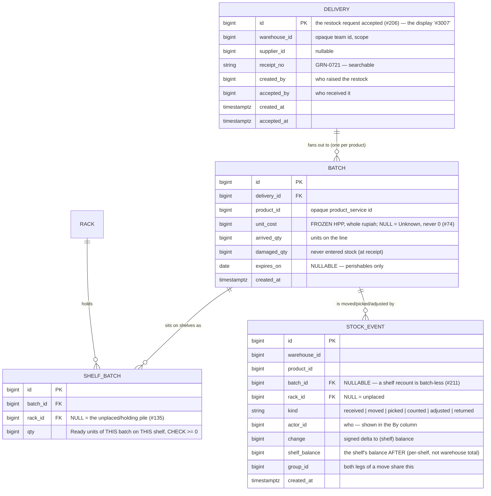

# Stock — the warehouse's per-(shelf × batch) ledger

Design discussion for the stock feature behind the warehouse product-detail, batch, move and adjust
screens (#208 → #209/#210/#211). **Frontend-first (HARD RULE 6):** the mocks are accepted, and the
proto + schema below are derived *from* them. Nothing here is built until the open questions at the
bottom are settled with the owner (HARD RULE 8).

> The mocks are `mocks/warehouse-product-detail.html`, `batch-list.html`, `batch-detail.html`,
> `batch-receipt.html`, `stock-move.html`, `stock-adjust.html` — layout & flow reference only.

---

## Decision log

- **2026-07-23** — Mocks accepted (#202/#208). They lock in the model below: stock is tracked per
  **(shelf × batch)**; a **batch = one product's units from one delivery**; each batch freezes its own
  HPP, so on-hand splits into **FIFO cost layers**; picks draw the oldest batch first.
- **2026-07-23** — **Open questions settled with the owner** (see the resolved list at the bottom):
  - **Q0 — this EVOLVES `inventory_service`**, it is not a new service. Batches, cost layers and
    `shelf_batch` are added there; the accept flow mints batches; `stock_levels` and `StockCost`
    (latest-restock HPP) migrate to the FIFO cost-layer model. So this doc governs an inventory_service
    evolution — its home stays `plans/stock_service/` for continuity with #208, but no
    `stock_service` directory is created under `backend/`.
  - **Q1 — a RECOUNT delta lands on the OLDEST batch on the shelf (FIFO)** — the same layer a pick
    would draw, so per-batch Ready keeps reconciling to on-hand and the loss has a defined cost.
  - **Q4 — a LOST/DAMAGED adjust WRITES OFF the frozen cost** (qty × unit_cost) as a value loss, not
    just quantity — so "what damage costs us" is a real number. Posts to `expense_service` (the loss
    is a cost the warehouse bears), via an interface inventory_service owns (as it owns `PostCODFee`).
  - **Q3 — RETURNS re-entry is IN SCOPE** for this epic: a returned unit re-enters stock, and the
    layer it takes is decided in Q3-detail below.
  - Q2 (single-batch move) and Q5/Q6 keep the mock's answers unless revisited.

---

## What physically happens (why this model)

A warehouse holds **other teams' goods** (#142). Those goods arrive as **deliveries** — an accepted
restock (#206) — and each delivery brings **several products**, each on its own line. The units of one
product from one delivery are a **batch**: they cost the same (one frozen HPP), they may expire on the
same date, and they can be split across several shelves.

Three facts the current `inventory_service` stock model cannot hold, and every screen here needs:

1. **Cost is per delivery, not per product.** The same shirt arrives at Rp 25.000 on one delivery and
   Rp 24.000 on the next. "What is this shelf worth" is a **sum over cost layers**, and a pick's COGS
   is the layer it drew from — not "the latest restock price" (which is what `StockCost` does today).
2. **Quantity is per (shelf × batch).** A move relocates *one delivery's* units between shelves; a
   pick draws *the oldest* batch on a shelf. Both need to know how much of *which batch* sits *where*.
3. **A batch has a lifecycle:** `Arrived = Damaged + Used + Ready`. Damaged never entered stock;
   Used was picked/shipped; Ready is still available. `Σ Ready = On hand`.

---

## The model (entities)

- **`Batch.arrived_qty` is fixed at acceptance.** `Ready = Σ shelf_batch.qty`; `Used = arrived −
  damaged − Ready` (derived). `Line cost = arrived × unit_cost` (supplier invoice); `Ready value =
  Ready × unit_cost`.
- **A cost layer is a batch** — the Prices tab groups batches by `unit_cost` and sums `Ready`.
- **`STOCK_EVENT` is the append-only truth**; `SHELF_BATCH.qty` is the derived snapshot maintained
  inside each event's transaction (same ledger+projection shape as `stock_movements`/`stock_levels`
  today). The three "After" numbers the screens show — shelf balance, batch Ready, warehouse total —
  are all projections of this one ledger along different axes.

---

## Screens → RPCs (every growing list paginates, HARD RULE 9)

**Warehouse Product Detail** (#209) — six vertical tabs (#198):

| Tab | RPC | Shape |
|---|---|---|
| Info | `ProductStockSummary` | one aggregate read: identity + Ready/Ongoing/Last-* tiles (one call keeps the header cheap) |
| Prices | `CostLayerList` | Cost/pc · On hand · Amount, per layer — paginated |
| Placement | `PlacementList` | Place · On hand · Last out · Last in · Last opname — paginated |
| Batches | `BatchList` | search by batch id or receipt no; the batch columns — paginated |
| Stock History | `StockEventList` | filter by batch; When·What·By·Batch·Place·Change·After — paginated |
| Placement History | `StockEventList` (moved-only) | filters rack **and** batch; moved events only — paginated |

**Batch list** (#209 sibling) — `BatchList` warehouse-wide: search + supplier filter + expiry filter;
stat tiles (batches, ready value, expiring ≤30d). **Batch detail** — `BatchDetail` + `BatchPlacementList`
+ `BatchEventList`. **Batch receipt** — `DeliveryReceipt` (one delivery, all its lines; printable, browser
print like #207).

**Move** (#210) — `MoveStock {product, from_rack, to_rack, batch, qty, note}` — atomic net-zero pair of
events; guards: same rack, over-available on `(from_rack, batch)`.

**Adjust** (#211) — `AdjustStock {product, rack, reason, batch?, qty, note}` — reason enum
`DAMAGED|LOST|FOUND|RECOUNT`; batch required except RECOUNT (shelf-level, batch-less "—").

Every read declares a `request_policy` scoped to the warehouse `team_id` (`use_scope`); every mutation
adds the warehouse write roles. The write path (batch creation) is **fed by restock acceptance**, not a
public RPC — the same principle as settlement's `PostEntry`.

---

## Open questions — RESOLVED (owner, 2026-07-23)

- [x] **Q0 — Evolve `inventory_service`** (not a new service). See the decision log. Batches / cost
  layers / `shelf_batch` are added to inventory_service; `stock_levels` and `StockCost` migrate to the
  FIFO model; the accept flow (#206) is reworked to mint a batch per received line.
- [x] **Q1 — Recount delta lands on the OLDEST batch on the shelf (FIFO).** A shelf-level count still
  shows Batch "—" in Stock History (it is a shelf reconcile, not a batch action), but under the hood
  the ± is applied to the oldest live `shelf_batch` so per-batch Ready reconciles to on-hand.
- [x] **Q2 — A move is single-batch** (the mock's answer). Both legs carry the one batch; a mixed-batch
  relocation is several moves.
- [x] **Q3 — Returns re-enter stock, IN SCOPE.** A return is of shipped order units, which were
  **picked from specific batches (FIFO-tagged on the pick event)**. A return therefore **re-enters the
  batch(es) it was picked from** — reversing the pick's draw — preserving cost integrity. If the
  originating pick/batch cannot be resolved (data gap), it falls back to a **new return batch** at the
  order line's recorded COGS. Built last in this epic, after detail/move/adjust.
- [x] **Q4 — A LOST/DAMAGED adjust writes off the frozen cost** (`qty × unit_cost`) as a value loss to
  `expense_service`, via an interface inventory_service owns (mirroring `PostCODFee` → settlement). A
  FOUND adjust is the inverse (a negative cost, i.e. stock recovered). A RECOUNT loss values at the
  oldest batch's cost (Q1).
- [x] **Q5 — Receipt "Checked-by" stays a paper signature line** for now (the batch records the one
  `accepted_by` actor). A real two-person verification step is a later issue if wanted.
- [x] **Q6 — Adjust confirms (`ConfirmDialog`), Move does not** — an adjust can reduce real stock and
  posts a value loss; a move is reversible and value-neutral, so the dialog itself is enough (#211/#210).

## Build order

1. **Model + migration** — `batches`, `shelf_batch`, extend `stock_movements` with `batch_id`
   (nullable) + `actor`; cost-layer + shelf-batch projections. Schema doc + `erDiagram` same commit.
2. **Rework accept (#206)** to mint a batch per received line and place its units as `shelf_batch`
   rows; `StockCost` → FIFO layer sum; keep the accept e2e green.
3. **#209 reads** — `ProductStockSummary`, `CostLayerList`, `PlacementList`, `BatchList`,
   `StockEventList` (+ moved-only), `BatchDetail`/`BatchPlacementList`/`BatchEventList`,
   `DeliveryReceipt` — one unit test each; then the six-tab screen + batch list/detail/receipt.
4. **#210 `MoveStock`**, **#211 `AdjustStock`** (with the expense write-off), then **returns re-entry**.
