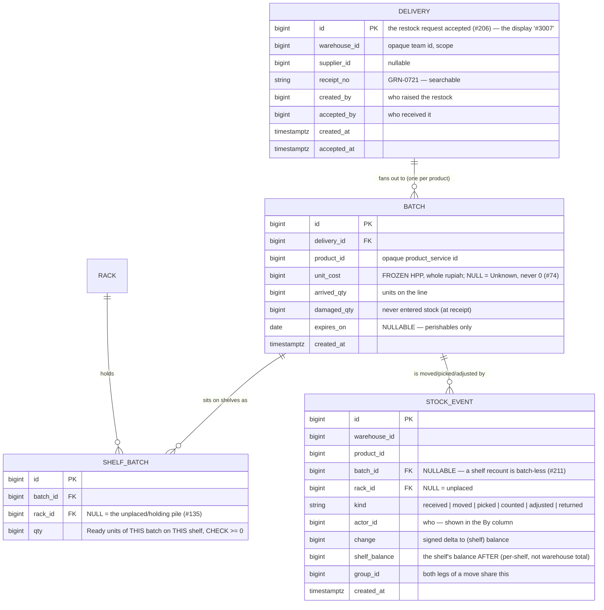

# Stock — the warehouse's per-(shelf × batch) ledger

Design discussion for the stock feature behind the warehouse product-detail, batch, move and adjust
screens (#208 → #209/#210/#211). **Frontend-first (HARD RULE 6):** the mocks are accepted, and the
proto + schema below are derived *from* them. Nothing here is built until the open questions at the
bottom are settled with the owner (HARD RULE 8).

> The mocks are `mocks/warehouse-product-detail.html`, `batch-list.html`, `batch-detail.html`,
> `batch-receipt.html`, `stock-move.html`, `stock-adjust.html` — layout & flow reference only.

---

## Decision log

- **2026-07-23** — Mocks accepted (#202/#208). They lock in the model below: stock is tracked per
  **(shelf × batch)**; a **batch = one product's units from one delivery**; each batch freezes its own
  HPP, so on-hand splits into **FIFO cost layers**; picks draw the oldest batch first.
- *(everything in "Open questions" is undecided — see the checkboxes.)*

---

## What physically happens (why this model)

A warehouse holds **other teams' goods** (#142). Those goods arrive as **deliveries** — an accepted
restock (#206) — and each delivery brings **several products**, each on its own line. The units of one
product from one delivery are a **batch**: they cost the same (one frozen HPP), they may expire on the
same date, and they can be split across several shelves.

Three facts the current `inventory_service` stock model cannot hold, and every screen here needs:

1. **Cost is per delivery, not per product.** The same shirt arrives at Rp 25.000 on one delivery and
   Rp 24.000 on the next. "What is this shelf worth" is a **sum over cost layers**, and a pick's COGS
   is the layer it drew from — not "the latest restock price" (which is what `StockCost` does today).
2. **Quantity is per (shelf × batch).** A move relocates *one delivery's* units between shelves; a
   pick draws *the oldest* batch on a shelf. Both need to know how much of *which batch* sits *where*.
3. **A batch has a lifecycle:** `Arrived = Damaged + Used + Ready`. Damaged never entered stock;
   Used was picked/shipped; Ready is still available. `Σ Ready = On hand`.

---

## The model (entities)

- **`Batch.arrived_qty` is fixed at acceptance.** `Ready = Σ shelf_batch.qty`; `Used = arrived −
  damaged − Ready` (derived). `Line cost = arrived × unit_cost` (supplier invoice); `Ready value =
  Ready × unit_cost`.
- **A cost layer is a batch** — the Prices tab groups batches by `unit_cost` and sums `Ready`.
- **`STOCK_EVENT` is the append-only truth**; `SHELF_BATCH.qty` is the derived snapshot maintained
  inside each event's transaction (same ledger+projection shape as `stock_movements`/`stock_levels`
  today). The three "After" numbers the screens show — shelf balance, batch Ready, warehouse total —
  are all projections of this one ledger along different axes.

---

## Screens → RPCs (every growing list paginates, HARD RULE 9)

**Warehouse Product Detail** (#209) — six vertical tabs (#198):

| Tab | RPC | Shape |
|---|---|---|
| Info | `ProductStockSummary` | one aggregate read: identity + Ready/Ongoing/Last-* tiles (one call keeps the header cheap) |
| Prices | `CostLayerList` | Cost/pc · On hand · Amount, per layer — paginated |
| Placement | `PlacementList` | Place · On hand · Last out · Last in · Last opname — paginated |
| Batches | `BatchList` | search by batch id or receipt no; the batch columns — paginated |
| Stock History | `StockEventList` | filter by batch; When·What·By·Batch·Place·Change·After — paginated |
| Placement History | `StockEventList` (moved-only) | filters rack **and** batch; moved events only — paginated |

**Batch list** (#209 sibling) — `BatchList` warehouse-wide: search + supplier filter + expiry filter;
stat tiles (batches, ready value, expiring ≤30d). **Batch detail** — `BatchDetail` + `BatchPlacementList`
+ `BatchEventList`. **Batch receipt** — `DeliveryReceipt` (one delivery, all its lines; printable, browser
print like #207).

**Move** (#210) — `MoveStock {product, from_rack, to_rack, batch, qty, note}` — atomic net-zero pair of
events; guards: same rack, over-available on `(from_rack, batch)`.

**Adjust** (#211) — `AdjustStock {product, rack, reason, batch?, qty, note}` — reason enum
`DAMAGED|LOST|FOUND|RECOUNT`; batch required except RECOUNT (shelf-level, batch-less "—").

Every read declares a `request_policy` scoped to the warehouse `team_id` (`use_scope`); every mutation
adds the warehouse write roles. The write path (batch creation) is **fed by restock acceptance**, not a
public RPC — the same principle as settlement's `PostEntry`.

---

## ⚠ Open questions — to settle with the owner before any code (HARD RULE 8)

- [ ] **Q0 — Service boundary: new `stock_service`, or evolve `inventory_service`?** This is the
  foundational fork, and #208 says "new service" while `inventory_service` *already* owns stock
  (`stock_levels`, `stock_movements`), racks, the restock/accept flow that would create batches, and
  the HPP formula. My recommendation is **evolve `inventory_service`**: batches are essentially
  first-class restock lines (#207 already concluded "a batch is a delivery line"), the accept flow that
  mints them lives there, and a second service tracking the same stock would need a sync that *will*
  drift. A separate service cleanly walls off the new model but splits one domain across two owners.
  **The answer decides where every table, RPC and this doc live** — and whether `stock_levels` /
  `StockCost` (latest-restock HPP) are migrated to the FIFO-layer model or kept in parallel.

- [ ] **Q1 — Recount cost attribution.** A `RECOUNT` reconciles a whole shelf and is batch-less ("—").
  But the shelf's units belong to specific batches (cost layers). When a recount says a shelf is −1,
  **which batch/layer absorbs it?** Options: (a) FIFO — take from the oldest batch on the shelf;
  (b) newest; (c) pro-rata across the shelf's batches. Needed so per-batch Ready still reconciles to
  on-hand, and so the value of a recount loss is defined.

- [ ] **Q2 — Can a Move span multiple batches?** The mock says **no** (one batch per move, both legs
  carry it). Confirm — or design a mixed-batch move as several batch-keyed legs under one `group_id`.

- [ ] **Q3 — Returns re-entry.** "Last return #RET-118 · 4 pcs came back." Which cost layer does a
  returned unit re-enter at — its **original batch** (if still known), or a **new return batch** at a
  decided cost? A distinct inbound path from restocks; may be out of scope for #209–#211 (returns are
  a separate service, `plans/return_service/`).

- [ ] **Q4 — Downward-adjust value.** Does a `LOST`/`DAMAGED` adjust write off the batch's frozen
  **cost** (a value movement into a loss account), or only its **quantity**? Affects whether Adjust
  touches settlement/expense at all.

- [ ] **Q5 — Two-person receipt.** The batch receipt has **Received-by** *and* **Checked-by**
  signatories. Is "Checked-by" a real acceptance/verification step to model, or just a paper signature
  line? The accept flow today records one actor.

- [ ] **Q6 — Adjust confirm step.** #211 says Adjust confirms (it can reduce real stock). A Move is
  reversible by another move — does it need a confirm too, or is the dialog enough?
