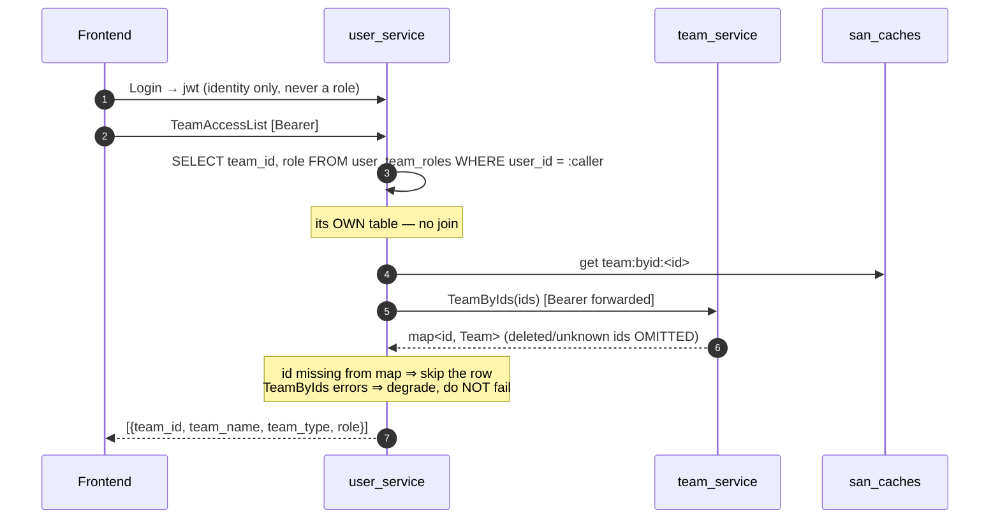

# Brainstorming — `team_service`

> Adapting a prior internal `team_service`. Companion to
> [../user_service/brainstorming.md](../user_service/brainstorming.md) — **this doc settles that
> one's open §6.3 and forces its §6.7.**
>
> **Nothing is implemented yet.**

> **Decisions so far**
> - **`team_service` owns `teams`** — settles user_service §6.3. There is a real team domain
>   (CRUD, team codes, bank details), so `teams` belongs to it, alone. (owner, 2026-07-13)
> - **Team bank details are readable by any authenticated user** — `TeamDetail` keeps
>   `allow_only_authenticated` and keeps `TeamInfo` embedded in the `Team` message. The owner
>   judged the exposure acceptable: every account in this system is internal staff.
>   **Writing** stays scoped (TEAM_OWNER/TEAM_ADMIN + `use_scope`). No separate
>   `TeamInfoDetail` RPC. (owner, 2026-07-13 — see §3.1 for when to revisit)
> - **Keep the all-teams dev seed** — but it lives in `cmd/tool seed`, **never in a migration**,
>   and hard-refuses a Production target. Bootstrap (root team + root user) is a separate,
>   real migration with the password from config. (owner, 2026-07-13 — §3.2)
> - **FIX `TeamInfoUpdate`** — the duplicate-row race and the silent field-blanking are real
>   data loss, not acceptable behaviour. UNIQUE index on `team_id` + `ON CONFLICT DO UPDATE`,
>   and `optional` fields so absent ≠ clear. (owner, 2026-07-13 — §3.3)
> - **`TeamType` is declared ONCE**, in `proto/warehouse/team/v1/team.proto`, by the service that
>   owns the table. It gains a `ROOT` value. Never redeclare a domain enum in another package.
>   (owner, 2026-07-13 — §3.4)
> - **Root-ness is guaranteed by seeding** — `team_service`'s own migration seeds team 1 as
>   `type='root'` **and advances the sequence** (an explicit-id insert does not). team_service
>   migrations must run **before** user_service's root-role seed.
>   (owner, 2026-07-13 — §3.5)
> - **`TeamCreate` is UNARY**, not streaming. Consequently `san_authz` ships with **no streaming
>   interceptor path at all** — so the "streaming silently ignores policy.Roles" failure mode
>   cannot exist. (owner, 2026-07-13 — §3.7)
> - **`TeamAccessList` DEGRADES, never fails**, when team_service is down — team ids and roles
>   still return; only the display name/type go blank. Authorization is unaffected (it never
>   reads `teams`). Do **not** cache the degraded value. (owner, 2026-07-13 — §5.5)
> - **`TeamUpdate` = `[ROOT, ADMIN, TEAM_OWNER, WAREHOUSE_OWNER]` + `use_scope`** — an owner may
>   rename their own team. `type` / `team_code` stay immutable. (owner, 2026-07-13 — §5.2)
> - **`TeamList` / `TeamByIds` stay unscoped** — any authenticated user may enumerate teams.
>   (owner, 2026-07-13 — §5.3)
> - **`TeamCreate` grants the owner via a BLOCKING RPC to `user_service.TeamUserUpdate`**, and
>   soft-deletes the team if that grant fails. Not an event. (owner, 2026-07-13 — §5.1)
> - **Persistence is GORM** — settles user_service §6.1. (owner, 2026-07-13 — overruled Claude's
>   pgx lean.) Migrations stay **goose SQL** (HARD RULE 3): goose owns the schema, GORM only
>   reads and writes rows. **No `AutoMigrate`.**
>   ⚠ **The one trap this creates:** the role lookup MUST use `.Find()`, never `.First()`.
>   `First` returns `ErrRecordNotFound` when a user is not a member — but *every* request looks
>   up the ROOT team and almost nobody is in it, so treating "no row" as an error would fail
>   every non-root request in the system. `Find` leaves the struct zeroed and returns no error,
>   so a missing membership correctly reads as role 0. See
>   `backend/pkgs/san_authz/role_resolver.go`.
> - **A warehouse IS a team** (`warehouse_id == team_id`); warehouses are created via
>   `TeamCreate(type=warehouse)`, and warehouse_service keys its own table by that id.
>   (owner, 2026-07-14 — §3.6)
> - **PARKED:** validating `return_warehouse_id` / `return_user_id` — §5.4.
>
> **✅ team_service is fully decided. Implementation can start.**

---

## 1. What it is

**Two tables, seven RPCs, no dependencies on any other domain service.** The smallest genuinely
useful service in the source, and the right *first* real service to build.

| Table | Holds |
| --- | --- |
| `teams` | id, type (`root`/`admin`/`warehouse`/`selling`), name, team_code (unique), description, deleted |
| `team_infos` | 1:1 with a team — contact number, bank details, and two **opaque cross-service ids** (`return_warehouse_id`, `return_user_id`) |

**Its real job is to be the anti-join primitive.** `TeamByIds(ids) → map<uint64, Team>` is how
every other service turns a `team_id` it stores locally into a name and type **without touching
team_service's database.** Everything else is ordinary CRUD hanging off that.

Two facts that shape everything:

- **Team type is not a security field.** Authorization reads `user_team_roles(user_id, team_id)
  → role`; it never reads `teams.type`. Type is classification (it drives the nav menu) and
  display. So team data can sit behind an RPC with **zero authorization coupling**.
- **Teams are near-static.** Only ROOT/ADMIN create or rename them; `type` and `team_code` are
  immutable after create. That is what makes the RPC-plus-cache answer below cheap.

---

## 2. The boundary problem — and the answer

The source **cheats**. `user_service/user/team_access_list.go:44` reaches into another service's
table by raw name:

```go
Joins("JOIN teams ON teams.id = user_team_roles.team_id")
```

Our independence rule forbids it. So how does a user's team list get its team *names*?

| | Mechanism | Verdict |
| --- | --- | --- |
| (a) | `TeamAccessList` returns bare ids; the **frontend** calls `TeamByIds` itself | runner-up |
| **(b)** | **`user_service` calls `team_service.TeamByIds` server-side and merges** | ✅ **lean** |
| (c) | Denormalise `name`+`type` onto `user_team_roles` | ❌ reject |

**(c) is rejected outright.** It doesn't remove the coupling, it *inverts* it: keeping the copy
fresh means `TeamUpdate` writing `user_service`'s rows — a cross-service **write**, banned just
as hard as the join. The source shows exactly where that road ends: `invoice_unpaid` and
`invoice_not_final` are *invoice_service's* aggregates denormalised onto *team_service's* table.

**(b) over (a)** because `team_type` selects the nav menu, and `TeamAccessList` is the
once-per-page-load bootstrap that blocks first render. Option (a) turns boot into a serial
two-hop waterfall to move one hop from a fast internal network onto the client's.

### The honest cost, and the mandatory mitigation

**(b) makes team_service a liveness dependency of login.** That is the real price, and it is the
one argument that would flip this decision.

**Mitigation is not optional:** `TeamAccessList` must **degrade, never fail**. If `TeamByIds`
errors, return the memberships with `team_name = ""` — a display-name lookup must never be able
to take down login.



A `team_id` **absent from the map means deleted-or-gone → skip it.** That incidentally fixes a
live bug: the source's JOIN has no `deleted = false` filter, so soft-deleted teams appear in
every user's team list forever.

### This forces user_service §6.7 — the interceptor must move

team_service is the **second guarded service**, so "how does a service check roles without
importing `user_service`?" must be answered **now**.

The source's answer is grim: `team_service` imports `user_service/access_interceptors` and hands
it **its own `*gorm.DB`** — so team_service's database handle reads `user_team_roles`. That
violates independence *in the authorization layer, on every single request*.

**Ours:**

- The interceptor lives in **`backend/pkgs/san_authz`**, not in `user_service` — otherwise every
  service in the system imports `user_service`.
- It resolves roles through a `RoleResolver` interface with two implementations:
  - `NewDBRoleResolver(pool)` — direct pgx. Used **only by `user_service`**, which owns the table.
  - `NewRPCRoleResolver(userClient, cache)` — a `RoleResolve` RPC + `san_caches`. Used by
    **every other service**.

---

## 3. Bugs in the source — fix, don't port

### ⚪ 3.1 Bank details readable by any authenticated user — ACCEPTED, not a bug
`TeamDetail` is `allow_only_authenticated` and embeds `TeamInfo`, so any logged-in user can read
any team's `bank_account_number` / `bank_owner_name` / `contact_number`. Writing stays scoped
(TEAM_OWNER + `use_scope`), so the read/write asymmetry is deliberate.

**Owner's call: acceptable — every account in this system is internal staff.** Port as-is.

**Revisit if any of these become true**, because each one turns this from a shrug into a leak:
- a non-staff principal can ever authenticate — a supplier, a customer, a marketplace
  integration, or the Chrome-extension client;
- warehouse-floor accounts become shared or low-trust (a shared handheld login is one
  shoulder-surf away from every team's payout account);
- payout details become a fraud target — changing where money lands is the classic attack, and
  reading them is reconnaissance for it.

The cheap hedge, if it ever matters: keep the `Team` message as-is but omit `TeamInfo` from
`TeamList`/`TeamByIds` (they don't need it anyway), so only a deliberate `TeamDetail` on a
specific id returns it. That keeps bulk enumeration off the table for near-zero cost.

### ⚪ 3.2 The all-teams dev seed — ACCEPTED, but it must be unable to reach production
A convenient dev fixture creates a superuser account with `ROLE_TEAM_OWNER` on **every team** plus
some sample data.

**Owner's call: keep it.** It is a genuinely useful dev convenience.

**But it is a known-credential superuser**, so the only thing standing between "handy" and
"catastrophic" is *where it runs*. That must be enforced by construction, not by remembering:

**Two seeds, not one — and they live in different places.**

| | Bootstrap seed | Dev seed |
| --- | --- | --- |
| What | root team (id=1) + root user + `ROLE_ROOT` | the all-teams superuser + sample teams/users |
| Where | **goose migration** (`team_service` 00002, `user_service` 00003) | **`go run ./cmd/tool seed`** — never a migration |
| Prod | **required** — the system does not work without team 1 | **hard-refuses**: aborts if the target is Production |
| Password | from config (`ROOT_PASSWORD`), never a literal | a fixed dev password, fine locally |

The rule that makes it safe: **the dev seed is never a migration.** Migrations run against
production by design — anything inside one *will* eventually execute there. `cmd/tool` already
prompts Local vs Production and makes you type `production` to confirm; `seed` simply refuses the
Production target outright.

Revisit only if someone needs the dev seed against a shared staging database — at which point it
is no longer a dev seed.

### 🔴 3.3 `TeamInfoUpdate` silently destroys data — twice ✅ **FIXING** (owner)

**Bug 1 — duplicate rows.** The source's comment claims *"team_infos has no unique index on
team_id, so this load-then-Save is the safe upsert."* **The opposite is true.** With no
transaction, no lock and no unique index, two concurrent updates on a team whose info row is
missing **both** miss, **both** insert, and produce **two rows for one team**. Thereafter
`First()` picks one arbitrarily and the other is a silent ghost — the team's bank account is now
whichever row the query planner felt like.

**Fix:** make the database enforce it, not the code.

```sql
CREATE UNIQUE INDEX team_infos_team_id_unique ON team_infos (team_id);
```

```sql
INSERT INTO team_infos (team_id, contact_number, bank_type, bank_owner_name,
                        bank_account_number, return_warehouse_id, return_user_id)
VALUES ($1, $2, $3, $4, $5, $6, $7)
ON CONFLICT (team_id) DO UPDATE SET
    contact_number      = COALESCE($2, team_infos.contact_number),
    bank_type           = COALESCE($3, team_infos.bank_type),
    bank_owner_name     = COALESCE($4, team_infos.bank_owner_name),
    bank_account_number = COALESCE($5, team_infos.bank_account_number),
    return_warehouse_id = CASE WHEN $8 THEN $6 ELSE team_infos.return_warehouse_id END,
    return_user_id      = CASE WHEN $9 THEN $7 ELSE team_infos.return_user_id END,
    updated_at          = NOW()
RETURNING ...;
```

The unique index is what makes `ON CONFLICT` possible at all — the race is closed by the schema,
so no amount of concurrency can reproduce it.

**Bug 2 — full replace, no field presence.** All six fields are assigned unconditionally, so a
client PATCHing only `contact_number` **silently blanks the bank details and both return ids**.
And because the source overloads `0` to mean "clear", there is *no way to express* "leave it
alone".

**Fix:** proto3 **`optional`** (explicit presence). Absent = leave alone. Present = write it,
including present-and-zero = clear to NULL. That is the distinction the source cannot make.

```proto
message TeamInfoUpdateRequest {
  option (warehouse.role_base.v1.request_policy) = {
    roles: [ROLE_ROOT, ROLE_ADMIN, ROLE_TEAM_OWNER, ROLE_TEAM_ADMIN]
  };
  uint64 team_id = 1 [(warehouse.role_base.v1.use_scope) = true];

  // absent = leave alone · present = write · present-and-zero = clear
  optional string contact_number      = 2;
  optional string bank_type           = 3;
  optional string bank_owner_name     = 4;
  optional string bank_account_number = 5;
  optional uint64 return_warehouse_id = 6;
  optional uint64 return_user_id      = 7;
}
```

Both fixes get a **test that fails against the old behaviour**: a concurrent-update test that
would produce two rows, and a partial-update test asserting the bank details survive a
contact-number-only PATCH.

### ✅ 3.6 A warehouse IS a team — **DECIDED** (owner, 2026-07-14)

**A warehouse is a team of type `warehouse`. `warehouse_id == team_id`.** One entity, one id.
The roling scope for a warehouse is its team id, which is also its warehouse id — exactly how
warehouse teams already work in the interceptor today. (owner: "#10 yes".)

What this commits `warehouse_service` to, when it is built:

- A warehouse is **created via `team_service.TeamCreate(type=warehouse)`** — team_service mints
  the id (per-service independence: warehouse_service cannot write `teams`). That returned team
  id **is** the warehouse id.
- `warehouse_service` owns a table of warehouse-specific attributes (address, fee config, racks,
  …) **keyed by that same id** (`warehouse_id`/PK = the team id). It stores no separate warehouse
  id of its own.
- Authorization for a warehouse scopes on its team id — no translation, no second lookup.
- The `warehouse_id == team_id` identity is **kept on purpose** (it is load-bearing in roling),
  but the id is now minted by team_service via RPC, not fused inside a single cross-table insert.
  So creating a warehouse is the same saga shape as §5.1 (create the team, then write the
  warehouse row; compensate if the second step fails).

Consequence for the "third writer of teams" problem: it dissolves. There is no independent
warehouse-team creation — one path (`TeamCreate`) mints every team, warehouses included.

### 🔴 3.4 The `TeamType` landmine ✅ **STANDARDIZED IN PROTO** (owner)

The source declares `TeamType` **three times**, and they do not agree:

| Package | 1 | 2 | 3 | has ROOT? |
| --- | --- | --- | --- | --- |
| `common.v1` | WAREHOUSE | SELLING | ADMIN | ✗ |
| `user_iface.v2` | WAREHOUSE | SELLING | ADMIN | ✗ — a straight copy-paste of `common.v1` |
| **`invoice_iface.v1`** | **SELLING** | **WAREHOUSE** | — | ✗ |

`invoice_iface` has **1 and 2 swapped**. Any code passing a raw enum int across that boundary
**silently turns a warehouse team into a selling team** — inside the service that decides who owes
whom money. Nothing catches it: both values are valid, so there is no error, just a wrong answer.

And because no declaration has a `ROOT` value, `user/team_access_list.go` collapses
`case AdminTeamType, RootTeamType: return TEAM_TYPE_ADMIN` — **the root team is indistinguishable
from an admin team on the wire.**

#### The fix: one enum, declared once, in the domain that owns it

`team_service` owns `teams`, so it owns what a team *type* is. Everyone else imports it. We have a
single buf module, so a cross-domain import costs nothing — there is no versioning dance to avoid.

```proto
// proto/warehouse/team/v1/team.proto
//
// THE canonical TeamType. Declared ONCE, here, by the service that owns the teams table.
// Never redeclare it in another package — that is exactly how the source ended up with three
// mutually-contradictory copies, one of which silently swaps warehouse and selling.
enum TeamType {
  TEAM_TYPE_UNSPECIFIED = 0;
  TEAM_TYPE_ROOT        = 1;  // NEW — the source has no ROOT, so it collapsed root into admin
  TEAM_TYPE_ADMIN       = 2;
  TEAM_TYPE_WAREHOUSE   = 3;
  TEAM_TYPE_SELLING     = 4;
}
```

Two deliberate choices:

- **`ROOT` exists.** Team 1 is the super-admin scope; it should be nameable, not silently folded
  into `ADMIN`.
- **The numbers deliberately match none of the three legacy numberings.** Nothing persists these
  (the DB stores `type` as `TEXT`, validated by a `CHECK`), so the numbers are free — and choosing
  fresh ones means any raw int carried over from legacy code produces an *obviously* wrong value
  rather than a plausible, silently-swapped one. Fail loudly, not quietly.

The database keeps `type TEXT` with `CHECK (type IN ('root','admin','warehouse','selling'))` —
readable in `psql`, and the enum↔text mapping lives in exactly one `mapper.go`.

### 🔴 3.5 Root-ness is an accident ✅ **GUARANTEED BY SEEDING** (owner)

The interceptor hardcodes `rootTeamID = 1` — ROOT/ADMIN *at team 1* is the entire global
super-admin bypass. But nothing in the source guarantees team 1 **is** the root team: the row
exists only because `user_service/seed.go` happens to insert it. If the sequence ever hands id 1
to some other team, **the super-admin bypass silently has no holder** and nobody can administer
anything.

**Seed it, in the migration of the service that owns the table.**

```sql
-- backend/services/team_service/db_migrations/00002_seed_root_team.sql
-- +goose Up
-- +goose StatementBegin
INSERT INTO teams (id, type, name, team_code, description)
VALUES (1, 'root', 'Root Team', 'ROOT', 'System root team — the global super-admin scope')
ON CONFLICT (id) DO NOTHING;

INSERT INTO team_infos (team_id) VALUES (1)
ON CONFLICT (team_id) DO NOTHING;

-- ⚠ LOAD-BEARING, AND EASY TO MISS.
-- An explicit-id INSERT does NOT advance a BIGSERIAL sequence. Without this, the sequence is
-- still at 1, so the FIRST REAL TeamCreate is handed id 1 and dies on a duplicate key.
SELECT setval(pg_get_serial_sequence('teams', 'id'),      (SELECT MAX(id) FROM teams));
SELECT setval(pg_get_serial_sequence('team_infos', 'id'), (SELECT MAX(id) FROM team_infos));
-- +goose StatementEnd

-- +goose Down
-- +goose StatementBegin
DELETE FROM teams WHERE id = 1;   -- team_infos cascades
SELECT setval(pg_get_serial_sequence('teams', 'id'), COALESCE((SELECT MAX(id) FROM teams), 1));
-- +goose StatementEnd
```

Three things this gets right that the source does not:

1. **The owning service seeds it.** In the source, `user_service` inserts `team_service`'s row —
   backwards, and a cross-service write.
2. **The sequence is advanced.** The source needs a separate repair helper
   (`cmd/migration/common.go: resyncIDSeq`) to clean up the duplicate-key mess afterwards.
   Doing it at seed time means the mess never happens.
3. **A deploy-ordering contract, written down:** `team_service`'s migrations must run **before**
   `user_service`'s root-role seed — `user_team_roles(team_id=1, user_id=1, ROLE_ROOT)` is
   meaningless until team 1 exists. There is no FK across the boundary to enforce this, so it is
   a documented ordering requirement, not an automatic one.

**Kept as cheap reinforcement** (say the word and I'll drop them):

- `CHECK ((type = 'root') = (id = 1))` on `teams` — makes "id 1" and "is root" the *same
  statement*, so the constant in the interceptor and the data in the table cannot drift apart.
- **`TeamDelete` refuses `team_id = 1`** — nothing in the source protects the super-admin scope
  from being soft-deleted by an admin with a stray click, which would strand every root/admin
  bypass in the system.
  (`TeamUpdate` on team 1 is *allowed* — renaming "Root Team" is harmless, and `type`/`team_code`
  are immutable after create, so a rename can never violate the `(type='root') = (id=1)` check.)

### 🟡 Smaller ones
- `team_detail.go` **doesn't filter `deleted`**, while `TeamList` and `TeamByIds` do — so an id
  omitted from `TeamByIds` is still fully readable via `TeamDetail`.
- `RowsAffected == 0` conflates *not found* with **"you submitted the same values"** — Postgres
  reports 0 rows affected on a no-op UPDATE, so re-submitting an unchanged form returns a
  spurious `NotFound`.
- A duplicate `team_code` surfaces as a raw Postgres error, not `CodeAlreadyExists`.
- `TeamList`'s search interpolates `q` into a LIKE pattern **without escaping `%` or `_`**.
- `TeamByIds` never preloads `TeamInfo`, so `Team.info` is **always nil** — a silent regression
  vs. the legacy RPC it replaced. (Our port dissolves it by removing `info` from `Team`.)

### 🟡 3.7 `TeamCreate` is streaming ✅ **MAKE IT UNARY** (owner)

`rpc TeamCreate(TeamCreateRequest) returns (stream TeamCreateResponse)` — the source's *only*
streaming RPC, dressed up as a "long-running task with progress".

It isn't one. The stream carries nothing but raw slog text
(`time=... level=INFO msg="team created"`), and `teamCreateLogger.Write` returns `(len(p), nil)`
**even when `stream.Send` fails** — so a broken stream never aborts the transaction and the team
is created anyway. The progress channel is decoration over a single INSERT.

```proto
rpc TeamCreate(TeamCreateRequest) returns (TeamCreateResponse);   // unary
```

**This is worth more than tidiness — it lets us delete the broken streaming interceptor.**
A streaming interceptor cannot read the request body (the handler consumes it via `conn.Receive`),
so it cannot read the `use_scope` field value: scope is forced to `0` and **any roles-policy
silently degrades to ROOT/ADMIN-at-team-1, ignoring `policy.Roles` entirely.** That path is a
loaded gun aimed at any future scoped streaming RPC.

`TeamCreate` was the only reason to keep it (the other streaming RPC, `TeamSynclegacy`, is already
dropped). Making it unary means `san_authz` ships with **no streaming path at all** — the failure
mode cannot exist. If a scoped streaming RPC is ever genuinely needed, authorize it inside the
handler after the first `conn.Receive`, and say so explicitly.

---

## 4. Data model

```sql
CREATE TABLE teams (
    id          BIGSERIAL   PRIMARY KEY,
    type        TEXT        NOT NULL,
    name        TEXT        NOT NULL,
    team_code   TEXT        NOT NULL,
    description TEXT        NOT NULL DEFAULT '',
    deleted     BOOLEAN     NOT NULL DEFAULT FALSE,
    created_at  TIMESTAMPTZ NOT NULL DEFAULT NOW(),
    updated_at  TIMESTAMPTZ NOT NULL DEFAULT NOW(),

    CONSTRAINT teams_type_valid   CHECK (type IN ('root','admin','warehouse','selling')),
    CONSTRAINT teams_code_present CHECK (team_code <> ''),

    -- ROOT-NESS IS STRUCTURAL: the interceptor hardcodes team 1 as the super-admin scope,
    -- so id=1 and type='root' must be the same statement. They cannot drift apart.
    CONSTRAINT teams_root_is_id_1 CHECK ((type = 'root') = (id = 1))
);
CREATE UNIQUE INDEX teams_team_code_unique ON teams (team_code);

CREATE TABLE team_infos (
    id      BIGSERIAL PRIMARY KEY,
    team_id BIGINT    NOT NULL REFERENCES teams (id) ON DELETE CASCADE,

    -- Opaque cross-service ids. No FK is possible under independence (§7.4).
    return_warehouse_id BIGINT,
    return_user_id      BIGINT,

    contact_number      TEXT NOT NULL DEFAULT '',
    bank_type           TEXT NOT NULL DEFAULT '',
    bank_owner_name     TEXT NOT NULL DEFAULT '',
    bank_account_number TEXT NOT NULL DEFAULT '',
    created_at TIMESTAMPTZ NOT NULL DEFAULT NOW(),
    updated_at TIMESTAMPTZ NOT NULL DEFAULT NOW()
);
-- UNIQUE, unlike the source's plain index — this is what makes the upsert safe (§3).
CREATE UNIQUE INDEX team_infos_team_id_unique ON team_infos (team_id);
```

**Deliberately dropped:** `product_limit_count`, `product_count`, `invoice_unpaid`,
`invoice_not_final`. They are *other services'* counters denormalised onto team_service's table —
precisely the coupling this project bans. team_service never reads or writes them.

---

## 5. Open decisions

- [x] **5.1 — `TeamCreate`'s owner grant: SYNCHRONOUS RPC + compensation.** ✅
      (owner: *"for now, block is enough"*, 2026-07-13)

      The source grants the creator `ROLE_TEAM_OWNER` **inside its own transaction**, writing
      `user_team_roles` — user_service's table. We cannot. So `TeamCreate` blocks on an RPC:

      ```mermaid
      sequenceDiagram
          participant A as Admin (ROOT/ADMIN)
          participant TS as team_service
          participant US as user_service

          A->>TS: TeamCreate{type, name, team_code}
          TS->>TS: BEGIN · INSERT teams + team_infos · COMMIT
          TS->>US: TeamUserUpdate{team_id, add: caller, ROLE_*_OWNER}  [Bearer forwarded]
          alt granted
              US-->>TS: ok
              TS-->>A: {team}
          else grant failed
              US-->>TS: error
              TS->>TS: COMPENSATE — soft-delete the team (deleted = TRUE)
              TS-->>A: Internal("team created but owner grant failed; rolled back")
          end
      ```

      **Which owner role is granted follows the team type** — `WAREHOUSE_OWNER` for a warehouse
      team, `TEAM_OWNER` otherwise (§5.2 established they are the same role in different team
      types).

      **Why blocking is fine here, concretely:** only ROOT/ADMIN may create a team, the call is
      rare (a handful, ever), and the exposure window is one RPC round-trip. And the worst case
      is benign — ROOT/ADMIN bypass every scope check, so even if compensation *also* fails, an
      ownerless team is **administrable, not bricked**: an admin can grant the owner by hand.

      **Two things this must get right, or the compensation is theatre:**
      1. `TeamUserUpdate` must be **idempotent** (`ON CONFLICT (team_id, user_id) DO UPDATE`) —
         a retry after an ambiguous timeout must not double-grant or fail.
      2. Compensation **soft-deletes** (`deleted = TRUE`); it must not hard-delete, because the
         grant may in fact have succeeded on a timed-out call. A soft-deleted team with an owner
         is recoverable; a hard-deleted one with a dangling `user_team_roles` row is orphaned
         garbage.

      *Revisit as a `TeamCreated` event if:* team creation ever becomes frequent or
      self-service — at which point the synchronous coupling starts to matter.

- [x] **5.2 — A team owner MAY rename their own team.** ✅ (owner, 2026-07-13)

      `TeamUpdate` becomes **`[ROOT, ADMIN, TEAM_OWNER, WAREHOUSE_OWNER]` and is SCOPED.**
      Both owner flavours are included because they are the same role in different team types:
      `TEAM_OWNER` owns a selling/admin team, `WAREHOUSE_OWNER` owns a warehouse team.

      ```proto
      message TeamUpdateRequest {
        option (warehouse.role_base.v1.request_policy) = {
          roles: [ROLE_ROOT, ROLE_ADMIN, ROLE_TEAM_OWNER, ROLE_WAREHOUSE_OWNER]
        };
        // use_scope is MANDATORY here, not optional — see below.
        uint64 team_id = 1 [(warehouse.role_base.v1.use_scope) = true];

        optional string name        = 2;
        optional string description = 3;
      }
      ```

      ⚠ **`use_scope` is load-bearing, not decoration.** An unscoped roles-policy is evaluated
      against **team 1** (the interceptor coerces `teamID = 0 → 1`), so without `use_scope` the
      TEAM_OWNER and WAREHOUSE_OWNER entries would be **dead letters** — the policy would *say*
      an owner may rename their team while the system silently required root/admin. That is
      exactly the "declared policies that are lie" bug from user_service §3.7. Scoping it is what
      makes the declaration true.

      `type` and `team_code` remain **immutable after create** — they are not in the request at
      all. That also means a rename can never violate the `(type='root') = (id=1)` constraint.
      Fields are `optional` (presence), per §3.3 — a name-only update must not blank the
      description.

- [x] **5.3 — Any authenticated user may list every team.** ✅ (owner, 2026-07-13)

      `TeamList` and `TeamByIds` stay `allow_only_authenticated` and **unscoped**. This is not an
      oversight — it is required: `TeamByIds` is the anti-join primitive (§2), and scoping it to
      one team would defeat its entire purpose. `TeamList` feeds the team pickers.

      **Note this compounds §3.1.** Bank details are readable by any authenticated user *and*
      `TeamByIds` accepts up to 200 ids per call, so a caller can enumerate every team's payout
      details in a handful of requests. Both decisions are individually defensible; together they
      make bulk harvesting trivial rather than tedious.

      **The one-line hedge, still available at zero cost:** keep `TeamInfo` on `TeamDetail` (a
      deliberate lookup of one team) but omit it from `TeamList` / `TeamByIds` — neither needs it,
      and the source's `TeamByIds` never even populates it. That preserves everything you've
      decided while making *bulk* extraction impossible. Say the word; otherwise I port it as-is.

- [⏸] **5.4 — `return_warehouse_id` / `return_user_id`: validate or opaque? — PARKED**
      (owner: "we talk later", 2026-07-13)

      **For now: stored as opaque, unvalidated `BIGINT NULL`** — which is also what the source
      does, so nothing is lost by deferring. No FK is possible across the service boundary, and
      `warehouse_service` does not exist yet to validate against.

      **What deferring actually costs**, so the decision is made with open eyes: a team's return
      destination can point at a **nonexistent** warehouse/user, or at **another team's**. Nothing
      catches it at write time. Whoever consumes it later (the returns flow) inherits a field that
      may not resolve — and a return routed to a warehouse that does not exist is goods with
      nowhere to go.

      **Revisit when `warehouse_service` exists** — at which point validation is one RPC on write,
      and the honest question becomes whether team_service should take a liveness dependency on
      warehouse_service to save a bad row.

- [x] **5.5 — `TeamAccessList` DEGRADES when team_service is down.** ✅ (owner, 2026-07-13)

      A team-name lookup must never be able to take down login. So when `TeamByIds` fails,
      `TeamAccessList` returns the memberships anyway:

      ```
      TeamByIds error  →  team_name = "", team_type = TEAM_TYPE_UNSPECIFIED
                          team_id, role, alias are still correct (own table)
                          → log at WARN, do NOT return an error
      ```

      **What still works with team_service down:** login, the team list (ids + roles), and
      **every scoped RPC** — because authorization reads `user_team_roles`, which is
      user_service's own table, and never reads `teams`. Team type is classification, not a
      security field. So a team_service outage is *cosmetic*: the app boots and stays usable,
      it just shows `Team #5` instead of `Jakarta Warehouse`.

      **What this costs:** the frontend must render a `Team #<id>` fallback rather than assuming
      `team_name` is non-empty, and the team-type-driven nav menu degrades to a default. Both are
      real UI work, not free — but the alternative is an auth outage.

      ⚠ **The one thing this must not do is cache the degraded value.** Writing
      `team_name = ""` into `san_caches` would turn a 30-second team_service blip into 60 seconds
      of blank team names *after it recovers*. On the error path: degrade the response, cache
      nothing.
