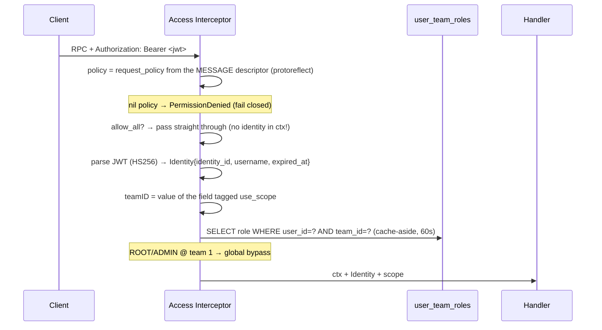

# Brainstorming — `user_service` + the roling system

> Adapting a prior internal `user_service` and its role/authorization ("roling") system.
> The owner explicitly authorised reading that source for this task.
>
> **Nothing is implemented yet.** The mechanism below is understood and specified; the open
> decisions in §6 must be settled before code lands.

> **Decisions so far**
> - **Adopt the roling system** from the prior internal design — the proto-declared policy model.
>   (owner, 2026-07-13)
> - Go + Connect RPC, one buf module at `proto/`, service at
>   `backend/services/user_service/`, per-service goose migrations, Google Wire.
> - **§6.3 SETTLED — `team_service` owns `teams`.** The owner adopted `team_service` too, so
>   there is a real team domain. `user_service` owns only `users` + `user_team_roles`, and
>   resolves team names via `team_service.TeamByIds` — never a JOIN. See
>   [../team_service/brainstorming.md](../team_service/brainstorming.md) §2. (owner, 2026-07-13)
> - **§6.7 — other services IMPORT THE INTERCEPTOR FROM `user_service`**, and roles are resolved
>   **directly from the database**. (owner, 2026-07-13.)
>   The interceptor lives in **`backend/services/user_service/access_interceptors/`**;
>   `team_service` imports it. user_service owns identity and roles, so it owns the thing that
>   enforces them. All services share one Postgres, so the role lookup is a plain query with no
>   hop.
>   The **generic** primitives it builds on — JWT signing, reading the proto policy options,
>   descriptor validation — stay in `backend/pkgs/san_auth`, which has no user_service coupling.
>   `access_interceptors.NewRPCRoleResolver` is implemented and available for the day a service
>   moves to its own database, at which point the direct read stops being possible.
> - **§3.2 — a SCOPED request with `team_id = 0` resolves to the ROOT SCOPE** (team 1), so it
>   becomes root/admin-only rather than a free pass. (owner, 2026-07-13.)
> - **§3.4 — a non-uint `use_scope` field cannot panic.** `scopeOf` guards on `Kind()` and fails
>   closed; `ValidateDescriptors()` also rejects it at startup. (owner, 2026-07-13.)
> - **§3.3 — nested `use_scope` is caught at STARTUP** by `ValidateDescriptors()`, so it can never
>   ship as a silently-unscoped RPC. (owner, 2026-07-13.)
> - **§3.6 — streaming RPCs are REFUSED by the interceptor**, not degraded. If one is ever needed,
>   authorize per-message inside the handler after `conn.Receive` — validate the event that was
>   actually sent. (owner, 2026-07-13.)
> - **§3.1 — `ResetPassword` IDOR is fixed**: the subject of an identity operation is the TOKEN
>   HOLDER, never a request field. Already applied to `RoleResolve` and `TeamAccessList`.
>   (owner, 2026-07-13.)
>
> **⚠ PARTIALLY IMPLEMENTED.** The auth core is built and verified end to end; user CRUD is not
> built at all. See **§0 — Status** immediately below.
> _(§6.2 protovalidate: KEPT. §6.4 token storage and §6.5 renewal bounds: renewal is bounded at
> 7 days; browser storage is still the frontend's call.)_

---

## 0. Status — what is built, what is not

*Last updated 2026-07-13, after implementation.*

### ✅ Built and verified

| | Where |
| --- | --- |
| `users`, `user_team_roles` tables + root seed | `db_migrations/00001..00003` |
| Root account that **cannot log in** until a password is set | `cmd/tool seed root --password X` |
| **`Login`** — bcrypt, no account enumeration, suspension check | `login.go` |
| **`Logout`** — evicts cached roles (token stays valid until expiry) | `logout.go` |
| **`CheckAccess`** — validates, renews (bounded), re-reads suspension | `check_access.go` |
| **`TeamAccessList`** — IDOR guard, resolves team names over RPC, degrades if team_service is down | `team_access_list.go` |
| **`TeamUserUpdate`** — idempotent upsert, invalidates the role cache | `team_user_update.go` |
| **`RoleResolve`** — the role lookup for other services | `role_resolve.go` |
| **`CreateUser`** — user + team membership in ONE transaction; scoped | `create_user.go` |
| **`ResetPassword`** — self-serve. **No `user_id` field exists** (§3.1) | `reset_password.go` |
| **`AdminResetPassword`** — root/admin sets another user's password | `reset_password.go` |
| **`UpdateProfile`** — self-serve edit. No `user_id`, same rule as ResetPassword | `user_admin.go` |
| **`UpdateUser`** — root/admin edits another user | `user_admin.go` |
| **`SuspendUser`** — reversible; **cuts off live sessions immediately** (§0.1) | `user_admin.go` |
| **`DeleteUser`** — memberships cascade; root is protected | `user_admin.go` |
| **`UserList`** — scoped + paginated + search. Full record, so role-gated | `user_query.go` |
| **`UserByIDs`**, **`SearchUser`** — `PublicUser` only: **no email, no phone** | `user_query.go` |
| **The access interceptor** + DB/RPC role resolvers | `access_interceptors/` — 20 tests |

### ✅ Frontend — every RPC is reachable from the UI

| Screen | RPCs it drives |
| --- | --- |
| Login / app shell | `Login`, `Logout`, `CheckAccess` (on every page load), `TeamAccessList` |
| **Users** (`/users`) | `UserList` (scoped + search), `CreateUser`, `UpdateUser`, `SuspendUser`, `DeleteUser`, `AdminResetPassword`, `TeamUserUpdate` (add/remove), `SearchUser` |
| **Profile** (`/profile`) | `UpdateProfile`, `ResetPassword`, `UserByIDs` |

`RoleResolve` is the ONE RPC with no UI, and must stay that way: it is server-to-server (the
access interceptor calls it). A browser invoking it would be an authorization oracle.

**15 Playwright tests**, driving a real browser against the real API and database — including
the ones that are easy to fake and easy to get wrong:

- a password change **keeps you signed in** (the reset kills every token issued before it,
  *including your own*, so the RPC hands back a fresh one and the client must store it);
- an **admin reset** kills the target's sessions and their old password, without the admin ever
  knowing it;
- **suspending** blocks sign-in, and **restoring** brings the same account back;
- **removing** someone from a team keeps the account (it reappears under "All users"), and
  `SearchUser` finds them again to add back — which is exactly why that RPC is unscoped.

### Frontend rules baked in

- **Team scope is a message field, not a header.** `TeamContext` supplies `current.teamId`, and
  each caller puts it in the request body — no interceptor can do it.
- **UI gating is UX, never security.** `nav.ts` and `roles.ts` hide what you cannot do, and say
  so in comments. The access interceptor is the only real boundary; a hidden button is still a
  reachable RPC.
- **Every destructive action goes through `ConfirmDialog`** (delete, suspend, remove-from-team).
- `UpdateProfile` vs `UpdateUser` and `ResetPassword` vs `AdminResetPassword` stay **separate in
  the UI too** — the split is what prevents the IDOR, so collapsing it in a dialog would quietly
  undo it.

### 0.1 A hole found while building `SuspendUser` — now closed

`is_suspended` was checked at **login** and at **token renewal**, but **not by the interceptor**.
So a suspended user's *existing token* kept authorizing every RPC until it expired — up to 24
hours. A suspension that does not cut off live sessions is not a suspension; it is a note.

**Fixed:** the resolver now returns an `Access{Role, RootRole, Suspended}` in one lookup, and the
interceptor checks `Suspended` on **every** authenticated request — *before* the
`allow_only_authenticated` fast path, which previously returned without consulting the resolver
at all. `SuspendUser` invalidates the cache, so it bites on the very next call.

Verified live: a picker with a working session was suspended and their **existing token** was
refused immediately; unsuspending restored the *same* token. Suspension also outranks ROOT.

### 0.2 Deliberate divergences from the source

- **`PublicUser` for `UserByIDs` / `SearchUser`.** The source returned the full record under a
  mere `allow_only_authenticated` policy, so any logged-in user could harvest every colleague's
  **email and phone number**. Those RPCs now return id + username + name only. `UserList` returns
  the full record — which is exactly why it is role-gated and scoped.
- **`UpdateProfile` split from `UpdateUser`**, mirroring `ResetPassword` / `AdminResetPassword`.
  One RPC that means both "edit me" and "edit anyone", gated as if it meant only the first, is
  how the source produced its IDOR.
- **`SearchUser` is unscoped ON PURPOSE and says so.** Its job is finding people *not yet in your
  team*. In the source it was unscoped *by accident* — its `team_id` was nested, and the
  interceptor only reads top-level scope fields. Bounded instead by a minimum query length, a
  hard result cap, and `PublicUser`.
- **Root cannot be suspended or deleted.** Either would strand the system's only guaranteed
  super-admin, and only a super-admin could undo it.

Verified end to end with a real browser against the real API and database (7 Playwright tests),
plus a manual run proving role and scope discrimination: a `WAREHOUSE_ADMIN` of team 2 could
edit team 2's info, could **not** rename team 2 (not in that policy), and could **not** touch
team 1 (no role there).

### ❌ NOT built

| Missing | Why |
| --- | --- |
| `UserChangePhoneNumber` | **Deferred** — pulls in Twilio. `UpdateProfile` covers the field itself. |
| `TeamSynclegacy` | **Dropped on purpose** — legacy migration, and the only streaming RPC. |
| **The dev seed** approved in team_service §3.2 | `cmd/tool seed` has only `root`. The all-teams dev fixture is not written. |
| **DB-backed handler tests** | Only `access_interceptors` is unit-tested (20 tests). The handlers are covered by 15 e2e tests, not by tests of their own. |

**`user_service` is functionally complete.** Every RPC in the source's surface is either ported,
deliberately dropped, or deferred — plus four that the source did not have (`RoleResolve`,
`AdminResetPassword`, `UpdateProfile`, and a reversible `SuspendUser`).

---

## 1. How the roling system works

The entire authorization contract is **two protobuf custom options** plus **one Connect
interceptor** that reads them by reflection at request time. No policy registry, no init-time
map, no policy table. **The ACL of the whole system lives in the `.proto` files.**

The single most important fact, and the easiest to get wrong:

> **`request_policy` extends `MessageOptions`, NOT `MethodOptions`.**
> The policy is declared on the **request message**, not on the `rpc`.

```proto
enum Role {
  reserved 7;                        // was ROLE_WAREHOUSE_LEADER → replaced by ADMIN (9)
  reserved "ROLE_WAREHOUSE_LEADER";

  ROLE_UNSPECIFIED = 0;
  ROLE_ROOT = 1;
  ROLE_ADMIN = 2;
  ROLE_TEAM_OWNER = 3;
  ROLE_TEAM_ADMIN = 4;
  ROLE_TEAM_CUSTOMER_SERVICE = 5;
  ROLE_WAREHOUSE_OWNER = 6;
  ROLE_WAREHOUSE_STAFF = 8;
  ROLE_WAREHOUSE_ADMIN = 9;
  ROLE_SYSTEM = 10;
}

message RequestPolicy {
  repeated Role roles = 1;
  bool allow_all = 3;
  bool allow_only_authenticated = 4;
}

extend google.protobuf.MessageOptions { RequestPolicy request_policy = 50002; }
extend google.protobuf.FieldOptions   { bool use_scope = 50002; }
```

Both extensions are number **50002** — legal because the extendees differ.

### 1.1 The four policy states

```proto
// PUBLIC — token never read.
message LoginRequest { option (request_policy) = {allow_all: true}; }

// ANY LOGGED-IN USER, TEAM-SCOPED — valid token AND any role in team_id.
message ProductListRequest {
  option (request_policy) = {allow_only_authenticated: true};
  uint64 team_id = 1 [(use_scope) = true];
}

// ROLE-GATED, TEAM-SCOPED — caller holds one of these roles IN team_id.
message TeamUserUpdateRequest {
  option (request_policy) = {roles: [ROLE_ROOT, ROLE_ADMIN, ROLE_TEAM_OWNER, ROLE_TEAM_ADMIN]};
  uint64 team_id = 1 [(use_scope) = true];
}

// NO OPTION AT ALL → PermissionDenied "no access policy" — deny by default.
```

So an RPC's authorization contract is readable from the `.proto` alone. That is the property
worth preserving.

### 1.2 Enforcement, end to end



The decision ladder, in order: not-a-proto → Internal · no policy → **PermissionDenied** ·
`allow_all` → pass · missing/invalid/expired token → Unauthenticated · `allow_only_authenticated`
& scope 0 → pass · **ROOT/ADMIN at team 1 → always pass** · `allow_only_authenticated` & scoped
→ need any role in that team · roles → need one of them in that team.

**The token carries identity, never a role.** Roles are read from the DB on every request
(cached 60s). That is the right call — it means a revoked role actually takes effect without
re-issuing tokens.

---

## 2. What we port, what we change, what we drop

| Piece | Verdict | Why |
| --- | --- | --- |
| `role_base` proto (options, Role enum, Identity) | **PORT, near-verbatim** | The contract. Role numbers are persisted in the DB — copy the enum byte-for-byte, `reserved 7` included. Lands in **our** `proto/warehouse/role_base/v1/` (one buf module — no BSR dep). |
| The access interceptor | **PORT, with fixes** | The mechanism is sound. The specific bugs in §3 must be fixed, not carried. |
| `users`, `user_team_roles` tables | **PORT** | + real FKs, which the source lacks entirely. |
| `teams` table | **ADAPT — §6.3** | Source puts it in `team_service` and JOINs across the boundary. Our independence rule forbids that. |
| JWT identity (HS256, proto-marshalled claim) | **PORT, with fixes** | See §3 — the standard `exp` claim is never populated. |
| `shared/` module | **DROP** | Does not exist here. What `user_service` genuinely needs is small; the reusable authz core goes to `backend/pkgs/san_authz`. |
| `shared/authorization/*` (domains, permissions, `domain_v2`) | **DROP** | A *second, older, unrelated* RBAC system that the roling system replaced. Dead weight. Do not port it. |
| `TeamSynclegacy` (streaming) | **DROP** | Legacy migration RPC. Dropping it removes the only streaming RPC — so we delete the broken streaming interceptor path entirely (§3.6). |
| `RoleBaseService` | **DROP** | Never implemented in the source. |
| `UserChangePhoneNumber` | **DEFER** | Pulls in Twilio. |
| gorm | **§6.1 — OPEN** | The source uses it. In the authz hot path it does exactly one scalar SELECT. Not load-bearing. |

---

## 3. The bugs in the source — do NOT port these

> **Status: §3.1 – §3.10 are all FIXED and shipped**, and each is verified against the running
> system (see §0).

The study found real defects. Adopting the design means adopting it **fixed**.

### 3.1 🔴 `ResetPassword` lets any user reset another user's password ✅ **FIXED**

The handler takes `user_id` **from the request** rather than from the authenticated identity,
and its policy is only `allow_only_authenticated`. So any logged-in user can reset **any**
account's password, given only that account's old password. It is an IDOR on the single most
sensitive write in the system.

**The rule, stated once and applied everywhere:**

> **The subject of an identity operation is the TOKEN HOLDER, never a request field.**

A `user_id` in the request is a *suggestion from the attacker*. `san_auth.GetIdentity(ctx)` is a
fact established by the signature.

```go
// ResetPassword — the caller is whoever holds the token. There is no user_id field.
identity, err := san_auth.GetIdentity(ctx)
if err != nil {
    return nil, connect.NewError(connect.CodeUnauthenticated, err)
}

userID := identity.GetIdentityId()   // NOT req.Msg.GetUserId()
```

Admin-resets-someone-else's-password is a **different operation** with a **different policy** —
`[ROLE_ROOT, ROLE_ADMIN]`, and it does not require the old password (an admin doesn't know it).
Conflating the two is how the source produced the bug: one RPC that means both "change *my*
password" and "change *anyone's* password", gated as if it only meant the first.

**Same bug class, same fix:** `UserChangePhoneNumber` (also honours an arbitrary `user_id`), and
`TeamAccessList` (`user_id = 0` means self; naming another user must require ROOT/ADMIN, or any
authenticated user can enumerate anyone's teams and roles).

**Already applied** to `RoleResolve` in the shipped proto — it takes only a `team_id`, and the
user is read from the token, precisely so it cannot become an authorization oracle.

### 3.2 🔴 `allow_only_authenticated` + `use_scope` + `team_id = 0` = free pass
The ladder passes when a *scoped* message simply leaves `team_id` unset. Any valid token gets
in with **zero team membership**. The source's only defence is a protovalidate `gt: 0`
constraint that exists on exactly **one** message.
**Fix in the interceptor, not in validation:** if the descriptor **has** a `use_scope` field and
its value is 0 → deny.

### 3.3 🔴 `use_scope` on a nested field is silently ignored
The scope walker loops **top-level fields only**. In the source this makes `SearchUser`
(whose `team_id` sits inside a nested message) permanently unscoped. The failure mode is
**silent over-permission**, not an error.
**Fix:** flatten scope fields to the top level, and assert it at startup.

### 3.4 🟠 `scopeTeamID` panics on a non-uint field
It calls `.Uint()` unconditionally. Tag a `string` with `use_scope` → the server panics on that
RPC. **Fix:** guard on `fd.Kind()`, and sweep all descriptors at startup, also asserting **at
most one** `use_scope` field per message (nothing enforces that today — first field wins).

### 3.5 🟠 The JWT has no standard `exp`
`RegisteredClaims` is embedded but never populated, so `jwt.ParseWithClaims` would happily
accept a token expired two years ago. Expiry survives *only* because the interceptor separately
calls `IsExpired()`. **Fix:** populate both, and keep the fail-closed rule that a **missing
`expired_at` counts as expired**.

### 3.6 🟠 The streaming path ignores the policy's roles entirely
It cannot read the request body, so scope is forced to 0 and any roles-policy degrades to
ROOT/ADMIN-only. We are dropping the only streaming RPC — **delete the path** rather than port
a broken one.

### 3.7 🟠 Declared policies that are lies
`CreateUser`/`UpdateUser` declare `[ROOT, ADMIN, TEAM_OWNER, TEAM_ADMIN]` but have **no**
`use_scope` field. Unscoped roles-checks are evaluated against team 1 — so a TEAM_OWNER of team
5 can never actually call them. The proto says one thing, the system does another.
**Fix:** either give them a scope, or narrow the policy to `[ROOT, ADMIN]`.

### 3.8 🟠 Per-handler mounting defeats deny-by-default
In the source, some services mount **no interceptor at all**, making their `request_policy`
options pure decoration. **Fix:** build the handler options **once** in `service_api.go` and
apply them to every service. `Login` is public because it says `allow_all` — never by omission.

### 3.9 🟡 Cache invalidation is missing on grant/revoke
The role cache is evicted on login/logout but **not** when a membership changes — so a granted
or revoked role takes up to 60s to apply. **Fix:** invalidate on the membership write path.

### 3.10 🟡 `CheckAccess` is an unbounded renewal oracle
It re-signs **any signature-valid token, however long expired**, with a fresh 24h — forever. No
revocation, no absolute cap, no re-check of `is_suspended`. Combined with `localStorage`
storage, one stolen token is a *permanent* session. **See §6.5.**

---

## 4. The data model

Per-service goose SQL in `backend/services/user_service/db_migrations/`, tracked in
`user_service_version`.

```sql
CREATE TABLE users (
    id                  BIGSERIAL   PRIMARY KEY,
    name                TEXT        NOT NULL DEFAULT '',
    username            TEXT        NOT NULL,
    password            TEXT        NOT NULL DEFAULT '',   -- bcrypt hash. never plaintext.
    email               TEXT        NOT NULL,
    phone_number        TEXT        NOT NULL DEFAULT '',
    is_suspended        BOOLEAN     NOT NULL DEFAULT FALSE,
    last_password_reset TIMESTAMPTZ,
    created_at          TIMESTAMPTZ NOT NULL DEFAULT NOW()
);
CREATE UNIQUE INDEX username_unique ON users (username);
CREATE UNIQUE INDEX email_unique    ON users (email);

CREATE TABLE user_team_roles (
    id         BIGSERIAL   PRIMARY KEY,
    team_id    BIGINT      NOT NULL,
    user_id    BIGINT      NOT NULL REFERENCES users (id) ON DELETE CASCADE,
    role       BIGINT      NOT NULL DEFAULT 0,   -- the proto enum NUMBER
    alias      TEXT        NOT NULL DEFAULT '',
    created_at TIMESTAMPTZ NOT NULL DEFAULT NOW()
);

-- LOAD-BEARING, not hygiene: the authz read does LIMIT 1 and caches a single scalar.
-- Two roles for one user in one team would silently break authorization.
CREATE UNIQUE INDEX team_user_unique ON user_team_roles (team_id, user_id);
```

Notes:
- `role BIGINT`, **not** a Postgres enum — the value is a proto enum number, and proto enums are
  open. A PG enum would break on every new role.
- The `ON DELETE CASCADE` is **new**. The source has no FKs at all and hard-deletes users,
  leaving orphaned membership rows.
- Bootstrap: team 1 = root team, user 1 = root, `user_team_roles(1, 1, ROLE_ROOT)`.
  **Team 1 is hardcoded** in the interceptor as the super-admin scope.

---

## 5. The RPC surface (by implementation priority)

`warehouse.user.v1`. Policy on the **request message**; `use_scope` marks `uint64 team_id`.

**Tier 1 — a working login plus one authorised call (proves the whole mechanism):**

| RPC | Policy | Scope |
| --- | --- | --- |
| `AuthService.Login` | `allow_all` | — |
| `AuthService.CheckAccess` | `allow_all` | — |
| `AuthService.Logout` | `allow_all` | — |
| `UserService.TeamAccessList` | `allow_only_authenticated` | — |
| `UserService.TeamUserUpdate` | `[ROOT, ADMIN, TEAM_OWNER, TEAM_ADMIN]` | **`team_id`** ✅ |

**Tier 2 — the admin console:** `UserList` (scoped), `CreateUser`, `UpdateUser`, `SuspendUser`,
`DeleteUser`, `ResetPassword`, `UserByIDs`, `SearchUser` — each with the §3 fixes applied.

Login returns the token **in the body** (no cookie), bcrypt-compares, and must return the
**same error** for unknown-user and bad-password (no account enumeration).

---

## 6. Open decisions — I need your call

- [x] **6.1 — Persistence is GORM.** ✅ (owner, 2026-07-13 — overruled the pgx lean.)

      Migrations remain **goose SQL** (HARD RULE 3). GORM reads and writes rows; it does **not**
      own the schema. **No `AutoMigrate`** — two sources of schema truth is exactly the drift
      the source suffers from.

      ⚠ **The trap, and it is the sharpest line in the whole port:** the role lookup must use
      **`.Find()`, never `.First()`**.

      ```go
      // Find, NOT First. `First` returns ErrRecordNotFound for a non-member — but EVERY request
      // resolves the ROOT team, and almost nobody is in the root team. Treating "no row" as an
      // error would fail every non-root request in the system.
      err = db.
          WithContext(ctx).
          Table("user_team_roles").
          Select("role").
          Where("user_id = ? AND team_id = ?", userID, teamID).
          Limit(1).
          Find(&row).
          Error
      ```

      `Find` leaves the struct zeroed and returns no error, so a missing membership reads as
      role 0 = `ROLE_UNSPECIFIED` = "not a member" — which is exactly right.
      Implemented in `backend/pkgs/san_authz/role_resolver.go`.

- [ ] **6.2 protovalidate — keep it, or hand-validate?**
      It's a *schema* dep (`buf.build/bufbuild/protovalidate`), not a published-module dep — so
      arguably not what the one-module rule was aimed at.
      *Lean: skip for v1* (~8 constraints total, hand-validate). But note it currently props up
      bug §3.2 — which we're fixing in the interceptor anyway, where it belongs.

- [ ] **6.3 Who owns `teams`?** ⚠ **This blocks Tier-1.**
      `TeamAccessList` JOINs `teams` to get name+type. Per-service independence forbids a
      cross-service JOIN.
      *Lean: **`user_service` owns a minimal `teams` table*** (id, type, name). User + team
      membership is arguably one bounded context, and the seeder already behaves as if it does.
      *Flips if:* you plan a real `team_service` with team CRUD/settings — then `TeamAccessList`
      needs an RPC hop on a hot read, or we denormalise name/type onto `user_team_roles`.

- [ ] **6.4 Token storage in the browser.**
      Source: `localStorage`/`sessionStorage` + `Authorization: Bearer`. JS-readable → one XSS is
      a full session (and, given §3.10, a *permanent* one). No cookie means no CSRF surface.
      *Lean: keep Bearer for v1*, but bound the renewal (6.5).
      *Flips if:* you want XSS-resistance → httpOnly+Secure+SameSite cookie, and then we owe CSRF
      handling.

- [ ] **6.5 Bound the `CheckAccess` renewal?**
      *Lean: **yes.*** Refuse to renew a token expired more than ~7 days; re-read the user row on
      renewal so `is_suspended` takes effect; reject tokens issued before `last_password_reset`.
      *Flips if:* you deliberately want immortal sessions for floor tablets that must never log
      out — a legitimate warehouse requirement, but say so explicitly.

- [ ] **6.6 The `teamID == 0 → teamID = 1` coercion.**
      It's what makes unscoped role-policies (`SuspendUser`, `DeleteUser`) work at all — and
      simultaneously what makes §3.7's policies lie.
      *Lean: keep it, document it, and fix the messages that abuse it.*
      *Flips if:* you prefer strictness — then every roles-policy message must carry `use_scope`.

- [ ] **6.7 How do OTHER services check roles** without importing `user_service`?
      Deferrable, but must be answered before the second guarded service ships.
      *Lean:* `CheckAccess` already returns a role for a team — make it the RPC-based resolver,
      cached ~60s in-process.
      *Flips if:* the extra hop per request is unacceptable → shared read-only DB access, which
      weakens the independence rule.

---

## 7. The sharpest edge

**The generated `role_base` Go package must be linked into the binary**, or
`proto.HasExtension` always returns false, every RPC resolves to "no access policy", and
**everything is denied**. It looks like a policy bug; it's a linking bug. If the option-reading
is ever split into its own package, use a **blank import**.

Runner-up: **the frontend is not a second line of defence and never was.** In the source, UI
gating is 100% by *team type*, not by role — a `WAREHOUSE_STAFF` sees the same menu and buttons
as a `WAREHOUSE_OWNER`. Role-aware UI would have to be **built**, not ported. And it stays UX
only: the interceptor is the only real boundary.
